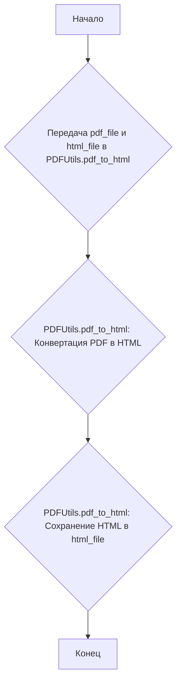

# Модуль конвертации PDF в HTML

## Обзор

Модуль содержит функцию `pdf2html`, которая конвертирует PDF-файл в HTML-файл. Использует библиотеку `PDFUtils` для выполнения преобразования.

## Подробней

Этот модуль предназначен для преобразования PDF-документов в HTML-формат, что может быть полезно для отображения PDF-контента в веб-браузере или для извлечения текста и других данных из PDF-файлов. В проекте `hypotez` данный модуль может использоваться для обработки и анализа PDF-документов, например, для извлечения информации и последующего использования в других модулях.

## Функции

### `pdf2html`

```python
def pdf2html(pdf_file, html_file):
    """ """
    PDFUtils.pdf_to_html(pdf_file, html_file)
```

**Назначение**: Конвертирует PDF-файл в HTML-файл.

**Параметры**:

- `pdf_file` (str | Path): Путь к PDF-файлу, который необходимо преобразовать.
- `html_file` (str | Path): Путь к HTML-файлу, в который будет записан результат преобразования.

**Возвращает**:
- Ничего (None). Функция выполняет преобразование файла и не возвращает значения.

**Вызывает исключения**:
- Может вызывать исключения, связанные с операциями файловой системы или проблемами в процессе конвертации PDF в HTML, обрабатываемые внутри `PDFUtils.pdf_to_html`.

**Как работает функция**:

1. Функция `pdf2html` принимает пути к PDF-файлу (`pdf_file`) и HTML-файлу (`html_file`) в качестве аргументов.
2. Вызывает метод `pdf_to_html` из класса `PDFUtils`, передавая ему пути к входному и выходному файлам.
3. Метод `pdf_to_html` выполняет конвертацию PDF-файла в HTML-файл и сохраняет результат по указанному пути.



**Примеры**:

```python
pdf_file = gs.path.root / 'assets' / 'materials' / '101_BASIC_Computer_Games_Mar75.pdf'
html_file = gs.path.root / 'assets' / 'materials' / '101_BASIC_Computer_Games_Mar75.html'

pdf2html(pdf_file, html_file)
```
В данном примере происходит преобразование PDF-файла `'101_BASIC_Computer_Games_Mar75.pdf'`, находящегося в директории `'assets/materials'`, в HTML-файл с именем `'101_BASIC_Computer_Games_Mar75.html'` в той же директории.