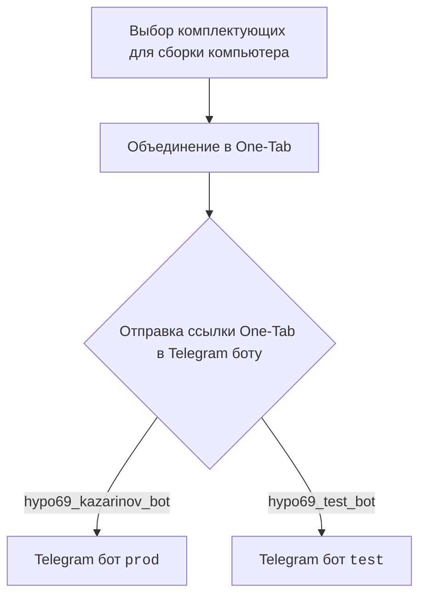
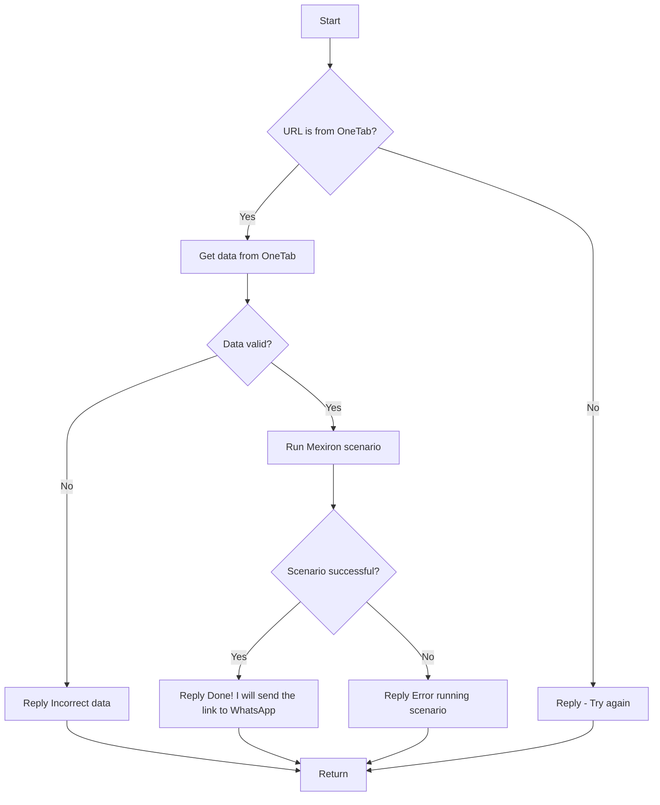

# Модуль: src.endpoints.kazarinov

## Обзор

Данный модуль предназначен для работы с Kazarinov. PDF Mexiron Creator.

## Подробнее

Этот модуль, судя по всему, является частью системы, автоматизирующей создание PDF-документов Mexiron на основе данных, полученных от пользователя через Telegram-ботов.

Основные компоненты:

- `KazarinovTelegramBot`: Связан с Telegram-ботами `prod` и `test` для получения данных от пользователя.
- `BotHandler`: Обрабатывает данные, полученные от бота, и запускает сценарии Mexiron.

Модуль интегрирован с One-Tab для объединения комплектующих для сборки компьютера в одну ссылку, которая затем отправляется в Telegram бот.

## Схемы

### Клиентская сторона (Kazarinov)

### Логика обработки кода

**Описание схемы**:

1.  **Start**: Начало обработки.
2.  **URL is from OneTab?**: Проверка, является ли URL ссылкой OneTab.
    *   Если да (Yes), то переходим к извлечению данных из OneTab.
    *   Если нет (No), то отправляем сообщение об ошибке и просим повторить ввод.
3.  **Get data from OneTab**: Извлечение данных из OneTab по предоставленной ссылке.
4.  **Data valid?**: Проверка валидности полученных данных.
    *   Если данные невалидны (No), отправляем сообщение об ошибке.
    *   Если данные валидны (Yes), запускаем сценарий Mexiron.
5.  **Run Mexiron scenario**: Запуск сценария Mexiron для обработки данных.
6.  **Scenario successful?**: Проверка успешности выполнения сценария.
    *   Если сценарий выполнен успешно (Yes), отправляем сообщение об успешном выполнении и ссылку для WhatsApp.
    *   Если сценарий выполнен с ошибкой (No), отправляем сообщение об ошибке.
7.  **Return**: Возврат.

## Дальнейшие шаги

*   [Kazarinov bot](https://github.com/hypo69/hypo/blob/master/src/endpoints/kazarinov/kazarinov_bot.md)
*   [Scenario Execution](https://github.com/hypo69/hypo/blob/master/src/endpoints/kazarinov/scenarios/README.MD)