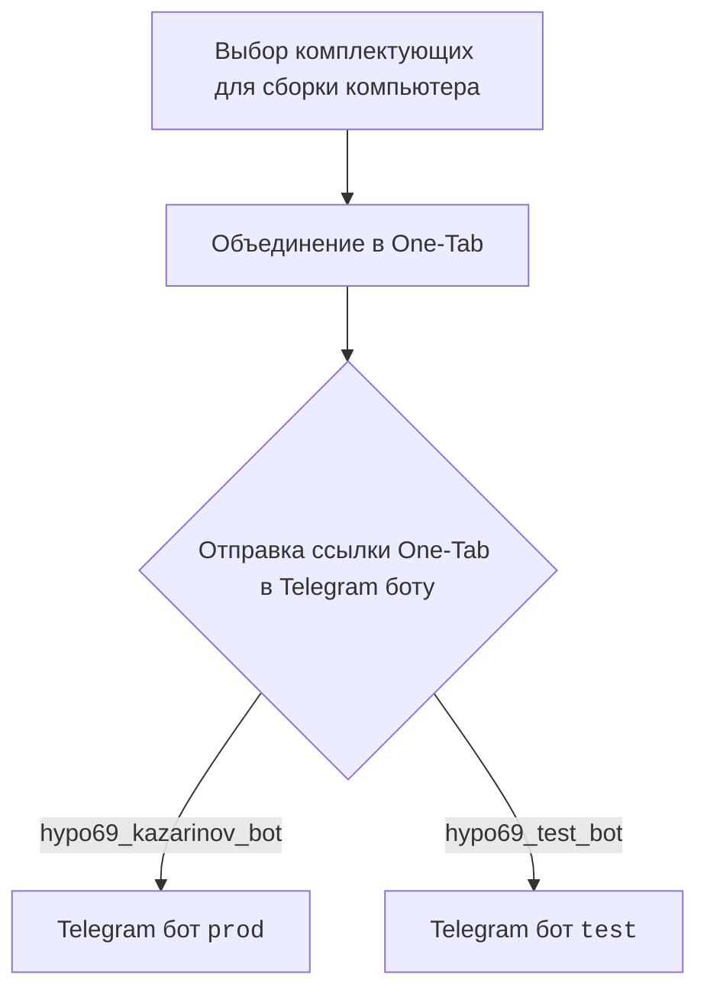
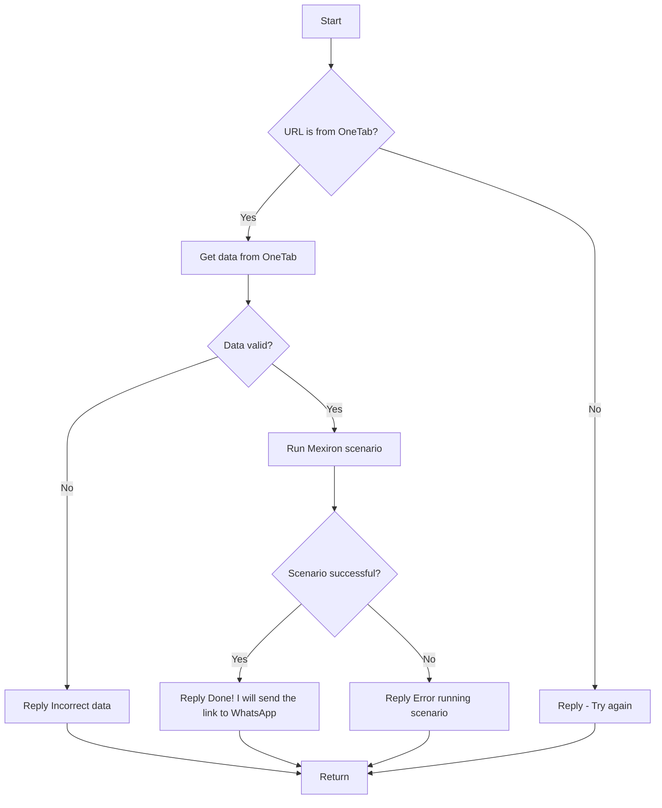

# Модуль: src.endpoints.kazarinov

## Обзор

Документация предоставляет информацию о модуле `src.endpoints.kazarinov`, который, судя по всему, связан с Telegram-ботом Kazarinov и процессами, используемыми для создания PDF-отчетов Mexiron.

## Подробней

Модуль, по-видимому, отвечает за обработку запросов от пользователей, связанных с конфигурацией компьютеров, и включает в себя взаимодействие с веб-сайтами, Telegram-ботами и сценариями Mexiron. Код включает в себя схематичное представление логики работы бота и обработки данных, а также ссылки на другие документы и ресурсы, связанные с проектом.

## Схемы взаимодействия

В данном разделе представлены схемы взаимодействия, описывающие клиентскую и серверную части работы модуля.

### Клиентская сторона (Kazarinov)

**Описание**:

1.  `Start`: Пользователь выбирает комплектующие для сборки компьютера.
2.  `Combine`: Выбранные комплектующие объединяются в One-Tab.
3.  `SendToBot`: Ссылка One-Tab отправляется в Telegram боту.
4.  `ProdBot`: Telegram бот `prod` (рабочий бот).
5.  `TestBot`: Telegram бот `test` (тестовый бот).

### Серверная сторона

**Описание**:

1.  `A[Start]`: Начало обработки запроса.
2.  `B{URL is from OneTab?}`: Проверка, является ли URL ссылкой из OneTab.
    *   Если `Yes`: Переход к шагу `C`.
    *   Если `No`: Переход к шагу `D`.
3.  `C[Get data from OneTab]`: Получение данных из OneTab.
4.  `D[Reply - Try again]`: Ответ с просьбой повторить попытку.
5.  `E{Data valid?}`: Проверка валидности полученных данных.
    *   Если `No`: Переход к шагу `F`.
    *   Если `Yes`: Переход к шагу `G`.
6.  `F[Reply Incorrect data]`: Ответ о некорректности данных.
7.  `G[Run Mexiron scenario]`: Запуск сценария Mexiron.
8.  `H{Scenario successful?}`: Проверка успешности выполнения сценария.
    *   Если `Yes`: Переход к шагу `I`.
    *   Если `No`: Переход к шагу `J`.
9.  `I[Reply Done! I will send the link to WhatsApp]`: Ответ об успешном выполнении и отправке ссылки в WhatsApp.
10. `J[Reply Error running scenario]`: Ответ об ошибке выполнения сценария.
11. `K[Return]`: Завершение обработки и возврат.

## Ссылки на другие документы

*   [Kazarinov bot](https://github.com/hypo69/hypo/blob/master/src/endpoints/kazarinov/kazarinov_bot.md)
*   [Scenario Execution](https://github.com/hypo69/hypo/blob/master/src/endpoints/kazarinov/scenarios/README.MD)