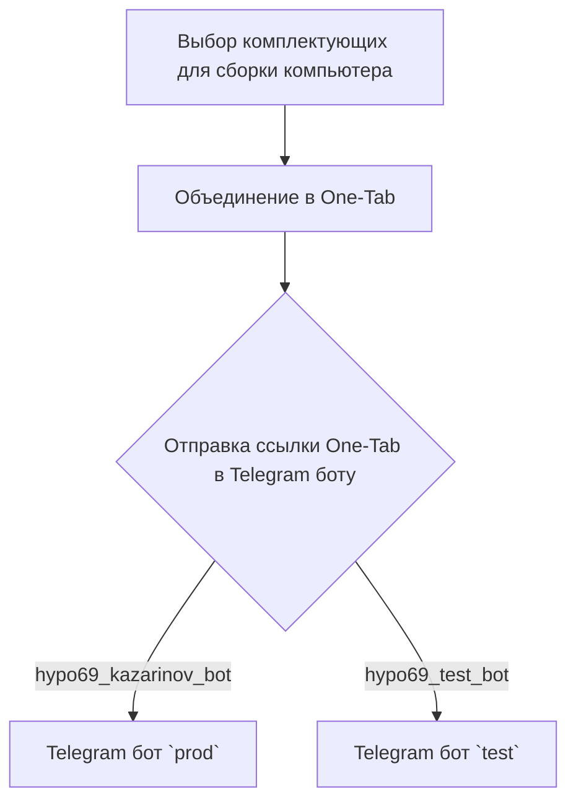
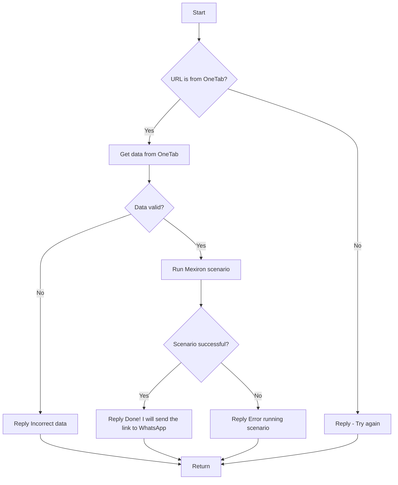

# Kazarinov. PDF Mexiron Creator

## Обзор

Этот документ описывает работу модуля `src.endpoints.kazarinov`, который отвечает за создание PDF-файлов на основе данных, полученных из One-Tab, и отправку их пользователю через Telegram-бота.

## Содержание

- [KazarinovTelegramBot](#kazarinovtelegrambot)
- [BotHandler](#bothandler)
- [Client side (Kazarinov)](#client-side-kazarinov)
- [Code side](#code-side)
- [Next](#next)

## KazarinovTelegramBot

- [https://one-tab.co.il](https://one-tab.co.il)
- [https://morlevi.co.il](https://morlevi.co.il)
- [https://grandavance.co.il](https://grandavance.co.il)
- [https://ivory.co.il](https://ivory.co.il)
- [https://ksp.co.il](https://ksp.co.il)

## BotHandler

### Client side (Kazarinov)

### Code side

## Next

- [Kazarinov bot](https://github.com/hypo69/hypo/blob/master/src/endpoints/kazarinov/kazarinov_bot.md)
- [Scenario Execution](https://github.com/hypo69/hypo/blob/master/src/endpoints/kazarinov/scenarios/README.MD)