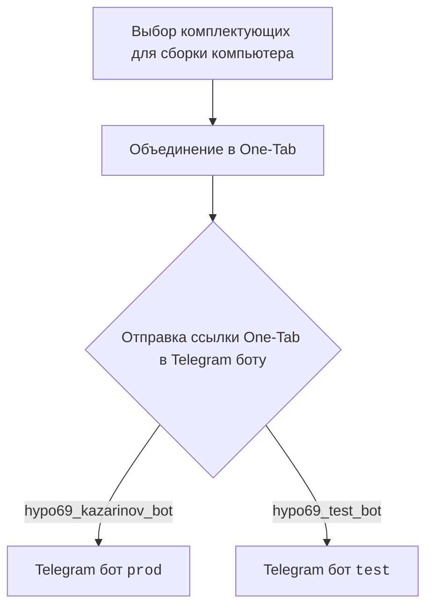
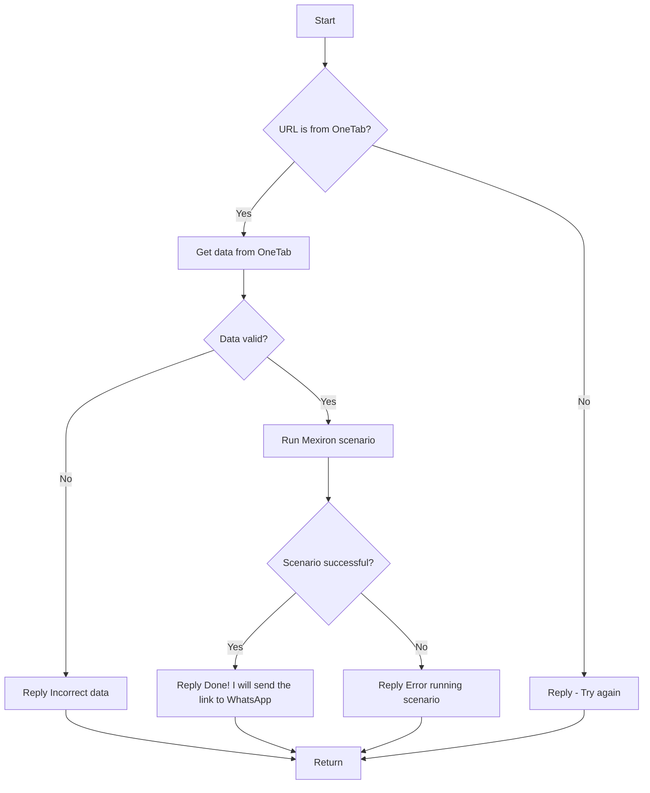

# Документация для модуля `src.endpoints.kazarinov`

## Обзор

Документация предоставляет информацию о модуле `src.endpoints.kazarinov`, который связан с созданием прайс-листа для Казаринова и включает в себя работу с Telegram ботами `KazarinovTelegramBot` и `BotHandler`.

## Подорбней

Модуль предназначен для автоматизации процесса формирования прайс-листов на основе данных о комплектующих, собранных пользователем. Пользователь выбирает комплектующие для сборки компьютера, объединяет их в One-Tab ссылку и отправляет эту ссылку в Telegram боту. Бот, в свою очередь, обрабатывает полученные данные и запускает сценарий для формирования прайс-листа.

Связь между клиентом и кодом организована следующим образом:

1.  **Клиентская часть**: Пользователь использует One-Tab для объединения ссылок на комплектующие и отправляет ссылку боту.
2.  **Серверная часть**: Бот обрабатывает сообщение, извлекает данные из One-Tab ссылки и запускает сценарий `Mexiron` для формирования прайс-листа.

## Схема работы

### Клиентская часть

### Обработка на стороне кода

1.  Бот `kazarinov_bot.handle_message()` принимает сообщение от пользователя.
2.  Проверяется, является ли URL ссылкой на One-Tab.
3.  Если да, извлекаются данные из One-Tab.
4.  Данные валидируются.
5.  Если данные валидны, запускается сценарий `Mexiron`.
6.  В зависимости от успеха сценария, бот отправляет пользователю сообщение об успехе или ошибке.

## Классы

В данном файле не указаны классы.

## Функции

В данном файле не указаны функции.

## Ссылки

-   [Казаринов бот](https://github.com/hypo69/hypo/blob/master/src/endpoints/kazarinov/kazarinov_bot.ru.md)
-   [Исполнение сценария](https://github.com/hypo69/hypo/blob/master/src/endpoints/kazarinov/scenarios/readme.ru.md)