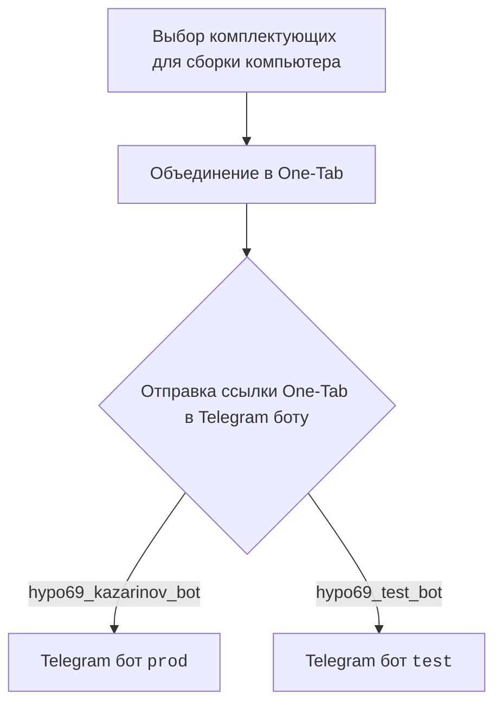
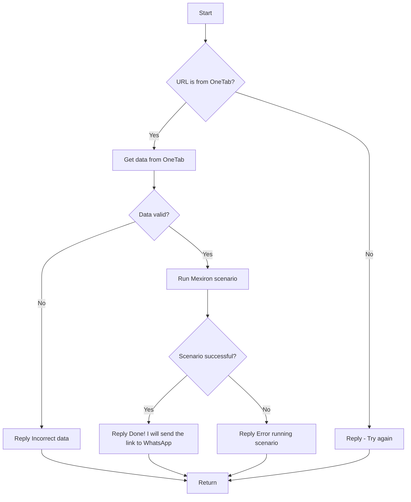

# Модуль: src.endpoints.kazarinov

## Обзор

Документация для модуля `src.endpoints.kazarinov`, который отвечает за создание прайс-листа для Казаринова. Модуль включает в себя описание взаимодействия с Telegram ботами `prod` и `test`, а также сценарии обработки данных, полученных от One-Tab.

## Подробнее

Модуль предназначен для автоматизации процесса формирования прайс-листа на основе данных, полученных от различных онлайн-магазинов комплектующих для компьютеров. Включает в себя работу с Telegram ботами для получения запросов от пользователей и сценарии обработки данных, полученных через ссылки One-Tab.

## Схема работы

### Клиентская сторона

Пользователь выбирает комплектующие для сборки компьютера, объединяет их в One-Tab и отправляет ссылку One-Tab в Telegram бот. В зависимости от выбранного бота (`prod` или `test`) запрос направляется в соответствующий Telegram бот.

### Сторона кода

- `kazarinov_bot.handle_message()` -> `kazarinov.scenarios.run_scenario()`:

1.  **Start**: Начало обработки сообщения.
2.  **URL is from OneTab?**: Проверка, является ли URL ссылкой OneTab.
    *   **Yes**: Если да, то извлекаются данные из OneTab.
    *   **No**: Если нет, бот отвечает "Попробуйте еще раз".
3.  **Get data from OneTab**: Извлечение данных из OneTab.
4.  **Data valid?**: Проверка валидности полученных данных.
    *   **No**: Если данные не валидны, бот отвечает "Некорректные данные".
    *   **Yes**: Если данные валидны, запускается сценарий Mexiron.
5.  **Run Mexiron scenario**: Запуск сценария Mexiron.
6.  **Scenario successful?**: Проверка успешности выполнения сценария.
    *   **Yes**: Если сценарий выполнен успешно, бот отвечает "Готово! Я отправлю ссылку в WhatsApp".
    *   **No**: Если сценарий завершился с ошибкой, бот отвечает "Ошибка при выполнении сценария".
7.  **Reply Incorrect data**: Ответ бота о некорректных данных.
8.  **Reply Done! I will send the link to WhatsApp**: Ответ бота об успешном выполнении и отправке ссылки.
9.  **Reply Error running scenario**: Ответ бота об ошибке выполнения сценария.
10. **Return**: Завершение обработки.

## Ссылки

-   [Казаринов бот](https://github.com/hypo69/hypo/blob/master/src/endpoints/kazarinov/kazarinov_bot.ru.md)
-   [Исполнение сценария](https://github.com/hypo69/hypo/blob/master/src/endpoints/kazarinov/scenarios/readme.ru.md)