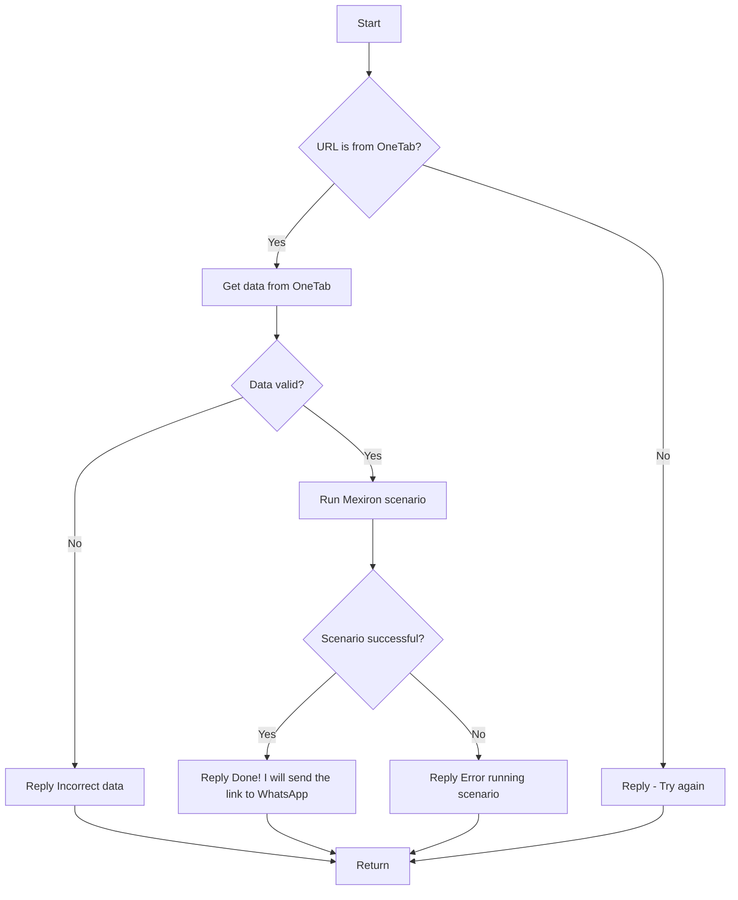

# Модуль `kazarinov` - Telegram бот для обработки ссылок с OneTab

## Обзор

Данный модуль реализует Telegram бота (`KazarinovTelegramBot`), предназначенного для обработки ссылок с сервиса OneTab.  Бот получает ссылки на комплектующие для сборки компьютера, собранные в OneTab, и выполняет сценарий обработки, основанный на сервисе Mexiron.

## Классы

### `KazarinovTelegramBot`

**Описание**: Класс представляет собой Telegram бота для обработки ссылок с OneTab.

**Методы**:

- `handle_message(update: Update, context: CallbackContext)`: Обрабатывает входящие сообщения.  Получает данные из ссылки, проверяет их валидность, запускает сценарий обработки и отправляет ответ пользователю.

### `BotHandler`

**Описание**:  Класс, отвечающий за обработку обновлений (updates) Telegram бота, в т.ч. за перенаправление запросов в `kazarinov.scenarios.run_scenario`.

**Методы**:


## Функции

### `run_scenario(url: str) -> str | None`

**Описание**: Функция запускает сценарий обработки ссылки.

**Параметры**:

- `url` (str): URL ссылка на комплектующие из OneTab.

**Возвращает**:

- str | None: Текстовое сообщение с результатом выполнения сценария. `None` при ошибке.

**Вызывает исключения**:

- `ValueError`: Если URL некорректен или не содержит необходимых данных.
- `MexironError`: Если возникла ошибка при работе с Mexiron.
- `Exception`: Общее исключение при сбое в обработке.


## Сценарий обработки (mermaid)





## Пример использования

```python
# (Пример использования внутри класса KazarinovTelegramBot)

try:
    result = run_scenario(update.message.text)
    if result:
        bot.send_message(chat_id=update.message.chat_id, text=result)
    else:
        bot.send_message(chat_id=update.message.chat_id, text="Ошибка при обработке.")
ex cept ValueError as ex:
    bot.send_message(chat_id=update.message.chat_id, text=f"Ошибка: {str(ex)}")
except MexironError as ex:
    bot.send_message(chat_id=update.message.chat_id, text=f"Ошибка Mexiron: {str(ex)}")
except Exception as ex:
    bot.send_message(chat_id=update.message.chat_id, text=f"Непредвиденная ошибка: {str(ex)}")

```

**Примечание:**  Для полной функциональности потребуется реализовать  классы `MexironError` и  `GetOneTabData` (для получения данных из OneTab) и  логику  для работы с Mexiron API.  Данный документ предоставляет структурированное описание модуля `kazarinov`.