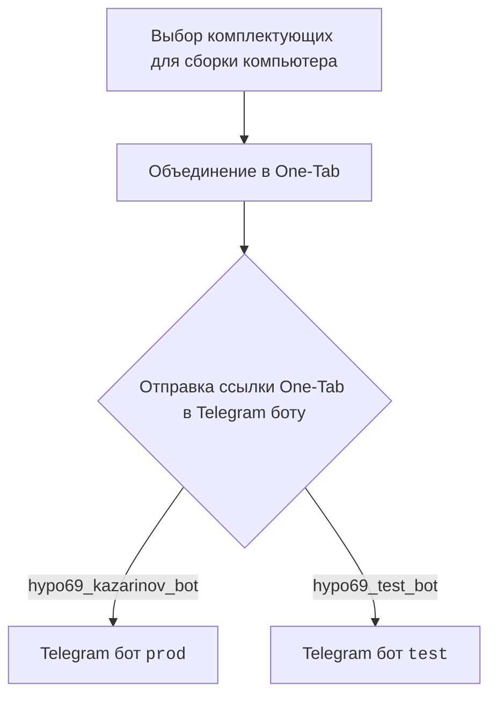
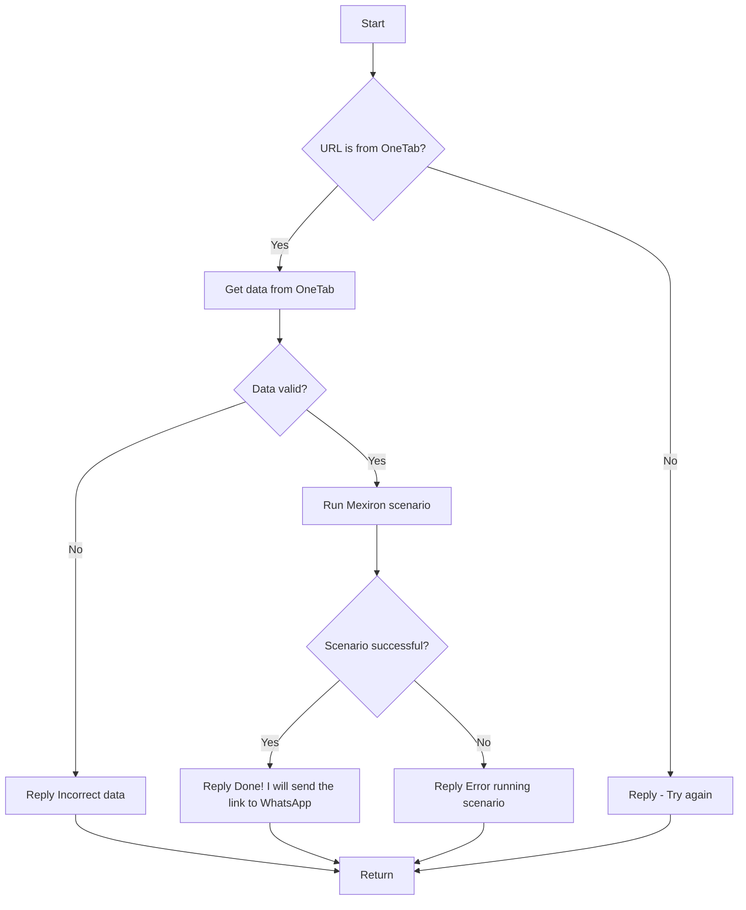

# Модуль: src.endpoints.kazarinov

## Обзор

Документация описывает создание прайслиста для Казаринова, включая взаимодействие с Telegram ботами `prod` и `test` для обработки данных, полученных из ссылок One-Tab. Также описывается логика обработки сценариев и валидации данных.

## Подробнее

Этот модуль предназначен для автоматизации процесса создания прайслистов для компании Казаринов. Он включает в себя взаимодействие с внешними источниками данных (One-Tab, сайты поставщиков) и Telegram ботами для упрощения процесса обработки и валидации данных.

## Схема работы

### Клиентская сторона:

На стороне клиента пользователь выбирает комплектующие для сборки компьютера, объединяет их в One-Tab и отправляет ссылку в Telegram боту (`prod` или `test`).

### Код:

- `kazarinov_bot.handle_message()` -> `kazarinov.scenarios.run_scenario()`:

1.  **Start**: Начало процесса.
2.  **URL is from OneTab?**: Проверяется, является ли URL ссылкой OneTab.
    *   Если да (Yes), то переходим к блоку **Get data from OneTab**.
    *   Если нет (No), то переходим к блоку **Reply - Try again**.
3.  **Get data from OneTab**: Получение данных из OneTab.
4.  **Data valid?**: Проверяется валидность полученных данных.
    *   Если данные не валидны (No), то переходим к блоку **Reply Incorrect data**.
    *   Если данные валидны (Yes), то переходим к блоку **Run Mexiron scenario**.
5.  **Run Mexiron scenario**: Запуск сценария Mexiron.
6.  **Scenario successful?**: Проверяется, успешно ли выполнен сценарий.
    *   Если да (Yes), то переходим к блоку **Reply Done! I will send the link to WhatsApp**.
    *   Если нет (No), то переходим к блоку **Reply Error running scenario**.
7.  **Reply Incorrect data**: Отправка сообщения об некорректных данных.
8.  **Reply Done! I will send the link to WhatsApp**: Отправка сообщения об успешном выполнении и отправке ссылки в WhatsApp.
9.  **Reply Error running scenario**: Отправка сообщения об ошибке при выполнении сценария.
10. **Reply - Try again**: Отправка сообщения с просьбой попробовать еще раз.
11. **Return**: Завершение процесса.

## Ссылки

-   [Казаринов бот](https://github.com/hypo69/hypo/blob/master/src/endpoints/kazarinov/kazarinov_bot.ru.md)
-   [Исполнение сценария](https://github.com/hypo69/hypo/blob/master/src/endpoints/kazarinov/scenarios/readme.ru.md)