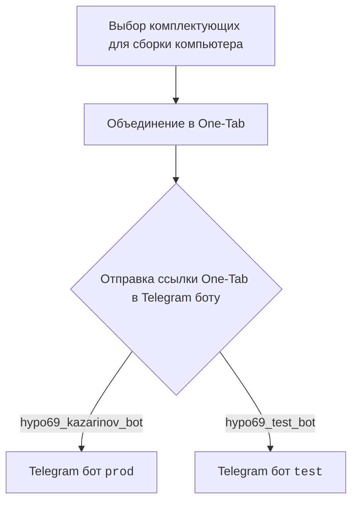
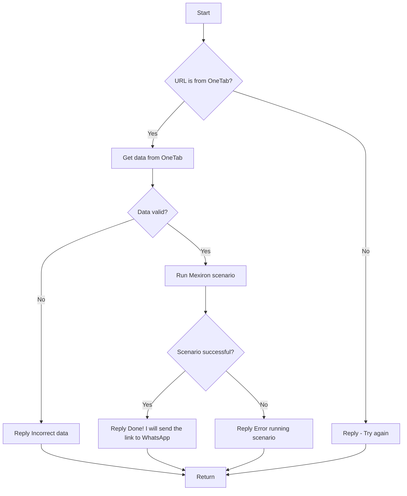

# Название модуля

## Обзор

Документация для модуля, отвечающего за создание прайслиста для Казаринова. Модуль включает в себя обработку сообщений от Telegram бота и выполнение сценариев для формирования прайслиста.

## Оглавление

1. [Обзор](#обзор)
2. [Описание работы](#описание-работы)
3. [Схема работы](#схема-работы)
4. [Ссылки на другие документы](#ссылки-на-другие-документы)

## Описание работы

Модуль `src.endpoints.kazarinov` предназначен для создания прайслиста для компании Казаринов. Основная функциональность заключается в следующем:

-   Обработка сообщений от Telegram бота (`KazarinovTelegramBot`).
-   Извлечение данных из ссылок One-Tab.
-   Выполнение сценариев для генерации прайслиста (`kazarinov.scenarios.run_scenario()`).
-   Отправка сформированного прайслиста через WhatsApp (планируется).

Используются следующие ресурсы:
- https://one-tab.co.il
- https://morlevi.co.il
- https://grandavance.co.il
- https://ivory.co.il
- https://ksp.co.il

## Схема работы

### Клиентская сторона

### Серверная сторона

-   `kazarinov_bot.handle_message()` -> `kazarinov.scenarios.run_scenario()`:

## Ссылки на другие документы

[Казарионв бот](https://github.com/hypo69/hypo/blob/master/src/endpoints/kazarinov/kazarinov_bot.ru.md)

[Исполнение сценария](https://github.com/hypo69/hypo/blob/master/src/endpoints/kazarinov/scenarios/readme.ru.md)