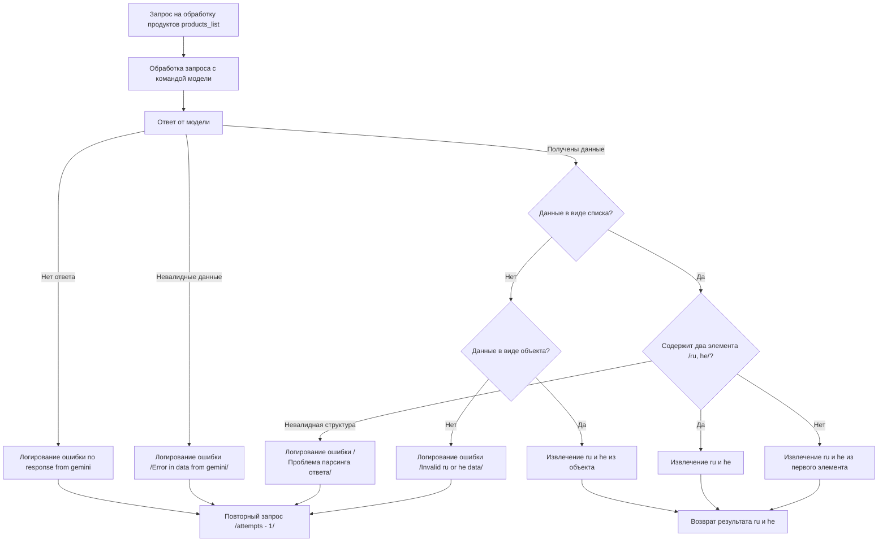

# Схема обработки продуктов

## Обзор

Данный файл содержит описание схемы обработки запроса на обработку списка продуктов с использованием AI-модели. Схема визуализирована с использованием Mermaid и описывает логику обработки запроса, проверки данных и возврата результатов.

## Подробней

Эта схема описывает процесс обработки запроса на обработку списка продуктов (`products_list`) с использованием AI-модели, вероятно, Google Gemini.  Она начинается с получения запроса и заканчивается возвратом обработанных данных на двух языках (`ru` и `he`). Схема включает в себя проверку наличия и валидности данных, а также обработку различных форматов ответа от модели.  В случае ошибок предусмотрено логирование и повторные попытки обработки.
В контексте проекта `hypotez`, эта схема, вероятно, описывает один из сценариев обработки данных, связанных с многоязыковой поддержкой продуктов. Анализ схемы позволяет понять порядок действий и логику обработки данных, что важно для разработки, отладки и масштабирования системы.

## Схема обработки продуктов

### flowchart TD



**Описание блоков и переходов:**

- **A [Запрос на обработку продуктов products_list]:**  Начальный блок, представляющий запрос на обработку списка продуктов. `products_list`, вероятно, является переменной, содержащей список продуктов для обработки.
- **B [Обработка запроса с командой модели]:**  Блок, описывающий обработку запроса с использованием команды для AI-модели.  Здесь происходит взаимодействие с моделью, которой передаются данные для обработки.
- **C [Ответ от модели]:**  Блок, представляющий ответ, полученный от AI-модели.  Этот ответ может содержать обработанные данные или сообщение об ошибке.

**Проверки и обработка ошибок:**

- **Нет ответа:**
    - **D [Логирование ошибки no response from gemini]:** Если от модели не получен ответ, фиксируется ошибка `no response from gemini`.
    - **E [Повторный запрос /attempts - 1/]:**  После логирования ошибки предпринимается повторный запрос к модели, уменьшая количество попыток (`attempts`) на 1.
- **Невалидные данные:**
    - **F [Логирование ошибки /Error in data from gemini/]:**  Если данные, полученные от модели, не соответствуют ожидаемому формату или содержат ошибки, фиксируется ошибка `Error in data from gemini`.
    - **E [Повторный запрос /attempts - 1/]:**  После логирования ошибки предпринимается повторный запрос к модели.

**Обработка полученных данных:**

- **G {Данные в виде списка?}:**  Проверка формата данных, полученных от модели.  Проверяется, является ли ответ списком.
    - **Да:**
        - **H {Содержит два элемента /ru, he/?}:**  Проверка, содержит ли список два элемента, предположительно представляющих данные на русском (`ru`) и иврите (`he`).
            - **Да:**
                - **I [Извлечение ru и he]:**  Извлечение данных на русском и иврите из списка.
            - **Нет:**
                - **J [Извлечение ru и he из первого элемента]:**  Попытка извлечь данные на русском и иврите из первого элемента списка.  Возможно, данные на двух языках находятся внутри одного элемента списка.
                - **K [Логирование ошибки /Проблема парсинга ответа/]:**  Если структура списка не соответствует ожидаемой, фиксируется ошибка `Проблема парсинга ответа`.
                - **E [Повторный запрос /attempts - 1/]:**  После логирования ошибки предпринимается повторный запрос к модели.
    - **Нет:**
        - **L {Данные в виде объекта?}:**  Проверка, является ли ответ объектом (например, словарем).
            - **Да:**
                - **M [Извлечение ru и he из объекта]:**  Извлечение данных на русском и иврите из объекта, вероятно, по ключам `ru` и `he`.
            - **Нет:**
                - **N [Логирование ошибки /Invalid ru or he data/]:**  Если данные не представлены ни в виде списка, ни в виде объекта, фиксируется ошибка `Invalid ru or he data`.
                - **E [Повторный запрос /attempts - 1/]:**  После логирования ошибки предпринимается повторный запрос к модели.

**Возврат результата:**

- **O [Возврат результата ru и he]:**  Возврат извлеченных данных на русском и иврите.

```