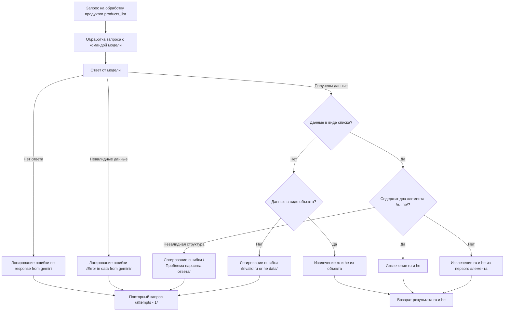

# Сценарии обработки запросов к модели Gemini для продуктов

## Обзор

Этот документ описывает сценарии обработки запросов к модели Gemini для получения информации о продуктах. Он детально описывает последовательность действий, начиная с отправки запроса и заканчивая получением и обработкой ответа. Документ включает в себя логику обработки различных возможных ответов модели, включая проверку валидности, извлечение нужной информации и логирование ошибок.

## Диаграмма потока

## Этапы обработки

1. **Запрос на обработку продуктов (products_list):**  Пользовательский запрос на обработку списка продуктов.
2. **Обработка запроса с командой модели:**  Запрос передается в модель Gemini с соответствующими инструкциями.
3. **Ответ от модели:**  Модель возвращает ответ.
4. **Проверка на отсутствие ответа:** Если ответ отсутствует, происходит логирование ошибки и повторный запрос (с уменьшением попыток).
5. **Проверка валидности данных:**  Проверка ответа на корректность структуры. Если данные невалидны, происходит логирование ошибки и повторный запрос.
6. **Проверка на полученные данные:**  Проверка типа полученных данных.
    * **Список:** Проверка на наличие двух элементов (ru, he).  Если структура невалидна, логируется ошибка.
    * **Объект:** Извлечение ru и he из объекта.  Если структура невалидна, логируется ошибка.
7. **Извлечение ru и he:**  Извлечение значений ru и he из полученных данных.
8. **Возврат результата:** Возврат полученных значений ru и he.

## Обрабатываемые исключения

- **`no response from gemini`:** Отсутствие ответа от модели.
- **`Error in data from gemini`:** Некорректные данные в ответе.
- **`Проблема парсинга ответа`:** Некорректная структура данных в ответе.
- **`Invalid ru or he data`:** Отсутствуют необходимые значения ru или he в данных.

## Замечания

Этот сценарий предполагает, что модель Gemini возвращает данные в виде списка или объекта, содержащего ключи 'ru' и 'he'.  Для обработки других типов данных необходимо будет добавить соответствующие проверки и логику извлечения.  Подробная реализация отдельных этапов зависит от конкретного способа получения и обработки данных.