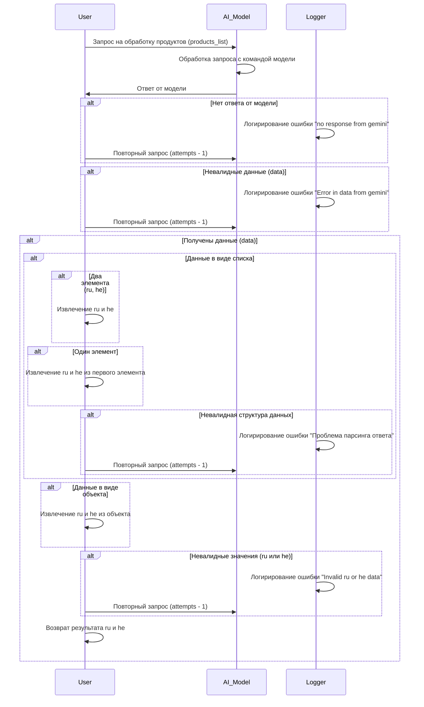

# Диаграмма сценария обработки списка продуктов (process_ai.mmd)

## Обзор

Данная диаграмма описывает сценарий обработки запроса на обработку списка продуктов (products_list) с помощью модели.  Диаграмма показывает взаимодействие между пользователем, моделью и логирующим сервисом, включая возможные ошибки и повторные запросы.

## Сценарий

Диаграмма представляет последовательность действий при получении запроса от пользователя на обработку списка продуктов.

## Описание этапов

Диаграмма отображает следующие ключевые этапы обработки:

- **Запрос пользователя:** Пользователь отправляет запрос на обработку списка продуктов.
- **Обработка модели:** Модель получает запрос и пытается обработать его.
- **Ответ модели:** Модель возвращает результат обработки.
- **Обработка ответа:** Проверка ответа на валидность и извлечение необходимых данных (ru и he).
- **Логирование ошибок:** В случае ошибок (отсутствие ответа, невалидные данные, невалидные значения) логируется ошибка.
- **Повторные запросы:** В случае ошибок модель может быть запрошена повторно.
- **Возврат результата:** Пользователь получает результат обработки.

## Возможные ошибки

- `no response from gemini`: Модель не вернула ответа.
- `Error in data from gemini`: Полученные данные имеют невалидный формат.
- `Проблема парсинга ответа`: Данные имеют невалидную структуру для извлечения ru и he.
- `Invalid ru or he data`: Извлеченные значения ru или he имеют невалидный формат.

## Заключение

Данный сценарий описывает последовательность действий для обработки запроса на обработку списка продуктов, включая возможные ошибки и механизмы их обработки.