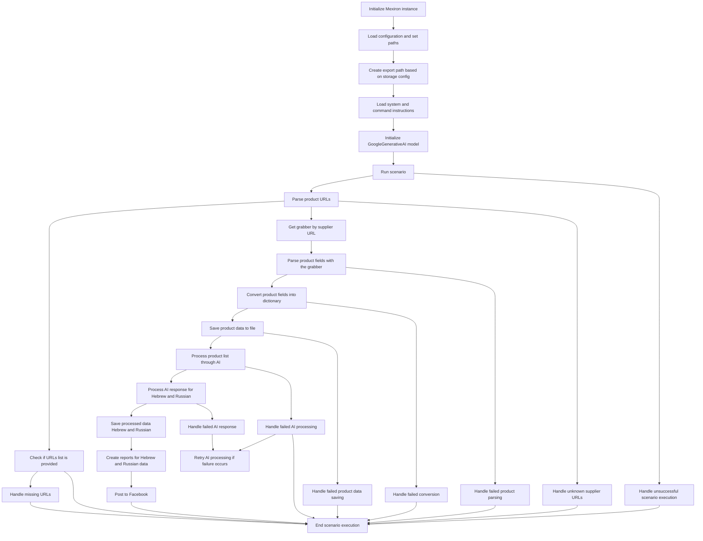

# Сценарий формирования прайс-листа (Mermaid диаграмма)

## Обзор

Данный файл описывает сценарий формирования прайс-листа, представленный в виде диаграммы Mermaid.  Диаграмма визуализирует последовательность шагов, необходимых для выполнения сценария, включая инициализацию, загрузку данных, обработку, сохранение результатов и генерацию отчетов.

## Диаграмма

## Последовательность шагов

Диаграмма изображает выполнение сценария, начиная с инициализации Mexiron до завершения и публикации отчетов на Facebook. В ней показаны проверки на ошибки, повторные попытки (retry) и обработка различных типов сбоев на каждом этапе.

## Обработка ошибок

Диаграмма демонстрирует наличие точек обработки ошибок (Handle...Failure) для следующих этапов:

* **Неудачная обработка сценария:** HandleScenarioFailure.
* **Ошибка парсинга данных:** HandleParseFailure.
* **Ошибка преобразования данных в словарь:** HandleConversionFailure.
* **Ошибка сохранения данных:** HandleSaveFailure.
* **Ошибка обработки данных с помощью AI:** HandleAIProcessingFailure.
* **Ошибка ответа AI:** HandleAIResponseFailure.
* **Отсутствующие URL:** HandleMissingURLs.
* **Неизвестные URL поставщиков:** HandleUnknownSupplierURLs.
* **Отсутствие списка URL:** CheckURLs.

Наличие этих элементов указывает на наличие механизмов обработки ошибок и повышения отказоустойчивости сценария.

## Заключение

Данная документация представляет собой описание сценария формирования прайс-листа с помощью Mermaid диаграммы, включая основные этапы,  обработку возможных ошибок и последовательность действий.