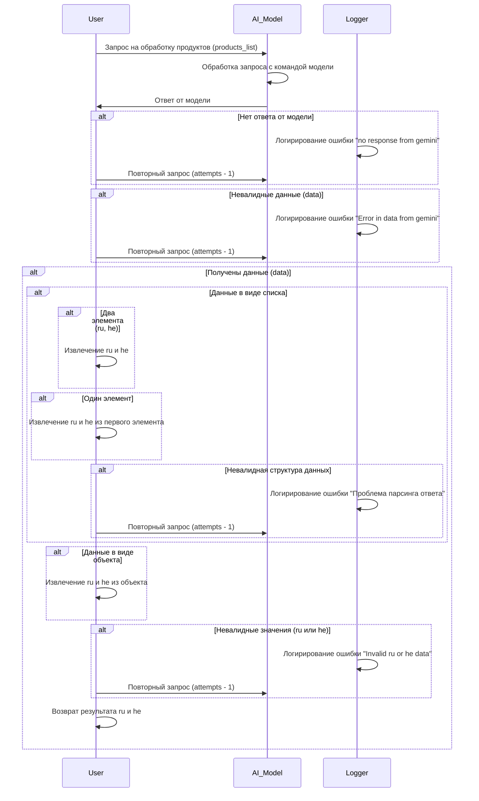

# Сценарии обработки ответов от модели Gemini

## Обзор

Этот документ описывает сценарии обработки ответов от модели Gemini. Он детально описывает возможные взаимодействия пользователя с моделью, обработку запросов и ответы, включая варианты ошибок и повторных попыток.

## Диаграмма состояний

## Обработка ответов

### Типы ответов

Модель Gemini может возвращать данные в разных форматах (список, объект).  Важная задача - проверка соответствия ожидаемому формату.

### Обработка ошибок

#### Нет ответа от модели

В случае отсутствия ответа от модели происходит логирование ошибки "no response from gemini" и повторный запрос с уменьшением количества попыток.

#### Невалидные данные

Если полученные данные не соответствуют ожидаемому формату или содержат ошибки, происходит логирование ошибки "Error in data from gemini".  В таком случае делается повторный запрос.

#### Невалидные значения (ru или he)

Если значения `ru` или `he` невалидны (например, пустые или не в том формате), то регистрируется ошибка "Invalid ru or he data". После чего запрос повторяется.

#### Проблема парсинга ответа

В случае, если структура данных не соответствует ожидаемому формату (не список или объект, а что-то другое), происходит логирование ошибки "Проблема парсинга ответа". Запрос повторяется.

##  Извлечение данных

### Список элементов

Если данные получены в виде списка, требуется определить количество элементов и провести извлечение `ru` и `he` в соответствии с количеством элементов.

#### Два элемента (ru, he)

Для случаев, когда в списке два элемента, необходимо извлечь данные для `ru` и `he`.

#### Один элемент

Если в списке один элемент, необходимо извлечь значения `ru` и `he` из этого элемента.

### Объект

Если ответ модели – объект, необходимо извлечь значения `ru` и `he` из соответствующих полей объекта.

## Выводы

Этот сценарий описывает полную процедуру обработки ответов от модели Gemini, включая различные варианты ошибок и их обработку.  Важным моментом является логгирование ошибок для отслеживания проблем и диагностики.