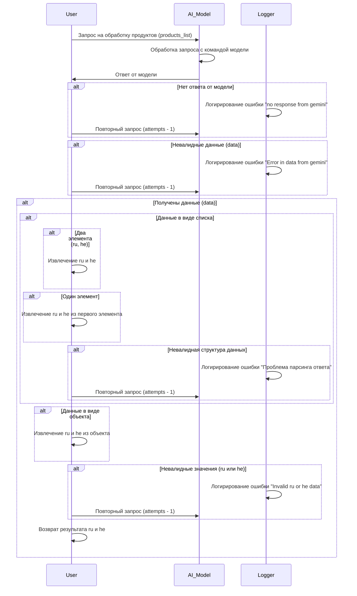

# Сценарии обработки запросов к модели Gemini

## Обзор

Этот документ описывает сценарии обработки запросов к модели Gemini для извлечения данных о продуктах. Он охватывает процесс запроса, обработки и валидации ответов, а также возможные ошибки и повторные запросы.

## Диаграмма последовательности



## Обработка запросов

Процесс обработки запроса включает следующие этапы:

- **Запрос:** Пользователь отправляет запрос на обработку списка продуктов (products_list).
- **Обработка модели:** Модель Gemini обрабатывает запрос и возвращает ответ.
- **Валидация ответа:** Программа проверяет ответ на ошибки:
    - Отсутствие ответа (no response from gemini)
    - Неправильный формат данных (Error in data from gemini)
    - Проблемы парсинга данных
    - Неправильные значения ru или he.
- **Обработка ошибок:** При обнаружении ошибки, программа записывает ошибку в лог (Logger) и предпринимает попытку повторного запроса (до определённого лимита попыток).
- **Извлечение данных:** Если данные валидны, программа извлекает необходимые значения (ru и he) из ответа.  Формат данных может быть списком или объектом.
- **Возврат результата:** Результат (руссифицированные и ивритские данные) возвращается пользователю.

## Обработка ошибок

Программа обрабатывает следующие типы ошибок:

- `no response from gemini`: Отсутствие ответа от модели Gemini.
- `Error in data from gemini`: Неправильный формат данных, полученных от Gemini.
- `Проблема парсинга ответа`: Ошибка при анализе структуры ответа от модели.
- `Invalid ru or he data`: Некорректные значения для ru или he.

В каждом случае ошибка записывается в лог и предпринимается попытка повторного запроса (до заданного предела).

## Подробности

В зависимости от типа данных, возвращаемых моделью (список или объект), код адаптируется для извлечения нужных полей (ru и he).


```
```
```python
# Пример псевдокода для обработки ответа
def process_response(response):
    """
    Обрабатывает ответ от модели Gemini.

    Args:
        response: Ответ от модели Gemini.

    Returns:
        tuple: Кортеж с ru и he данными, или None при ошибке.

    Raises:
        GeminiResponseError: При ошибках в ответе.
    """
    # ... (код проверки ответа на ошибки) ...
    if response is None:
        raise GeminiResponseError("Нет ответа от модели")
    # ... (код извлечения ru и he) ...

    return ru_data, he_data


# Пример обработки ошибки
class GeminiResponseError(Exception):
    pass
```

## Заключение

Данный документ предоставляет подробное описание сценариев обработки запросов к модели Gemini.  Этот подход гарантирует надежную и устойчивую работу приложения при взаимодействии с моделью.