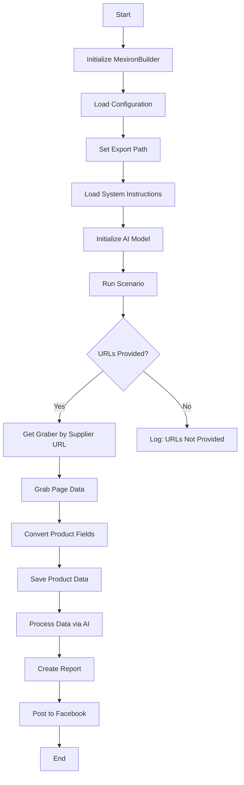

# Модуль для создания "мехирона" для Сергея Казаринова

## Обзор

Этот скрипт является частью директории `hypotez/src/endpoints/kazarinov/scenarios` и предназначен для автоматизации процесса создания "мехирона" для Сергея Казаринова. Скрипт извлекает, анализирует и обрабатывает данные о продуктах от различных поставщиков, подготавливает данные, обрабатывает их с помощью ИИ и интегрируется с Facebook для публикации продуктов.

## Подробнее

Скрипт автоматизирует процесс извлечения данных о товарах, их обработки с использованием AI-моделей, генерации отчетов и публикации в Facebook. Он предназначен для упрощения и ускорения процесса создания "мехирона" (специализированного каталога товаров) для конкретного пользователя.
В проекте `hypotez` данный модуль отвечает за автоматизированное создание каталога продукции, оптимизированного для последующей публикации и продвижения в социальных сетях, в частности, на платформе Facebook.
Анализ предоставленного ранее кода показывает, что скрипт достаточно сложный и включает в себя несколько этапов обработки данных, начиная от извлечения и заканчивая публикацией. Каждый этап включает в себя логирование ошибок и обработку исключений, что повышает надежность работы скрипта.

## Основные возможности

1.  **Извлечение и анализ данных**: Извлекает и анализирует данные о продуктах от различных поставщиков.
2.  **Обработка данных с использованием ИИ**: Обрабатывает извлеченные данные с помощью модели Google Generative AI.
3.  **Хранение данных**: Сохраняет обработанные данные в файлы.
4.  **Генерация отчетов**: Генерирует отчеты в форматах HTML и PDF на основе обработанных данных.
5.  **Публикация в Facebook**: Публикует обработанные данные в Facebook.

## Блок-схема модуля



## Легенда

1.  **Start**: Начало выполнения скрипта.
2.  **InitMexironBuilder**: Инициализация класса `MexironBuilder`.
3.  **LoadConfig**: Загрузка конфигурации из JSON-файла.
4.  **SetExportPath**: Установка пути для экспорта данных.
5.  **LoadSystemInstruction**: Загрузка системных инструкций для AI-модели.
6.  **InitModel**: Инициализация модели Google Generative AI.
7.  **RunScenario**: Выполнение основного сценария.
8.  **CheckURLs**: Проверка, предоставлены ли URL-адреса для анализа.
9.  **GetGraber**: Получение соответствующего грабера для URL-адреса поставщика.
10. **GrabPage**: Извлечение данных страницы с использованием грабера.
11. **ConvertFields**: Преобразование полей продукта в словарь.
12. **SaveData**: Сохранение данных продукта в файл.
13. **ProcessAI**: Обработка данных продукта с помощью AI-модели.
14. **CreateReport**: Создание отчетов в форматах HTML и PDF на основе обработанных данных.
15. **PostFacebook**: Публикация обработанных данных в Facebook.
16. **End**: Завершение выполнения скрипта.

## Классы

### `MexironBuilder`

**Описание**: Класс `MexironBuilder` предназначен для автоматизации процесса создания "мехирона". Он включает в себя методы для извлечения, обработки данных о продуктах, генерации отчетов и публикации в Facebook.

**Аттрибуты**:

*   `driver` (selenium.webdriver): Экземпляр Selenium WebDriver для управления браузером.
*   `export_path` (str): Путь для экспорта данных.
*   `mexiron_name` (Optional[str]): Пользовательское имя для процесса "мехирон". По умолчанию `None`.
*   `price` (Optional[str]): Цена для обработки. По умолчанию `None`.
*   `timestamp` (float): Временная метка для процесса.
*   `products_list` (List[dict]): Список обработанных данных о продуктах.
*   `model` (src.ai.gemini.GeminiModel): Модель Google Generative AI для обработки данных.
*   `config` (dict): Конфигурация, загруженная из JSON-файла.

**Методы**:

*   `__init__(self, driver: Driver, mexiron_name: Optional[str] = None)`

    **Назначение**: Инициализирует класс `MexironBuilder` с необходимыми компонентами.

    **Параметры**:

    *   `driver` (Driver): Экземпляр Selenium WebDriver.
    *   `mexiron_name` (Optional[str], optional): Пользовательское имя для процесса "мехирон". По умолчанию `None`.

*   `run_scenario(self, system_instruction: Optional[str] = None, price: Optional[str] = None, mexiron_name: Optional[str] = None, urls: Optional[str | List[str]] = None, bot = None) -> bool`

    **Назначение**: Выполняет сценарий: анализирует продукты, обрабатывает их с помощью ИИ и сохраняет данные.

    **Параметры**:

    *   `system_instruction` (Optional[str], optional): Системные инструкции для AI-модели. По умолчанию `None`.
    *   `price` (Optional[str], optional): Цена для обработки. По умолчанию `None`.
    *   `mexiron_name` (Optional[str], optional): Пользовательское имя "мехирона". По умолчанию `None`.
    *   `urls` (Optional[str | List[str]], optional): URL-адреса страниц продуктов. По умолчанию `None`.
    *   `bot` (telegram.Bot, optional): Экземпляр бота Telegram для отправки уведомлений. По умолчанию `None`.

    **Возвращает**:

    *   `bool`: `True`, если сценарий выполнен успешно, иначе `False`.

    **Как работает функция**:

    1.  Проверяется, является ли URL-адрес OneTab. Если да, данные извлекаются из OneTab.
    2.  Если данные невалидны, отправляется сообщение об ошибке.
    3.  Если граббер найден, начинается разбор страницы.
    4.  После успешного разбора поля продукта преобразуются.
    5.  Данные сохраняются, и список продуктов пополняется.
    6.  Происходит обработка данных с помощью AI для языков `he` (иврит) и `ru` (русский).
    7.  Результаты сохраняются в формате JSON для каждого языка.
    8.  Генерируются отчеты в форматах HTML и PDF.
    9.  PDF-файлы отправляются через Telegram.

    **Блок-схема**:

    ```mermaid
    flowchart TD
    Start[Start] --> IsOneTab{URL is from OneTab?}
    IsOneTab -->|Yes| GetDataFromOneTab[Get data from OneTab]
    IsOneTab -->|No| ReplyTryAgain[Reply - Try again]
    GetDataFromOneTab --> IsDataValid{Data valid?}
    IsDataValid -->|No| ReplyIncorrectData[Reply Incorrect data]
    IsDataValid -->|Yes| RunMexironScenario[Run Mexiron scenario]
    RunMexironScenario --> IsGraberFound{Graber found?}
    IsGraberFound -->|Yes| StartParsing[Start parsing: `url`]
    IsGraberFound -->|No| LogNoGraber[Log: No graber for `url`]
    StartParsing --> IsParsingSuccessful{Parsing successful?}
    IsParsingSuccessful -->|Yes| ConvertProductFields[Convert product fields]
    IsParsingSuccessful -->|No| LogParsingFailed[Log: Failed to parse product fields]
    ConvertProductFields --> IsConversionSuccessful{Conversion successful?}
    IsConversionSuccessful -->|Yes| SaveProductData[Save product data]
    IsConversionSuccessful -->|No| LogConversionFailed[Log: Failed to convert product fields]
    SaveProductData --> IsDataSaved{Data saved?}
    IsDataSaved -->|Yes| AppendToProductsList[Append to products_list]
    IsDataSaved -->|No| LogDataNotSaved[Log: Data not saved]
    AppendToProductsList --> ProcessAIHe[AI processing lang = he]
    ProcessAIHe --> ProcessAIRu[AI processing lang = ru]
    ProcessAIRu --> SaveHeJSON{Save JSON for he?}
    SaveHeJSON -->|Yes| SaveRuJSON[Save JSON for ru]
    SaveHeJSON -->|No| LogHeJSONError[Log: Error saving he JSON]
    SaveRuJSON --> IsRuJSONSaved{Save JSON for ru?}
    IsRuJSONSaved -->|Yes| GenerateReports[Generate reports]
    SaveRuJSON -->|No| LogRuJSONError[Log: Error saving ru JSON]
    GenerateReports --> IsReportGenerationSuccessful{Report generation successful?}
    IsReportGenerationSuccessful -->|Yes| SendPDF[Send PDF via Telegram]
    IsReportGenerationSuccessful -->|No| LogPDFError[Log: Error creating PDF]
    SendPDF --> ReturnTrue[Return True]
    LogPDFError --> ReturnTrue[Return True]
    ReplyIncorrectData --> ReturnTrue[Return True]
    ReplyTryAgain --> ReturnTrue[Return True]
    LogNoGraber --> ReturnTrue[Return True]
    LogParsingFailed --> ReturnTrue[Return True]
    LogConversionFailed --> ReturnTrue[Return True]
    LogDataNotSaved --> ReturnTrue[Return True]
    LogHeJSONError --> ReturnTrue[Return True]
    LogRuJSONError --> ReturnTrue[Return True]
    ```

*   `get_graber_by_supplier_url(self, url: str)`

    **Назначение**: Возвращает соответствующий грабер для заданного URL-адреса поставщика.

    **Параметры**:

    *   `url` (str): URL-адрес страницы поставщика.

    **Возвращает**:

    *   `Graber` или `None`: Экземпляр грабера, если найден, иначе `None`.

*   `convert_product_fields(self, f: ProductFields) -> dict`

    **Назначение**: Преобразует поля продукта в словарь.

    **Параметры**:

    *   `f` (ProductFields): Объект, содержащий проанализированные данные продукта.

    **Возвращает**:

    *   `dict`: Отформатированный словарь данных продукта.

*   `save_product_data(self, product_data: dict)`

    **Назначение**: Сохраняет данные продукта в файл.

    **Параметры**:

    *   `product_data` (dict): Отформатированные данные продукта.

*   `process_ai(self, products_list: List[str], lang: str, attempts: int = 3) -> tuple | bool`

    **Назначение**: Обрабатывает список продуктов с помощью AI-модели.

    **Параметры**:

    *   `products_list` (List[str]): Список словарей данных продукта в виде строк.
    *   `lang` (str): Язык обработки (`ru` или `he`).
    *   `attempts` (int, optional): Количество попыток повтора в случае неудачи. По умолчанию `3`.

    **Возвращает**:

    *   `tuple` или `bool`: Обработанный ответ в форматах `ru` и `he`.

*   `post_facebook(self, mexiron: SimpleNamespace) -> bool`

    **Назначение**: Выполняет сценарий публикации в Facebook.

    **Параметры**:

    *   `mexiron` (SimpleNamespace): Обработанные данные для публикации.

    **Возвращает**:

    *   `bool`: `True`, если публикация успешна, иначе `False`.

*   `create_report(self, data: dict, html_file: Path, pdf_file: Path)`

    **Назначение**: Генерирует отчеты в форматах HTML и PDF на основе обработанных данных.

    **Параметры**:

    *   `data` (dict): Обработанные данные.
    *   `html_file` (Path): Путь для сохранения HTML-отчета.
    *   `pdf_file` (Path): Путь для сохранения PDF-отчета.

## Функции

В данном коде отдельные функции вне класса `MexironBuilder` отсутствуют. Все основные операции выполняются методами внутри класса.

## Использование

Чтобы использовать этот скрипт, выполните следующие действия:

1.  **Инициализация драйвера**: Создайте экземпляр класса `Driver`.
2.  **Инициализация MexironBuilder**: Создайте экземпляр класса `MexironBuilder` с драйвером.
3.  **Запуск сценария**: Вызовите метод `run_scenario` с необходимыми параметрами.

### Пример

```python
from src.webdriver.driver import Driver
from src.endpoints.kazarinov.scenarios.scenario_pricelist import MexironBuilder

# Инициализация драйвера
driver = Driver(...)

# Инициализация MexironBuilder
mexiron_builder = MexironBuilder(driver)

# Запуск сценария
urls = ['https://example.com/product1', 'https://example.com/product2']
mexiron_builder.run_scenario(urls=urls)
```

## Зависимости

*   `selenium`: Для автоматизации веб-браузера.
*   `asyncio`: Для асинхронных операций.
*   `pathlib`: Для обработки путей к файлам.
*   `types`: Для создания простых пространств имен.
*   `typing`: Для аннотаций типов.
*   `src.ai.gemini`: Для обработки данных с использованием AI.
*   `src.suppliers.*.graber`: Для извлечения данных от различных поставщиков.
*   `src.endpoints.advertisement.facebook.scenarios`: Для публикации в Facebook.

## Обработка ошибок

Скрипт включает надежную обработку ошибок для обеспечения непрерывного выполнения, даже если некоторые элементы не найдены или возникают проблемы с веб-страницей. Это особенно полезно для работы с динамическими или нестабильными веб-страницами.
На каждом этапе, где могут возникнуть ошибки, предусмотрены узлы для логирования ошибок (например, `LogNoGraber`, `LogParsingFailed`, `LogHeJSONError` и т.д.).

## Вклад

Приветствуются вклады в этот скрипт. Убедитесь, что любые изменения хорошо документированы и включают соответствующие тесты.

## Лицензия

Этот скрипт распространяется под лицензией MIT. Подробности см. в файле `LICENSE`.