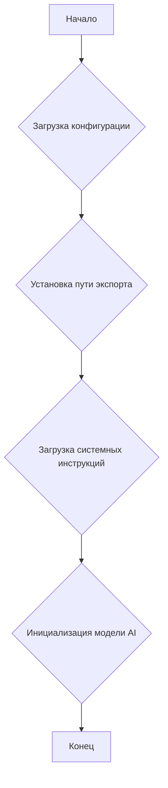
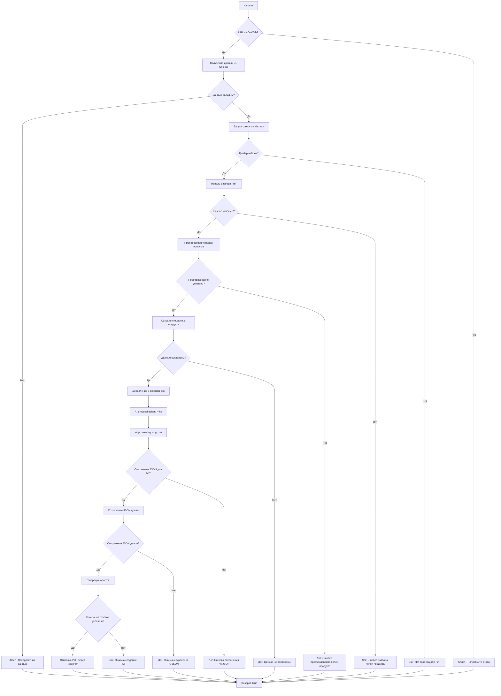

# Документация модуля `scenario.py`

## Обзор

Этот модуль является частью проекта `hypotez/src/endpoints/kazarinov/scenarios` и предназначен для автоматизации процесса создания "мехирона" для Сергея Казаринова. Скрипт извлекает, анализирует и обрабатывает данные о продуктах от различных поставщиков, подготавливает данные, обрабатывает их с помощью ИИ и интегрируется с Facebook для публикации продуктов.

## Подробней

Модуль автоматизирует процесс создания "мехирона", включая извлечение и анализ данных о продуктах от различных поставщиков, обработку данных с использованием ИИ, сохранение обработанных данных в файлы, создание отчетов и публикацию данных в Facebook. Он использует Selenium для автоматизации веб-браузера, Google Generative AI для обработки данных и различные другие библиотеки для выполнения задач.

## Классы

### `MexironBuilder`

**Описание**: Класс `MexironBuilder` предназначен для создания и управления процессом "мехирона". Он включает в себя методы для извлечения данных, обработки их с помощью ИИ, сохранения и публикации данных.

**Принцип работы**:
Класс инициализируется с драйвером Selenium и опциональным именем "мехирона". Он загружает конфигурацию из JSON-файла, устанавливает путь для экспорта данных, загружает системные инструкции для модели ИИ и инициализирует модель Google Generative AI. Основной метод `run_scenario` выполняет последовательность действий: проверяет наличие URL-адресов, извлекает данные с веб-страниц, преобразует поля продукта, сохраняет данные, обрабатывает их с помощью ИИ, создает отчеты и публикует в Facebook.

**Атрибуты**:

- `driver` (Driver): Экземпляр Selenium WebDriver для управления браузером.
- `export_path` (Path): Путь для экспорта данных.
- `mexiron_name` (Optional[str]): Пользовательское имя для процесса "мехирона". По умолчанию `None`.
- `price` (str): Цена для обработки.
- `timestamp` (datetime): Временная метка для процесса.
- `products_list` (List[dict]): Список обработанных данных о продуктах.
- `model` (GenerativeModel): Google Generative AI модель.
- `config` (dict): Конфигурация, загруженная из JSON.

**Методы**:

- `__init__(self, driver: Driver, mexiron_name: Optional[str] = None)`: Инициализирует класс `MexironBuilder`.
- `run_scenario(self, system_instruction: Optional[str] = None, price: Optional[str] = None, mexiron_name: Optional[str] = None, urls: Optional[str | List[str]] = None, bot = None) -> bool`: Выполняет основной сценарий обработки данных.
- `get_graber_by_supplier_url(self, url: str)`: Возвращает грабер для заданного URL поставщика.
- `convert_product_fields(self, f: ProductFields) -> dict`: Преобразует поля продукта в словарь.
- `save_product_data(self, product_data: dict)`: Сохраняет данные о продукте в файл.
- `process_ai(self, products_list: List[str], lang: str, attempts: int = 3) -> tuple | bool`: Обрабатывает список продуктов с помощью ИИ.
- `post_facebook(self, mexiron: SimpleNamespace) -> bool`: Выполняет сценарий публикации в Facebook.
- `create_report(self, data: dict, html_file: Path, pdf_file: Path)`: Генерирует отчеты в форматах HTML и PDF.

## Функции

### `__init__(self, driver: Driver, mexiron_name: Optional[str] = None)`

**Назначение**: Инициализирует класс `MexironBuilder` с необходимыми компонентами.

**Параметры**:
- `driver` (Driver): Экземпляр Selenium WebDriver.
- `mexiron_name` (Optional[str], optional): Пользовательское имя для процесса "мехирона". По умолчанию `None`.

**Возвращает**:
- `None`

**Как работает функция**:

1. Инициализирует класс `MexironBuilder` с драйвером Selenium и именем "мехирона".
2. Загружает конфигурацию из JSON-файла.
3. Устанавливает путь для экспорта данных.
4. Загружает системные инструкции для модели ИИ.
5. Инициализирует модель Google Generative AI.



### `run_scenario(self, system_instruction: Optional[str] = None, price: Optional[str] = None, mexiron_name: Optional[str] = None, urls: Optional[str | List[str]] = None, bot = None) -> bool`

**Назначение**: Выполняет основной сценарий: анализирует продукты, обрабатывает их через ИИ и сохраняет данные.

**Параметры**:
- `system_instruction` (Optional[str], optional): Системные инструкции для модели ИИ. По умолчанию `None`.
- `price` (Optional[str], optional): Цена для обработки. По умолчанию `None`.
- `mexiron_name` (Optional[str], optional): Пользовательское имя "мехирона". По умолчанию `None`.
- `urls` (Optional[str | List[str]], optional): URL-адреса страниц продуктов. По умолчанию `None`.
- `bot`: Бот Telegram.

**Возвращает**:
- `bool`: `True`, если сценарий выполнен успешно, иначе `False`.

**Как работает функция**:

1. Проверяет, является ли URL-адрес из OneTab. Если да, извлекает данные оттуда.
2. Проверяет валидность данных. Если данные не валидны, отправляет сообщение об ошибке.
3. Ищет грабер для URL-адреса поставщика. Если грабер найден, начинает разбор страницы.
4. Преобразует поля продукта в необходимый формат.
5. Сохраняет данные о продукте.
6. Обрабатывает данные с помощью ИИ для языков `he` (иврит) и `ru` (русский).
7. Сохраняет результаты обработки в формате JSON для каждого языка.
8. Генерирует отчеты в форматах HTML и PDF.
9. Отправляет PDF-файлы через Telegram.



### `get_graber_by_supplier_url(self, url: str)`

**Назначение**: Возвращает соответствующий грабер для заданного URL-адреса поставщика.

**Параметры**:
- `url` (str): URL-адрес страницы поставщика.

**Возвращает**:
- `Graber` | `None`: Экземпляр грабера, если найден, иначе `None`.

**Как работает функция**:

1. Получает URL-адрес страницы поставщика.
2. Определяет, какой грабер соответствует данному URL-адресу.
3. Возвращает соответствующий грабер или `None`, если грабер не найден.

### `convert_product_fields(self, f: ProductFields) -> dict`

**Назначение**: Преобразует поля продукта в словарь.

**Параметры**:
- `f` (ProductFields): Объект, содержащий разобранные данные продукта.

**Возвращает**:
- `dict`: Отформатированный словарь данных продукта.

**Как работает функция**:

1. Получает объект `ProductFields`, содержащий данные продукта.
2. Преобразует поля продукта в словарь, где ключи - это названия полей, а значения - соответствующие данные.
3. Возвращает отформатированный словарь.

### `save_product_data(self, product_data: dict)`

**Назначение**: Сохраняет данные о продукте в файл.

**Параметры**:
- `product_data` (dict): Отформатированные данные продукта.

**Возвращает**:
- `None`

**Как работает функция**:

1. Получает отформатированные данные о продукте.
2. Определяет путь к файлу, в котором будут сохранены данные.
3. Сохраняет данные в файл в формате JSON.

### `process_ai(self, products_list: List[str], lang: str, attempts: int = 3) -> tuple | bool`

**Назначение**: Обрабатывает список продуктов с помощью модели ИИ.

**Параметры**:
- `products_list` (List[str]): Список словарей данных продукта в виде строк.
- `lang` (str): Язык, на котором нужно обработать данные (`ru` или `he`).
- `attempts` (int, optional): Количество попыток повтора в случае неудачи. По умолчанию `3`.

**Возвращает**:
- `tuple` | `bool`: Обработанный ответ в форматах `ru` и `he`.

**Как работает функция**:

1. Получает список данных о продуктах.
2. Вызывает модель ИИ для обработки данных на указанном языке.
3. Если обработка не удалась, повторяет попытку указанное количество раз.
4. Возвращает обработанные данные или `False` в случае неудачи.

### `post_facebook(self, mexiron: SimpleNamespace) -> bool`

**Назначение**: Выполняет сценарий публикации в Facebook.

**Параметры**:
- `mexiron` (SimpleNamespace): Обработанные данные для публикации.

**Возвращает**:
- `bool`: `True`, если публикация прошла успешно, иначе `False`.

**Как работает функция**:

1. Получает обработанные данные для публикации.
2. Вызывает функцию для публикации данных в Facebook.
3. Возвращает `True`, если публикация прошла успешно, иначе `False`.

### `create_report(self, data: dict, html_file: Path, pdf_file: Path)`

**Назначение**: Создает отчеты в форматах HTML и PDF из обработанных данных.

**Параметры**:
- `data` (dict): Обработанные данные.
- `html_file` (Path): Путь для сохранения HTML-отчета.
- `pdf_file` (Path): Путь для сохранения PDF-отчета.

**Возвращает**:
- `None`

**Как работает функция**:

1. Получает обработанные данные.
2. Генерирует HTML-отчет из данных.
3. Преобразует HTML-отчет в PDF-отчет.
4. Сохраняет отчеты в указанные файлы.

## Примеры

Чтобы использовать этот скрипт, выполните следующие шаги:

1. **Инициализация драйвера**: Создайте экземпляр класса `Driver`.
2. **Инициализация MexironBuilder**: Создайте экземпляр класса `MexironBuilder` с драйвером.
3. **Запуск сценария**: Вызовите метод `run_scenario` с необходимыми параметрами.

```python
from src.webdriver.driver import Driver
from src.endpoints.kazarinov.scenarios.scenario_pricelist import MexironBuilder

# Инициализация драйвера
driver = Driver(...)

# Инициализация MexironBuilder
mexiron_builder = MexironBuilder(driver)

# Запуск сценария
urls = ['https://example.com/product1', 'https://example.com/product2']
mexiron_builder.run_scenario(urls=urls)
```

## Зависимости

- `selenium`: Для автоматизации веб-браузера.
- `asyncio`: Для асинхронных операций.
- `pathlib`: Для обработки путей к файлам.
- `types`: Для создания простых пространств имен.
- `typing`: Для аннотаций типов.
- `src.ai.gemini`: Для обработки данных с помощью ИИ.
- `src.suppliers.*.graber`: Для извлечения данных от различных поставщиков.
- `src.endpoints.advertisement.facebook.scenarios`: Для публикации в Facebook.

## Обработка ошибок

Скрипт включает надежную обработку ошибок, чтобы обеспечить непрерывное выполнение, даже если некоторые элементы не найдены или есть проблемы с веб-страницей. Это особенно полезно для обработки динамических или нестабильных веб-страниц.

## Вклад

Вклад в этот скрипт приветствуется. Пожалуйста, убедитесь, что все изменения хорошо документированы и включают соответствующие тесты.

## Лицензия

Этот скрипт распространяется под лицензией MIT. Подробности см. в файле `LICENSE`.