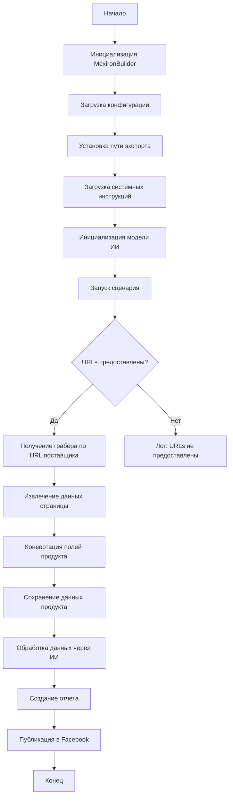
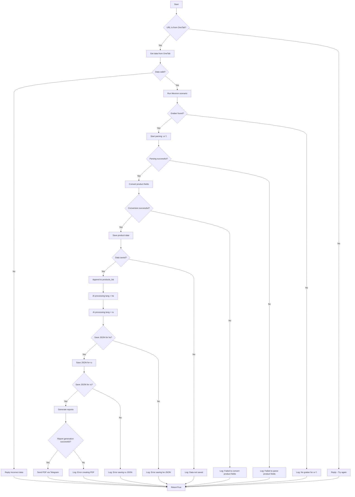

# Сценарий создания мехирона для Сергея Казаринова

## Обзор

Этот скрипт находится в директории `hypotez/src/endpoints/kazarinov/scenarios` и автоматизирует процесс создания "мехирона" для Сергея Казаринова. Скрипт предназначен для извлечения, парсинга и обработки данных о продуктах от различных поставщиков, их подготовки, обработки с использованием ИИ и интеграции с Facebook для публикации продуктов.

## Подорбней

Этот скрипт используется для автоматизации процесса создания мехирона, что включает в себя сбор данных о продуктах, их обработку с помощью ИИ и публикацию в Facebook. Это позволяет автоматизировать рутинные задачи и экономить время.

## Блок-схема модуля



## Легенда

1. **Start**: Начало выполнения скрипта.
2. **InitMexironBuilder**: Инициализация класса `MexironBuilder`.
3. **LoadConfig**: Загрузка конфигурации из JSON файла.
4. **SetExportPath**: Установка пути для экспорта данных.
5. **LoadSystemInstruction**: Загрузка системных инструкций для модели ИИ.
6. **InitModel**: Инициализация модели Google Generative AI.
7. **RunScenario**: Выполнение основного сценария.
8. **CheckURLs**: Проверка, предоставлены ли URLs для парсинга.
9. **GetGraber**: Получение соответствующего грабера для URL поставщика.
10. **GrabPage**: Извлечение данных страницы с помощью грабера.
11. **ConvertFields**: Конвертация полей продукта в словарь.
12. **SaveData**: Сохранение данных продукта в файл.
13. **ProcessAI**: Обработка данных продукта через модель ИИ.
14. **CreateReport**: Создание HTML и PDF отчетов из обработанных данных.
15. **PostFacebook**: Публикация обработанных данных в Facebook.
16. **End**: Конец выполнения скрипта.

-----------------------

## Классы

### `MexironBuilder`

**Описание**: Класс `MexironBuilder` предназначен для автоматизации процесса создания мехирона, включая парсинг данных о продуктах, их обработку с использованием ИИ и публикацию в Facebook.

**Как работает класс**:
Класс инициализируется с экземпляром Selenium WebDriver, путем экспорта данных, пользовательским именем для процесса мехирона, ценой для обработки, меткой времени для процесса, списком обработанных данных о продуктах, моделью Google Generative AI и конфигурацией, загруженной из JSON.

**Атрибуты**:
- `driver`: Экземпляр Selenium WebDriver, используемый для взаимодействия с веб-страницами.
- `export_path`: Путь для экспорта данных.
- `mexiron_name`: Пользовательское имя для процесса мехирона.
- `price`: Цена для обработки.
- `timestamp`: Метка времени для процесса.
- `products_list`: Список обработанных данных о продуктах.
- `model`: Модель Google Generative AI.
- `config`: Конфигурация, загруженная из JSON.

#### `__init__`

```python
def __init__(self, driver: Driver, mexiron_name: Optional[str] = None):
    """
    Инициализирует класс `MexironBuilder` с необходимыми компонентами.

    Args:
        driver: Экземпляр Selenium WebDriver.
        mexiron_name: Пользовательское имя для процесса мехирона.
    """
    ...
```

**Назначение**: Инициализация экземпляра класса `MexironBuilder`.

**Как работает функция**:
1. Инициализирует основные атрибуты класса, такие как `driver`, `export_path`, `mexiron_name`, `price` и `timestamp`.
2. Устанавливает `products_list` как пустой список.
3. Загружает конфигурацию из JSON-файла с использованием `j_loads_ns`.
4. Загружает системные инструкции из текстового файла.
5. Инициализирует модель Google Generative AI.

**Параметры**:
- `driver` (Driver): Экземпляр Selenium WebDriver.
- `mexiron_name` (Optional[str]): Пользовательское имя для процесса мехирона. По умолчанию `None`.

**Примеры**:
```python
from src.webdriver.driver import Driver
from src.endpoints.kazarinov.scenarios.scenario_pricelist import MexironBuilder

# Инициализация Driver
driver = Driver(...)

# Инициализация MexironBuilder
mexiron_builder = MexironBuilder(driver, mexiron_name='test_mexiron')
```

#### `run_scenario`

```python
def run_scenario(self, system_instruction: Optional[str] = None, price: Optional[str] = None, mexiron_name: Optional[str] = None, urls: Optional[str | List[str]] = None, bot = None) -> bool:
    """
    Выполняет сценарий: парсит продукты, обрабатывает их через ИИ и сохраняет данные.

    Args:
        system_instruction: Системные инструкции для модели ИИ.
        price: Цена для обработки.
        mexiron_name: Пользовательское имя мехирона.
        urls: URLs страниц продуктов.

    Returns:
        `True`, если сценарий выполнен успешно, иначе `False`.
    """
    ...
```

**Назначение**: Запускает основной сценарий работы мехирона.

**Как работает функция**:
1. Проверяет, предоставлен ли URL из OneTab.
2. Если URL из OneTab, извлекает данные.
3. Проверяет валидность данных.
4. Запускает сценарий Mexiron:
   - Получает грабер для каждого URL.
   - Извлекает данные страницы.
   - Конвертирует поля продукта.
   - Сохраняет данные продукта.
   - Обрабатывает данные через ИИ (для языков `he` и `ru`).
   - Сохраняет JSON для каждого языка.
   - Генерирует отчеты.
   - Отправляет PDF через Telegram.
5. Логирует ошибки на каждом этапе.

**Параметры**:
- `system_instruction` (Optional[str]): Системные инструкции для модели ИИ.
- `price` (Optional[str]): Цена для обработки.
- `mexiron_name` (Optional[str]): Пользовательское имя мехирона.
- `urls` (Optional[str | List[str]]): URLs страниц продуктов.
- `bot`: Бот (назначение не указано).

**Возвращает**:
- `bool`: `True`, если сценарий выполнен успешно, иначе `False`.

**Блок-схема**:



**Легенда**:
1. **Начало (Start)**: Сценарий начинает выполнение.
2. **Проверка источника URL (IsOneTab)**:
   - Если URL из OneTab, данные извлекаются из OneTab.
   - Если URL не из OneTab, пользователю отправляется сообщение "Try again".
3. **Проверка валидности данных (IsDataValid)**:
   - Если данные не валидны, пользователю отправляется сообщение "Incorrect data".
   - Если данные валидны, запускается сценарий Mexiron.
4. **Поиск грабера (IsGraberFound)**:
   - Если грабер найден, начинается парсинг страницы.
   - Если грабер не найден, логируется сообщение о том, что грабер отсутствует для данного URL.
5. **Парсинг страницы (StartParsing)**:
   - Если парсинг успешен, данные преобразуются в нужный формат.
   - Если парсинг не удался, логируется ошибка.
6. **Преобразование данных (ConvertProductFields)**:
   - Если преобразование успешно, данные сохраняются.
   - Если преобразование не удалось, логируется ошибка.
7. **Сохранение данных (SaveProductData)**:
   - Если данные сохранены, они добавляются в список продуктов.
   - Если данные не сохранены, логируется ошибка.
8. **Обработка через AI (ProcessAIHe, ProcessAIRu)**:
   - Данные обрабатываются AI для языков `he` (иврит) и `ru` (русский).
9. **Сохранение JSON (SaveHeJSON, SaveRuJSON)**:
   - Результаты обработки сохраняются в формате JSON для каждого языка.
   - Если сохранение не удалось, логируется ошибка.
10. **Генерация отчетов (GenerateReports)**:
    - Создаются HTML и PDF отчеты для каждого языка.
    - Если создание отчета не удалось, логируется ошибка.
11. **Отправка PDF через Telegram (SendPDF)**:
    - PDF-файлы отправляются через Telegram.
    - Если отправка не удалась, логируется ошибка.
12. **Завершение (ReturnTrue)**:
    - Сценарий завершается, возвращая `True`.

**Логи ошибок**:
На каждом этапе, где возможны ошибки, добавлены узлы для логирования ошибок (например, `LogNoGraber`, `LogParsingFailed`, `LogHeJSONError` и т.д.).

**Примеры**:
```python
from src.webdriver.driver import Driver
from src.endpoints.kazarinov.scenarios.scenario_pricelist import MexironBuilder

# Инициализация Driver
driver = Driver(...)

# Инициализация MexironBuilder
mexiron_builder = MexironBuilder(driver)

# Запуск сценария
urls = ['https://example.com/product1', 'https://example.com/product2']
mexiron_builder.run_scenario(urls=urls)
```

#### `get_graber_by_supplier_url`

```python
def get_graber_by_supplier_url(self, url: str):
    """
    Возвращает соответствующий грабер для данного URL поставщика.

    Args:
        url: URL страницы поставщика.

    Returns:
        Экземпляр грабера, если найден, иначе `None`.
    """
    ...
```

**Назначение**: Получение грабера (скрипта для парсинга) на основе URL поставщика.

**Как работает функция**:
1. Определяет поставщика на основе URL.
2. Импортирует соответствующий модуль грабера.
3. Возвращает экземпляр грабера, если он найден.
4. Если грабер не найден, возвращает `None`.

**Параметры**:
- `url` (str): URL страницы поставщика.

**Возвращает**:
- Экземпляр грабера, если найден, иначе `None`.

**Примеры**:
```python
from src.webdriver.driver import Driver
from src.endpoints.kazarinov.scenarios.scenario_pricelist import MexironBuilder

# Инициализация Driver
driver = Driver(...)

# Инициализация MexironBuilder
mexiron_builder = MexironBuilder(driver)

url = 'https://example.com/product1'
graber = mexiron_builder.get_graber_by_supplier_url(url)
if graber:
    print('Graber найден')
else:
    print('Graber не найден')
```

#### `convert_product_fields`

```python
def convert_product_fields(self, f: ProductFields) -> dict:
    """
    Конвертирует поля продукта в словарь.

    Args:
        f: Объект, содержащий парсированные данные о продукте.

    Returns:
        Форматированный словарь данных о продукте.
    """
    ...
```

**Назначение**: Преобразование полей продукта из объекта `ProductFields` в словарь.

**Как работает функция**:
1. Извлекает данные из объекта `ProductFields`.
2. Создает словарь с ключами, соответствующими полям продукта.
3. Возвращает форматированный словарь данных о продукте.

**Параметры**:
- `f` (ProductFields): Объект, содержащий парсированные данные о продукте.

**Возвращает**:
- `dict`: Форматированный словарь данных о продукте.

**Примеры**:
```python
from src.webdriver.driver import Driver
from src.endpoints.kazarinov.scenarios.scenario_pricelist import MexironBuilder
from typing import NamedTuple

# Определение структуры ProductFields (пример)
class ProductFields(NamedTuple):
    title: str
    price: float

# Инициализация Driver
driver = Driver(...)

# Инициализация MexironBuilder
mexiron_builder = MexironBuilder(driver)

# Пример объекта ProductFields
product = ProductFields(title='Example Product', price=99.99)

# Конвертация полей продукта
product_data = mexiron_builder.convert_product_fields(product)
print(product_data)
```

#### `save_product_data`

```python
def save_product_data(self, product_data: dict):
    """
    Сохраняет данные о продукте в файл.

    Args:
        product_data: Форматированные данные о продукте.
    """
    ...
```

**Назначение**: Сохранение данных о продукте в JSON-файл.

**Как работает функция**:
1. Формирует имя файла для сохранения данных, используя `mexiron_name` и `timestamp`.
2. Записывает данные о продукте в JSON-файл.
3. Логирует сообщение об успешном сохранении данных.

**Параметры**:
- `product_data` (dict): Форматированные данные о продукте.

**Примеры**:
```python
from src.webdriver.driver import Driver
from src.endpoints.kazarinov.scenarios.scenario_pricelist import MexironBuilder

# Инициализация Driver
driver = Driver(...)

# Инициализация MexironBuilder
mexiron_builder = MexironBuilder(driver)

# Пример данных о продукте
product_data = {'title': 'Example Product', 'price': 99.99}

# Сохранение данных о продукте
mexiron_builder.save_product_data(product_data)
```

#### `process_ai`

```python
def process_ai(self, products_list: List[str], lang: str, attempts: int = 3) -> tuple | bool:
    """
    Обрабатывает список продуктов через модель ИИ.

    Args:
        products_list: Список словарей данных о продуктах в виде строки.
        attempts: Количество попыток повторного запроса в случае неудачи.

    Returns:
        Обработанный ответ в форматах `ru` и `he`.
    """
    ...
```

**Назначение**: Обработка списка продуктов с использованием модели ИИ для указанного языка.

**Как работает функция**:
1. Преобразует список продуктов в строку JSON.
2. Отправляет запрос в модель ИИ для обработки данных.
3. Повторяет попытки запроса в случае неудачи (до `attempts` раз).
4. Возвращает обработанный ответ.

**Параметры**:
- `products_list` (List[str]): Список словарей данных о продуктах в виде строки.
- `lang` (str): Язык обработки (`ru` или `he`).
- `attempts` (int): Количество попыток повторного запроса в случае неудачи. По умолчанию `3`.

**Возвращает**:
- `tuple | bool`: Обработанный ответ в форматах `ru` и `he`.

**Примеры**:
```python
from src.webdriver.driver import Driver
from src.endpoints.kazarinov.scenarios.scenario_pricelist import MexironBuilder

# Инициализация Driver
driver = Driver(...)

# Инициализация MexironBuilder
mexiron_builder = MexironBuilder(driver)

# Пример списка продуктов
products_list = ["{'title': 'Example Product', 'price': 99.99}"]

# Обработка данных через ИИ для русского языка
result = mexiron_builder.process_ai(products_list, lang='ru')
print(result)
```

#### `post_facebook`

```python
def post_facebook(self, mexiron: SimpleNamespace) -> bool:
    """
    Выполняет сценарий публикации в Facebook.

    Args:
        mexiron: Обработанные данные для публикации.

    Returns:
        `True`, если публикация успешна, иначе `False`.
    """
    ...
```

**Назначение**: Публикация данных о продукте в Facebook.

**Как работает функция**:
1. Вызывает сценарий публикации в Facebook.
2. Передает обработанные данные для публикации.
3. Возвращает результат выполнения сценария.

**Параметры**:
- `mexiron` (SimpleNamespace): Обработанные данные для публикации.

**Возвращает**:
- `bool`: `True`, если публикация успешна, иначе `False`.

**Примеры**:
```python
from src.webdriver.driver import Driver
from src.endpoints.kazarinov.scenarios.scenario_pricelist import MexironBuilder
from types import SimpleNamespace

# Инициализация Driver
driver = Driver(...)

# Инициализация MexironBuilder
mexiron_builder = MexironBuilder(driver)

# Пример данных для публикации
mexiron_data = SimpleNamespace(title='Example Product', price=99.99)

# Публикация в Facebook
result = mexiron_builder.post_facebook(mexiron_data)
print(result)
```

#### `create_report`

```python
def create_report(self, data: dict, html_file: Path, pdf_file: Path):
    """
    Генерирует HTML и PDF отчеты из обработанных данных.

    Args:
        data: Обработанные данные.
        html_file: Путь для сохранения HTML отчета.
        pdf_file: Путь для сохранения PDF отчета.
    """
    ...
```

**Назначение**: Создание HTML и PDF отчетов на основе обработанных данных.

**Как работает функция**:
1. Генерирует HTML отчет из данных.
2. Конвертирует HTML отчет в PDF.
3. Сохраняет HTML и PDF отчеты в указанные файлы.

**Параметры**:
- `data` (dict): Обработанные данные.
- `html_file` (Path): Путь для сохранения HTML отчета.
- `pdf_file` (Path): Путь для сохранения PDF отчета.

**Примеры**:
```python
from src.webdriver.driver import Driver
from src.endpoints.kazarinov.scenarios.scenario_pricelist import MexironBuilder
from pathlib import Path

# Инициализация Driver
driver = Driver(...)

# Инициализация MexironBuilder
mexiron_builder = MexironBuilder(driver)

# Пример данных для отчета
report_data = {'title': 'Example Product', 'price': 99.99}

# Пути для сохранения отчетов
html_path = Path('report.html')
pdf_path = Path('report.pdf')

# Создание отчетов
mexiron_builder.create_report(report_data, html_path, pdf_path)
```

## Использование

Для использования этого скрипта выполните следующие шаги:

1. **Инициализация Driver**: Создайте экземпляр класса `Driver`.
2. **Инициализация MexironBuilder**: Создайте экземпляр класса `MexironBuilder` с драйвером.
3. **Запуск сценария**: Вызовите метод `run_scenario` с необходимыми параметрами.

## Зависимости

- `selenium`: Для веб-автоматизации.
- `asyncio`: Для асинхронных операций.
- `pathlib`: Для обработки путей к файлам.
- `types`: Для создания простых пространств имен.
- `typing`: Для аннотаций типов.
- `src.ai.gemini`: Для обработки данных через ИИ.
- `src.suppliers.*.graber`: Для извлечения данных от различных поставщиков.
- `src.endpoints.advertisement.facebook.scenarios`: Для публикации в Facebook.

## Обработка ошибок

Скрипт включает надежную обработку ошибок, чтобы обеспечить продолжение выполнения даже в случае, если некоторые элементы не найдены или если возникли проблемы с веб-страницей. Это особенно полезно для обработки динамических или нестабильных веб-страниц.

## Вклад

Вклад в этот скрипт приветствуется. Пожалуйста, убедитесь, что любые изменения хорошо документированы и включают соответствующие тесты.

## Лицензия

Этот скрипт лицензирован под MIT License. Подробности смотрите в файле `LICENSE`.