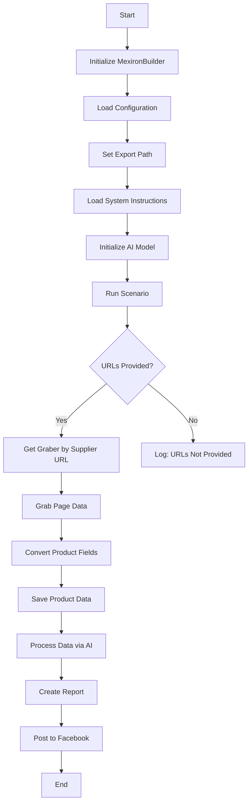
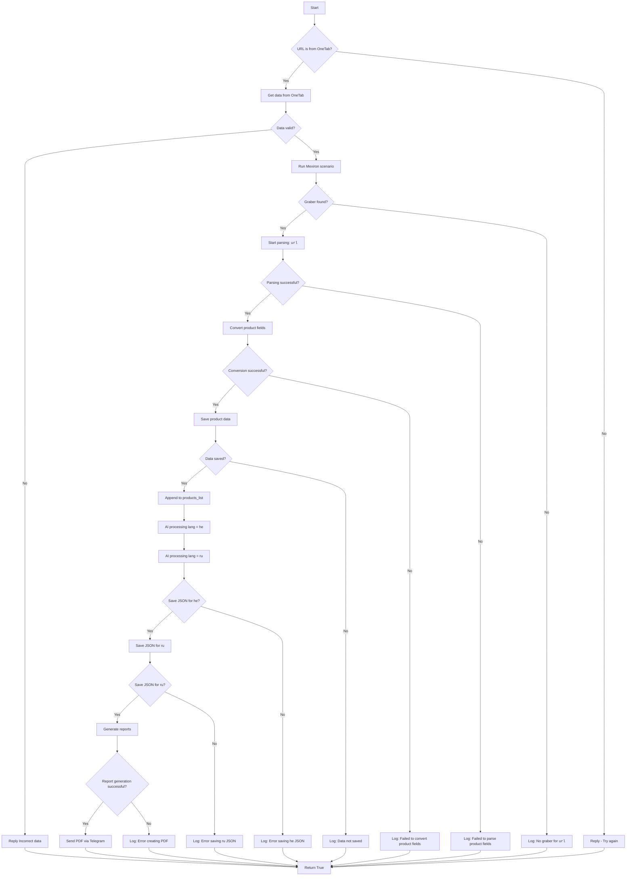

# Модуль `scenario_pricelist.py`

## Обзор

Этот скрипт является частью каталога `hypotez/src/endpoints/kazarinov/scenarios` и предназначен для автоматизации процесса создания "мехирона" для Сергея Казаринова. Скрипт извлекает, анализирует и обрабатывает данные о продуктах от различных поставщиков, подготавливает данные, обрабатывает их с помощью ИИ и интегрируется с Facebook для публикации продуктов.

## Содержание

- [Обзор](#обзор)
- [Ключевые особенности](#ключевые-особенности)
- [Блок-схема модуля](#блок-схема-модуля)
- [Легенда](#легенда)
- [Класс: `MexironBuilder`](#класс-mexironbuilder)
    - [Метод `__init__`](#__init__)
    - [Метод `run_scenario`](#run_scenario)
    - [Метод `get_graber_by_supplier_url`](#get_graber_by_supplier_url)
    - [Метод `convert_product_fields`](#convert_product_fields)
    - [Метод `save_product_data`](#save_product_data)
    - [Метод `process_ai`](#process_ai)
    - [Метод `post_facebook`](#post_facebook)
    - [Метод `create_report`](#create_report)
- [Использование](#использование)
- [Зависимости](#зависимости)
- [Обработка ошибок](#обработка-ошибок)
- [Вклад](#вклад)
- [Лицензия](#лицензия)

## Ключевые особенности

1.  **Извлечение и анализ данных**: Извлекает и анализирует данные о продуктах от различных поставщиков.
2.  **Обработка данных с помощью ИИ**: Обрабатывает извлеченные данные с помощью модели Google Generative AI.
3.  **Хранение данных**: Сохраняет обработанные данные в файлы.
4.  **Генерация отчетов**: Создает отчеты в форматах HTML и PDF из обработанных данных.
5.  **Публикация в Facebook**: Публикует обработанные данные в Facebook.

## Блок-схема модуля



## Легенда

1.  **Start**: Начало выполнения скрипта.
2.  **InitMexironBuilder**: Инициализация класса `MexironBuilder`.
3.  **LoadConfig**: Загрузка конфигурации из JSON-файла.
4.  **SetExportPath**: Установка пути для экспорта данных.
5.  **LoadSystemInstruction**: Загрузка системных инструкций для модели ИИ.
6.  **InitModel**: Инициализация модели Google Generative AI.
7.  **RunScenario**: Выполнение основного сценария.
8.  **CheckURLs**: Проверка, предоставлены ли URL-адреса для анализа.
9.  **GetGraber**: Получение соответствующего грабера для URL-адреса поставщика.
10. **GrabPage**: Извлечение данных страницы с помощью грабера.
11. **ConvertFields**: Преобразование полей продукта в словарь.
12. **SaveData**: Сохранение данных о продукте в файл.
13. **ProcessAI**: Обработка данных о продукте с помощью модели ИИ.
14. **CreateReport**: Создание отчетов HTML и PDF из обработанных данных.
15. **PostFacebook**: Публикация обработанных данных в Facebook.
16. **End**: Конец выполнения скрипта.

## Класс: `MexironBuilder`

- **Атрибуты**:
  - `driver`: Экземпляр Selenium WebDriver.
  - `export_path`: Путь для экспорта данных.
  - `mexiron_name`: Пользовательское имя для процесса мехирона.
  - `price`: Цена за обработку.
  - `timestamp`: Метка времени процесса.
  - `products_list`: Список обработанных данных о продуктах.
  - `model`: Модель Google Generative AI.
  - `config`: Конфигурация, загруженная из JSON.

### `__init__`

**Описание**: Инициализирует класс `MexironBuilder` необходимыми компонентами.

**Параметры**:

- `driver` (Driver): Экземпляр Selenium WebDriver.
- `mexiron_name` (Optional[str], optional): Пользовательское имя для процесса мехирона. По умолчанию `None`.

### `run_scenario`

**Описание**: Выполняет сценарий: анализирует продукты, обрабатывает их с помощью ИИ и сохраняет данные.

**Параметры**:

- `system_instruction` (Optional[str], optional): Системные инструкции для модели ИИ. По умолчанию `None`.
- `price` (Optional[str], optional): Цена за обработку. По умолчанию `None`.
- `mexiron_name` (Optional[str], optional): Пользовательское имя мехирона. По умолчанию `None`.
- `urls` (Optional[str | List[str]], optional): URL-адреса страниц продуктов. По умолчанию `None`.
- `bot` (optional):  Бот для отправки сообщений

**Возвращает**:

- `bool`: `True`, если сценарий выполнен успешно, иначе `False`.

**Блок-схема**:



**Легенда**:

1. **Start**: Начало выполнения сценария.
2. **URL Source Check (IsOneTab)**:
   - Если URL-адрес из OneTab, данные извлекаются из OneTab.
   - Если URL-адрес не из OneTab, пользователю отправляется сообщение "Попробуйте еще раз".
3. **Data Validity Check (IsDataValid)**:
   - Если данные недействительны, пользователю отправляется сообщение "Некорректные данные".
   - Если данные действительны, запускается сценарий Mexiron.
4. **Grabber Search (IsGraberFound)**:
   - Если грабер найден, начинается разбор страницы.
   - Если грабер не найден, генерируется сообщение журнала о том, что для данного URL-адреса нет грабера.
5. **Page Parsing (StartParsing)**:
   - Если разбор успешен, данные преобразуются в требуемый формат.
   - Если разбор не удался, регистрируется ошибка.
6. **Data Conversion (ConvertProductFields)**:
   - Если преобразование выполнено успешно, данные сохраняются.
   - Если преобразование не удалось, регистрируется ошибка.
7. **Data Saving (SaveProductData)**:
   - Если данные сохранены, они добавляются в список продуктов.
   - Если данные не сохранены, регистрируется ошибка.
8. **AI Processing (ProcessAIHe, ProcessAIRu)**:
   - Данные обрабатываются ИИ для языков `he` (иврит) и `ru` (русский).
9. **JSON Saving (SaveHeJSON, SaveRuJSON)**:
   - Результаты обработки сохраняются в формате JSON для каждого языка.
   - Если сохранение не удалось, регистрируется ошибка.
10. **Report Generation (GenerateReports)**:
    - HTML- и PDF-отчеты создаются для каждого языка.
    - Если генерация отчетов не удалась, регистрируется ошибка.
11. **PDF Sending via Telegram (SendPDF)**:
    - PDF-файлы отправляются через Telegram.
    - Если отправка не удалась, регистрируется ошибка.
12. **Completion (ReturnTrue)**:
    - Сценарий завершается возвратом `True`.

**Регистрация ошибок**:
- На каждом этапе, где могут возникнуть ошибки, включены узлы для регистрации ошибок (например, `LogNoGraber`, `LogParsingFailed`, `LogHeJSONError` и т. д.).

### `get_graber_by_supplier_url`

**Описание**: Возвращает соответствующий грабер для заданного URL-адреса поставщика.

**Параметры**:

- `url` (str): URL-адрес страницы поставщика.

**Возвращает**:

- Graber: Экземпляр грабера, если найден, иначе `None`.

### `convert_product_fields`

**Описание**: Преобразует поля продукта в словарь.

**Параметры**:

- `f` (ProductFields): Объект, содержащий проанализированные данные о продукте.

**Возвращает**:

- `dict`: Отформатированный словарь с данными о продукте.

### `save_product_data`

**Описание**: Сохраняет данные о продукте в файл.

**Параметры**:

- `product_data` (dict): Отформатированные данные о продукте.

### `process_ai`

**Описание**: Обрабатывает список продуктов с помощью модели ИИ.

**Параметры**:

- `products_list` (List[str]): Список словарей данных о продуктах в виде строк.
- `lang` (str): Язык обработки.
- `attempts` (int, optional): Количество попыток повтора в случае сбоя. По умолчанию `3`.

**Возвращает**:

- `tuple | bool`: Обработанный ответ в форматах `ru` и `he`, или `False` в случае ошибки.

### `post_facebook`

**Описание**: Выполняет сценарий публикации в Facebook.

**Параметры**:

- `mexiron` (SimpleNamespace): Обработанные данные для публикации.

**Возвращает**:

- `bool`: `True`, если публикация выполнена успешно, иначе `False`.

### `create_report`

**Описание**: Создает отчеты в форматах HTML и PDF из обработанных данных.

**Параметры**:

- `data` (dict): Обработанные данные.
- `html_file` (Path): Путь для сохранения отчета в формате HTML.
- `pdf_file` (Path): Путь для сохранения отчета в формате PDF.

## Использование

Для использования этого скрипта выполните следующие шаги:

1.  **Инициализация драйвера**: Создайте экземпляр класса `Driver`.
2.  **Инициализация MexironBuilder**: Создайте экземпляр класса `MexironBuilder` с драйвером.
3.  **Запуск сценария**: Вызовите метод `run_scenario` с необходимыми параметрами.

### Пример

```python
from src.webdriver.driver import Driver
from src.endpoints.kazarinov.scenarios.scenario_pricelist import MexironBuilder

# Инициализация драйвера
driver = Driver(...)

# Инициализация MexironBuilder
mexiron_builder = MexironBuilder(driver)

# Запуск сценария
urls = ['https://example.com/product1', 'https://example.com/product2']
mexiron_builder.run_scenario(urls=urls)
```

## Зависимости

-   `selenium`: Для веб-автоматизации.
-   `asyncio`: Для асинхронных операций.
-   `pathlib`: Для обработки путей к файлам.
-   `types`: Для создания простых пространств имен.
-   `typing`: Для аннотаций типов.
-   `src.ai.gemini`: Для обработки данных с помощью ИИ.
-   `src.suppliers.*.graber`: Для извлечения данных от различных поставщиков.
-   `src.endpoints.advertisement.facebook.scenarios`: Для публикации в Facebook.

## Обработка ошибок

Скрипт включает надежную обработку ошибок для обеспечения непрерывного выполнения, даже если некоторые элементы не найдены или возникли проблемы с веб-страницей. Это особенно полезно для обработки динамических или нестабильных веб-страниц.

## Вклад

Приветствуются вклады в этот скрипт. Пожалуйста, убедитесь, что любые изменения хорошо документированы и включают соответствующие тесты.

## Лицензия

Этот скрипт лицензирован в соответствии с лицензией MIT. Подробности см. в файле `LICENSE`.