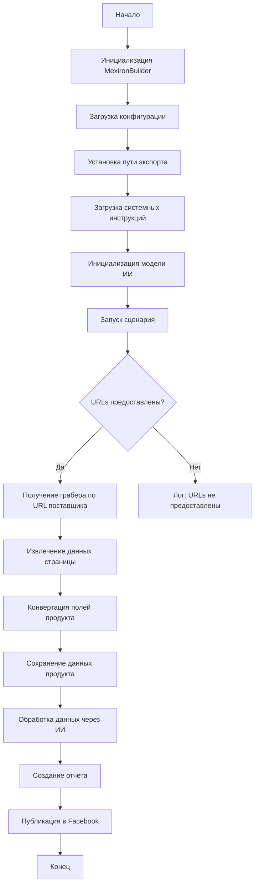

# Сценарий создания мехирона для Сергея Казаринова

## Обзор

Этот скрипт предназначен для автоматизации процесса создания "мехирона" для Сергея Казаринова. Он извлекает, парсит, обрабатывает данные о продуктах от различных поставщиков, обрабатывает их через ИИ и публикует продукты в Facebook.

## Оглавление

* [Сценарий создания мехирона для Сергея Казаринова](#сценарий-создания-мехирона-для-сергея-казаринова)
* [Обзор](#обзор)
* [Основные возможности](#основные-возможности)
* [Структура модуля](#структура-модуля)
* [Легенда](#легенда)
* [Класс: `MexironBuilder`](#класс-mexironbuilder)
* [Использование](#использование)
* [Пример](#пример)
* [Зависимости](#зависимости)
* [Обработка ошибок](#обработка-ошибок)
* [Вклад](#вклад)
* [Лицензия](#лицензия)

## Основные возможности

1. **Извлечение и парсинг данных**: Извлекает и парсит данные о продуктах от различных поставщиков.
2. **Обработка данных через ИИ**: Обрабатывает извлеченные данные через модель Google Generative AI.
3. **Хранение данных**: Сохраняет обработанные данные в файлы.
4. **Генерация отчетов**: Генерирует HTML и PDF отчеты из обработанных данных.
5. **Публикация в Facebook**: Публикует обработанные данные в Facebook.

## Структура модуля

## Легенда

(Описание элементов схемы, как в исходном коде)

## Класс: `MexironBuilder`

### Описание

Класс `MexironBuilder` отвечает за выполнение сценария создания мехирона.

### Атрибуты

* `driver`: Экземпляр Selenium WebDriver.
* `export_path`: Путь для экспорта данных.
* `mexiron_name`: Пользовательское имя для процесса мехирона.
* `price`: Цена для обработки.
* `timestamp`: Метка времени для процесса.
* `products_list`: Список обработанных данных о продуктах.
* `model`: Модель Google Generative AI.
* `config`: Конфигурация, загруженная из JSON.

### Методы

#### `__init__(self, driver: Driver, mexiron_name: Optional[str] = None)`

**Назначение**: Инициализирует класс `MexironBuilder` с необходимыми компонентами.

**Параметры**:
* `driver`: Экземпляр Selenium WebDriver.
* `mexiron_name`: Пользовательское имя для процесса мехирона (по умолчанию `None`).

#### `run_scenario(self, system_instruction: Optional[str] = None, price: Optional[str] = None, mexiron_name: Optional[str] = None, urls: Optional[str | List[str]] = None, bot = None) -> bool`

**Назначение**: Выполняет сценарий: парсит продукты, обрабатывает их через ИИ и сохраняет данные.

**Параметры**:
* `system_instruction`: Системные инструкции для модели ИИ (по умолчанию `None`).
* `price`: Цена для обработки (по умолчанию `None`).
* `mexiron_name`: Пользовательское имя мехирона (по умолчанию `None`).
* `urls`: URLs страниц продуктов (по умолчанию `None`).
* `bot`: необязательный параметр.

**Возвращает**: `True`, если сценарий выполнен успешно, иначе `False`.

#### `get_graber_by_supplier_url(self, url: str)`

**Назначение**: Возвращает соответствующий грабер для данного URL поставщика.

**Параметры**:
* `url`: URL страницы поставщика.

**Возвращает**: Экземпляр грабера, если найден, иначе `None`.

#### `convert_product_fields(self, f: ProductFields) -> dict`

**Назначение**: Конвертирует поля продукта в словарь.

**Параметры**:
* `f`: Объект, содержащий парсированные данные о продукте.

**Возвращает**: Форматированный словарь данных о продукте.

#### `save_product_data(self, product_data: dict)`

**Назначение**: Сохраняет данные о продукте в файл.

**Параметры**:
* `product_data`: Форматированные данные о продукте.

#### `process_ai(self, products_list: List[str], lang: str, attempts: int = 3) -> tuple | bool`

**Назначение**: Обрабатывает список продуктов через модель ИИ.

**Параметры**:
* `products_list`: Список словарей данных о продуктах в виде строки.
* `lang`: язык обработки (например, 'ru', 'he').
* `attempts`: Количество попыток повторного запроса (по умолчанию 3).

**Возвращает**: Обработанный ответ в указанных языках.

#### `post_facebook(self, mexiron: SimpleNamespace) -> bool`

**Назначение**: Выполняет сценарий публикации в Facebook.

**Параметры**:
* `mexiron`: Обработанные данные для публикации.

**Возвращает**: `True`, если публикация успешна, иначе `False`.

#### `create_report(self, data: dict, html_file: Path, pdf_file: Path)`

**Назначение**: Генерирует HTML и PDF отчеты из обработанных данных.

**Параметры**:
* `data`: Обработанные данные.
* `html_file`: Путь для сохранения HTML отчета.
* `pdf_file`: Путь для сохранения PDF отчета.

(Остальные разделы документации, как в исходном коде)