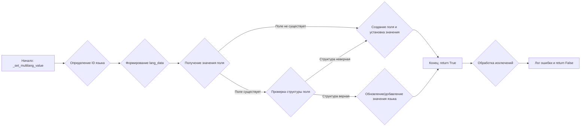

# Модуль product_fields.py

## Обзор

Модуль `product_fields.py` предназначен для описания и управления полями товаров в формате API PrestaShop. Он включает в себя классы и методы для загрузки, установки и преобразования данных полей товаров, а также для работы с мультиязычными значениями и ассоциациями.

## Подробней

Этот модуль является важной частью процесса интеграции и управления данными товаров в PrestaShop. Он обеспечивает стандартизированный способ представления данных о товарах, что упрощает взаимодействие с API PrestaShop и обеспечивает согласованность данных. Модуль включает в себя функциональность для работы с различными типами данных, такими как целые числа, числа с плавающей запятой, даты и строки, а также поддерживает мультиязычность и связи между товарами и другими сущностями, такими как категории, изображения и характеристики.

## Классы

### `ProductFields`

**Описание**: Класс `ProductFields` предназначен для представления и управления полями товара в формате, требуемом API PrestaShop. Он содержит атрибуты для хранения значений различных полей товара и методы для их установки, получения и форматирования.

**Принцип работы**:

1.  **Инициализация**: При создании экземпляра класса `ProductFields` происходит загрузка дефолтных значений полей товара из файла конфигурации.
2.  **Управление полями**: Класс предоставляет свойства (properties) и сеттеры для каждого поля товара, что позволяет получать и устанавливать значения полей с контролем типов и обработкой ошибок.
3.  **Мультиязычность**: Класс поддерживает установку мультиязычных значений для полей, таких как название и описание товара, с использованием метода `_set_multilang_value`.
4.  **Ассоциации**: Класс управляет связями товара с другими сущностями, такими как категории, изображения и характеристики, через атрибут `associations` и методы для добавления и удаления связей.
5.  **Преобразование в словарь**: Класс предоставляет метод `to_dict` для преобразования объекта `ProductFields` в словарь, готовый для отправки в API PrestaShop.

**Атрибуты**:

*   `presta_fields` (SimpleNamespace): Объект SimpleNamespace, хранящий значения полей товара.
*   `id_lang` (int): ID языка, используемый по умолчанию для мультиязычных полей.

**Методы**:

*   `__post_init__()`: Вызывается после инициализации экземпляра класса. Запускает метод `_payload()` для загрузки данных.
*   `_payload()`: Загружает дефолтные значения полей товара из файлов `fields_list.txt` и `product_fields_default_values.json`.
*   `_set_multilang_value()`: Устанавливает мультиязычное значение для заданного поля.
*   `id_product()`: Property для доступа к `id_product`.
*   `id_supplier()`: Property для доступа к `id_supplier`.
*   `id_manufacturer()`: Property для доступа к `id_manufacturer`.
*   `id_category_default()`: Property для доступа к `id_category_default`.
*   `id_shop_default()`: Property для доступа к `id_shop_default`.
*   `id_shop()`: Property для доступа к `id_shop`.
*   `id_tax()`: Property для доступа к `id_tax`.
*   `position_in_category()`: Property для доступа к `position_in_category`.
*   `on_sale()`: Property для доступа к `on_sale`.
*   `online_only()`: Property для доступа к `online_only`.
*   `ean13()`: Property для доступа к `ean13`.
*   `isbn()`: Property для доступа к `isbn`.
*   `upc()`: Property для доступа к `upc`.
*   `mpn()`: Property для доступа к `mpn`.
*   `ecotax()`: Property для доступа к `ecotax`.
*   `minimal_quantity()`: Property для доступа к `minimal_quantity`.
*   `low_stock_threshold()`: Property для доступа к `low_stock_threshold`.
*   `low_stock_alert()`: Property для доступа к `low_stock_alert`.
*   `price()`: Property для доступа к `price`.
*   `wholesale_price()`: Property для доступа к `wholesale_price`.
*   `unity()`: Property для доступа к `unity`.
*   `unit_price_ratio()`: Property для доступа к `unit_price_ratio`.
*   `additional_shipping_cost()`: Property для доступа к `additional_shipping_cost`.
*   `reference()`: Property для доступа к `reference`.
*   `supplier_reference()`: Property для доступа к `supplier_reference`.
*   `location()`: Property для доступа к `location`.
*   `width()`: Property для доступа к `width`.
*   `height()`: Property для доступа к `height`.
*   `depth()`: Property для доступа к `depth`.
*   `weight()`: Property для доступа к `weight`.
*   `volume()`: Property для доступа к `volume`.
*   `out_of_stock()`: Property для доступа к `out_of_stock`.
*   `additional_delivery_times()`: Property для доступа к `additional_delivery_times`.
*   `quantity_discount()`: Property для доступа к `quantity_discount`.
*   `customizable()`: Property для доступа к `customizable`.
*   `uploadable_files()`: Property для доступа к `uploadable_files`.
*   `text_fields()`: Property для доступа к `text_fields`.
*   `active()`: Property для доступа к `active`.
*   `redirect_type()`: Property для доступа к `redirect_type`.
*   `id_type_redirected()`: Property для доступа к `id_type_redirected`.
*   `available_for_order()`: Property для доступа к `available_for_order`.
*   `available_date()`: Property для доступа к `available_date`.
*   `show_condition()`: Property для доступа к `show_condition`.
*   `condition()`: Property для доступа к `condition`.
*   `show_price()`: Property для доступа к `show_price`.
*   `indexed()`: Property для доступа к `indexed`.
*   `visibility()`: Property для доступа к `visibility`.
*   `cache_is_pack()`: Property для доступа к `cache_is_pack`.
*   `cache_has_attachments()`: Property для доступа к `cache_has_attachments`.
*   `is_virtual()`: Property для доступа к `is_virtual`.
*   `cache_default_attribute()`: Property для доступа к `cache_default_attribute`.
*   `date_add()`: Property для доступа к `date_add`.
*   `date_upd()`: Property для доступа к `date_upd`.
*   `advanced_stock_management()`: Property для доступа к `advanced_stock_management`.
*   `pack_stock_type()`: Property для доступа к `pack_stock_type`.
*   `state()`: Property для доступа к `state`.
*   `product_type()`: Property для доступа к `product_type`.
*   `name()`: Property для доступа к `name`.
*   `description()`: Property для доступа к `description`.
*   `description_short()`: Property для доступа к `description_short`.
*   `link_rewrite()`: Property для доступа к `link_rewrite`.
*   `meta_description()`: Property для доступа к `meta_description`.
*   `meta_keywords()`: Property для доступа к `meta_keywords`.
*   `meta_title()`: Property для доступа к `meta_title`.
*   `available_now()`: Property для доступа к `available_now`.
*   `available_later()`: Property для доступа к `available_later`.
*   `delivery_in_stock()`: Property для доступа к `delivery_in_stock`.
*   `delivery_out_stock()`: Property для доступа к `delivery_out_stock`.
*   `delivery_additional_message()`: Property для доступа к `delivery_additional_message`.
*   `affiliate_short_link()`: Property для доступа к `affiliate_short_link`.
*   `affiliate_text()`: Property для доступа к `affiliate_text`.
*   `affiliate_summary()`: Property для доступа к `affiliate_summary`.
*   `affiliate_summary_2()`: Property для доступа к `affiliate_summary_2`.
*   `affiliate_image_small()`: Property для доступа к `affiliate_image_small`.
*   `affiliate_image_medium()`: Property для доступа к `affiliate_image_medium`.
*   `affiliate_image_large()`: Property для доступа к `affiliate_image_large`.
*   `ingredients()`: Property для доступа к `ingredients`.
*   `specification()`: Property для доступа к `specification`.
*   `how_to_use()`: Property для доступа к `how_to_use`.
*   `id_default_image()`: Property для доступа к `id_default_image`.
*   `link_to_video()`: Property для доступа к `link_to_video`.
*   `local_image_path()`: Property для доступа к `local_image_path`.
*   `local_video_path()`: Property для доступа к `local_video_path`.
*   `additional_categories()`: Property для доступа к `additional_categories`.
*   `additional_category_append()`: Добавляет связь с категорией, если ее еще нет.
*   `additional_categories_clear()`: Очищает все связи с категориями.
*   `product_images()`: Property для доступа к `product_images`.
*   `product_image_append()`: Добавляет связь с изображением.
*   `product_images_clear()`: Очищает все связи с изображениями.
*   `images_urls()`: Property для доступа к `images_urls`.
*   `images_urls_append()`: Устанавливает список URL, откуда скачать дополнительные изображения.
*   `product_combinations()`: Property для доступа к `product_combinations`.
*   `product_combination_append()`: Добавляет связь с комбинацией.
*   `product_combinations_clear()`: Очищает все связи с комбинациями.
*   `product_options()`: Property для доступа к `product_options`.
*   `product_options_append()`: Добавляет связь со значением опции продукта.
*   `product_options_clear()`: Очищает все связи со значениями опций продукта.
*   `product_product_features()`: Property для доступа к `product_product_features`.
*   `product_features_append()`: Добавляет связь с характеристикой продукта.
*   `product_features_clear()`: Очищает все связи с характеристиками продукта.
*   `product_product_tags()`: Property для доступа к `product_product_tags`.
*   `product_tag_append()`: Добавляет связь с тегом.
*   `product_tags_clear()`: Очищает все связи с тегами.
*   `product_stock_availables()`: Property для доступа к `product_stock_availables`.
*   `product_stock_available_append()`: Добавляет связь с доступностью на складе.
*   `product_stock_availables_clear()`: Очищает все связи с доступностью на складе.
*   `product_attachments()`: Property для доступа к `product_attachments`.
*   `product_attachment_append()`: Добавляет связь с вложением.
*   `product_attachments_clear()`: Очищает все связи с вложениями.
*   `product_accessories()`: Property для доступа к `product_accessories`.
*   `product_accessory_append()`: Добавляет связь с аксессуаром.
*   `product_accessories_clear()`: Очищает все связи с аксессуарами.
*   `product_bundle()`: Property для доступа к `product_bundle`.
*   `product_bundle_append()`: Добавляет связь с бандлом продукта.
*   `product_bundle_clear()`: Очищает все связи с бандлами продуктов.
*   `to_dict()`: Преобразует объект `ProductFields` в словарь для PrestaShop API.
*   `_format_multilang_value()`: Форматирует мультиязычные значения в список словарей для PrestaShop API.

### `EnumRedirect`

**Описание**: Перечисление `EnumRedirect` определяет возможные типы редиректов для товара.

**Атрибуты**:

*   `ERROR_404`: Редирект на страницу ошибки 404.
*   `REDIRECT_301_PRODUCT`: Постоянный редирект (301) на другой товар.
*   `REDIRECT_302_PRODUCT`: Временный редирект (302) на другой товар.
*   `REDIRECT_301_CATEGORY`: Постоянный редирект (301) на категорию.
*   `REDIRECT_302_CATEGORY`: Временный редирект (302) на категорию.

### `EnumCondition`

**Описание**: Перечисление `EnumCondition` определяет возможные состояния товара.

**Атрибуты**:

*   `NEW`: Новый товар.
*   `USED`: Бывший в употреблении товар.
*   `REFURBISHED`: Восстановленный товар.

### `EnumVisibity`

**Описание**: Перечисление `EnumVisibity` определяет возможные варианты видимости товара.

**Атрибуты**:

*   `BOTH`: Виден в каталоге и при поиске.
*   `CATALOG`: Виден только в каталоге.
*   `SEARCH`: Виден только при поиске.
*   `NONE`: Не виден ни в каталоге, ни при поиске.

### `EnumProductType`

**Описание**: Перечисление `EnumProductType` определяет возможные типы товаров.

**Атрибуты**:

*   `STANDARD`: Стандартный товар.
*   `PACK`: Пакет товаров.
*   `VIRTUAL`: Виртуальный товар.
*   `COMBINATIONS`: Товар с комбинациями.
*   `EMPTY`: Пустой тип.

## Функции

### `ProductFields.__post_init__`

```python
def __post_init__(self):
    """"""
    self._payload()
```

**Назначение**: Метод `__post_init__` вызывается после инициализации объекта класса `ProductFields`.

**Как работает функция**:

1.  Вызывается метод `_payload()`.

```mermaid
graph LR
    A[Начало: Инициализация ProductFields] --> B(Вызов _payload());
    B --> C[Конец: Загрузка данных завершена];
```

**Примеры**:

```python
product_fields = ProductFields()
```

### `ProductFields._payload`

```python
def _payload(self) -> bool:
    """
    Загрузка дефолтных значений полей.
    Returns:
        bool: True, если загрузка прошла успешно, иначе False.
    """
    base_path:Path = __root__ / 'src' / 'endpoints' / 'prestashop'
    presta_fields_list:list =  read_text_file(base_path / 'product_fields' / 'fields_list.txt', as_list=True) 
    if not presta_fields_list:
        logger.error(f"Ошибка загрузки файла со списком полей ")
        ...
        return False

    try:
        self.presta_fields:SimpleNamespace = SimpleNamespace(**{key: None for key in presta_fields_list})
    except Exception as ex:
        logger.error(f"Ошибка конвертации", ex)
        ...
        return

    data_dict: dict = j_loads (base_path  / 'product_fields' / 'product_fields_default_values.json')
    if not data_dict:
        logger.debug(f"Ошибка загрузки полей из файла product_fields_default_values.json")
        ...
        return False
    try:
        for name, value in data_dict.items():
            setattr(self.presta_fields, name, value )
        return True
    except Exception as ex:
        logger.error(f"Exception ", ex)
        ...
        return False
```

**Назначение**: Метод `_payload` загружает дефолтные значения полей товара из файлов `fields_list.txt` и `product_fields_default_values.json`.

**Параметры**:

*   Нет

**Возвращает**:

*   `bool`: `True`, если загрузка прошла успешно, иначе `False`.

**Как работает функция**:

1.  Определяется базовый путь к файлам конфигурации.
2.  Считывается список полей товара из файла `fields_list.txt` с использованием функции `read_text_file`.
3.  Если список полей не был загружен, регистрируется ошибка и возвращается `False`.
4.  Создается объект `SimpleNamespace` с атрибутами, соответствующими полям товара, и значениями `None`.
5.  Загружаются дефолтные значения полей из файла `product_fields_default_values.json` с использованием функции `j_loads`.
6.  Если значения не были загружены, регистрируется отладочное сообщение и возвращается `False`.
7.  Устанавливаются значения атрибутов объекта `presta_fields` из загруженного словаря.
8.  Возвращается `True`, если все операции прошли успешно.

```mermaid
graph LR
    A[Начало: _payload()] --> B{Чтение fields_list.txt};
    B -- Нет данных --> C[Лог ошибки и return False];
    B -- Данные есть --> D{Создание SimpleNamespace};
    D --> E{Чтение product_fields_default_values.json};
    E -- Нет данных --> F[Лог отладки и return False];
    E -- Данные есть --> G{Установка значений атрибутов};
    G --> H[Конец: return True];
```

**Примеры**:

```python
product_fields = ProductFields()
success = product_fields._payload()
if success:
    print("Данные успешно загружены")
else:
    print("Ошибка загрузки данных")
```

### `ProductFields._set_multilang_value`

```python
def _set_multilang_value(self, field_name: str, value: str, id_lang: Optional[int | str] = None) -> bool:
    """
    Устанавливает мультиязычное значение для заданного поля.

    Args:
        field_name (str): Имя поля (например, 'name', 'description').
        value (str): Значение для установки.
        id_lang (Optional[Union[int, str]]): ID языка. Если не указан, используется self.id_lan.

    Описание:
        Функция устанавливает мультиязычное значение для указанного поля объекта.  
        Поле может хранить значения для разных языков.  Значения хранятся в виде списка словарей,
        где каждый словарь представляет собой значение для определенного языка и имеет структуру:

        {'attrs': {'id': 'language_id'}, 'value': 'language_value'}
         {'id': 'language_id'}, 'value': 'language_value'}

        - 'attrs': Словарь, содержащий атрибуты значения.  В данном случае, обязательным атрибутом является 'id',
                   который представляет собой идентификатор языка.
        - 'value': Значение поля для указанного языка.

        Если поле с указанным именем не существует, оно создается. Если поле существует, но не имеет
        ожидаемой структуры (словарь с ключом 'language', содержащим список), поле перезаписывается.
        Если поле существует и имеет правильную структуру, функция пытается обновить значение для
        указанного языка. Если язык уже существует в списке, его значение обновляется. Если язык
        не существует, добавляется новая запись в список.

    Returns:
        bool: True, если значение успешно установлено, False в случае ошибки.
    """
    id_lang: int = int(id_lang) if id_lang else int(self.id_lang)

    # lang_data: dict = {'attrs': {'id': id_lang}, 'value': f'{value}' }
    lang_data: dict = {'@id': id_lang, '#text': f'{value}' }
    try:
        # Get the existing field value, or None if it doesn't exist
        field = getattr(self.presta_fields, field_name, None)
        if field is None:
            # If the field doesn't exist, create a dictionary with the new language data
            setattr(self.presta_fields, field_name, {'language': lang_data})
        else:
            # If the field exists, update or append the new language data to the existing list
            if not isinstance(field, dict) or 'language' not in field or not isinstance(field['language'], list):
                # Если поле не является словарем с ключом 'language', содержащим список, то создаем словарь
                setattr(self.presta_fields, field_name, {'language': lang_data})
            else:
                language_list = field['language']
                found = False
                for i, lang_item in enumerate(language_list):
                    if 'attrs' in lang_item and 'id' in lang_item['attrs'] and str(lang_item['attrs']['id']) == id_lang_str:
                        # Language already exists, update the value
                        language_list[i]['value'] = value
                        found = True
                        break
                if not found:
                    # Language doesn't exist, append the new language data
                    language_list.append(lang_data)

        return True

    except Exception as ex:
        logger.error(f"""Ошибка установки значения в мультиязычное поле {field_name}
        Значение {value}:\n{ex}""")  # Include exception details in the log
        return False
```

**Назначение**: Метод `_set_multilang_value` устанавливает мультиязычное значение для заданного поля объекта `ProductFields`.

**Параметры**:

*   `field_name` (str): Имя поля (например, `'name'`, `'description'`).
*   `value` (str): Значение для установки.
*   `id_lang` (Optional[int  |  str], optional): ID языка. Если не указан, используется `self.id_lang`. По умолчанию `None`.

**Возвращает**:

*   `bool`: `True`, если значение успешно установлено, `False` в случае ошибки.

**Как работает функция**:

1.  Определяет ID языка, используя переданный параметр `id_lang` или значение по умолчанию `self.id_lang`.
2.  Формирует структуру данных для языка в виде словаря `lang_data`.
3.  Пытается получить текущее значение поля `field_name` из объекта `self.presta_fields`.
4.  Если поле не существует, создает его и устанавливает значение `lang_data`.
5.  Если поле существует, проверяет, является ли оно словарем с ключом `'language'`, содержащим список.
6.  Если структура поля не соответствует ожидаемой, перезаписывает поле новым значением `lang_data`.
7.  Если структура поля соответствует ожидаемой, пытается обновить значение для указанного языка в списке.
8.  Если язык уже существует в списке, обновляет его значение.
9.  Если язык не существует в списке, добавляет новую запись в список.
10. Возвращает `True` в случае успеха.
11. В случае возникновения исключения, регистрирует ошибку и возвращает `False`.



**Примеры**:

```python
product_fields = ProductFields()
success = product_fields._set_multilang_value('name', 'Новый продукт', id_lang=2)
if success:
    print("Значение успешно установлено")
else:
    print("Ошибка установки значения")
```

### `ProductFields.to_dict`

```python
def to_dict(self) -> Dict[str, Any]:
    """
    Преобразует объект ProductFields в словарь для PrestaShop API,
    исключая ключи, значения которых равны None или пустой строке,
    и формирует мультиязычные поля в нужном формате. Все поля должны быть представлены как строки.

    Returns:
        Dict[str, Any]: Словарь с полями, готовый для PrestaShop API.
    """
    product_dict = {}

    # -- ps_product fields --
    def str_val(value: Any) -> Optional[str]:
        """Helper function to convert values to strings, handling None."""
        return str(value) if value is not None else None

    if self.id_product is not None:
        product_dict["id_product"] = str_val(self.id_product)
    if self.id_supplier is not None:
        product_dict["id_supplier"] = str_val(self.id_supplier)
    if self.id_manufacturer is not None:
        product_dict["id_manufacturer"] = str_val(self.id_manufacturer)
    if self.id_category_default is not None:
        product_dict["id_category_default"] = str_val(self.id_category_default)
    if self.id_shop_default is not None:
        product_dict["id_shop_default"] = str_val(self.id_shop_default)
    if self.id_shop is not None:
        product_dict["id_shop"] = str_val(self.id_shop)
    if self.id_tax is not None:
        product_dict["id_tax"] = str_val(self.id_tax)
    if self.on_sale is not None:
        product_dict["on_sale"] = str_val(self.on_sale)
    if self.online_only is not None:
        product_dict["online_only"] = str_val(self.online_only)
    if self.ean13:
        product_dict["ean13"] = str_val(self.ean13)
    if self.isbn:
        product_dict["isbn"] = str_val(self.isbn)
    if self.upc:
        product_dict["upc"] = str_val(self.upc)
    if self.mpn:
        product_dict["mpn"] = str_val(self.mpn)
    if self.ecotax:
        product_dict["ecotax"] = str_val(self.ecotax)
    if self.minimal_quantity:
        product_dict["minimal_quantity"] = str_val(self.minimal_quantity)
    if self.low_stock_threshold:
        product_dict["low_stock_threshold"] = str_val(self.low_stock_threshold)
    if self.low_stock_alert:
        product_dict["low_stock_alert"] = str_val(self.low_stock_alert)
    if self.price:
        product_dict["price"] = str_val(self.price)
    if self.wholesale_price:
        product_dict["wholesale_price"] = str_val(self.wholesale_price)
    if self.unity:
        product_dict["unity"] = str_val(self.unity)
    if self.unit_price_ratio:
        product_dict["unit_price_ratio"] = str_val(self.unit_price_ratio)
    if self.additional_shipping_cost:
        product_dict["additional_shipping_cost"] = str_val(self.additional_shipping_cost)
    if self.reference:
        product_dict["reference"] = str_val(self.reference)
    if self.supplier_reference:
        product_dict["supplier_reference"] = str_val(self.supplier_reference)
    if self.location:
        product_dict["location"] = str_val(self.location)
    if self.width:
        product_dict["width"] = str_val(self.width)
    if self.height:
        product_dict["height"] = str_val(self.height)
    if self.depth:
        product_dict["depth"] = str_val(self.depth)
    if self.weight:
        product_dict["weight"] = str_val(self.weight)
    if self.volume:
        product_dict["volume"] = str_val(self.volume)
    if self.out_of_stock:
        product_dict["out_of_stock"] = str_val(self.out_of_stock)
    if self.additional_delivery_times:
        product_dict["additional_delivery_times"] = str_val(self.additional_delivery_times)
    if self.quantity_discount:
        product_dict["quantity_discount"] = str_val(self.quantity_discount)
    if self.customizable:
        product_dict["customizable"] = str_val(self.customizable)
    if self.uploadable_files:
        product_dict["uploadable_files"] = str_val(self.uploadable_files)
    if self.text_fields:
        product_dict["text_fields"] = str_val(self.text_fields)
    if self.active is not None:
        product_dict["active"] = str_val(self.active)
    if self.redirect_type:
        product_dict["redirect_type"] = str_val(self.redirect_type)
    if self.id_type_redirected:
        product_dict["id_type_redirected"] = str_val(self.id_type_redirected)
    if self.available_for_order is not None:
        product_dict["available_for_order"] = str_val(self.available_for_order)
    if self.available_date:
        product_dict["available_date"] = str_val(self.available_date.isoformat() if isinstance(self.available_date,datetime) else self.available_date)
    if self.show_condition is not None:
        product_dict["show_condition"] = str_val(self.show_condition)
    if self.condition:
        product_dict["condition"] = str_val(self.condition)
    if self.show_price is not None:
        product_dict["show_price"] = str_val(self.show_price)
    if self.indexed is not None:
        product_dict["indexed"] = str_val(self.indexed)
    if self.visibility:
        product_dict["visibility"] = str_val(self.visibility)
    if self.cache_is_pack is not None:
        product_dict["cache_is_pack"] = str_val(self.cache_is_pack)
    if self.cache_has_attachments is not None:
        product_dict["cache_has_attachments"] = str_val(self.cache_has_attachments)
    if self.is_virtual is not None:
        product_dict["is_virtual"] = str_val(self.is_virtual)
    if self.cache_default_attribute:
        product_dict["cache_default_attribute"] = str_val(self.cache_default_attribute)
    if self.date_add:
       product_dict["date_add"] = str_val(self.date_add.isoformat() if isinstance(self.date_add,datetime) else self.date_add)
    if self.date_upd:
       product_dict["date_upd"] = str_val(self.date_upd.isoformat()  if isinstance(self.date_upd,datetime) else self.date_upd)
    if self.advanced_stock_management is not None:
        product_dict["advanced_stock_management"] = str_val(self.advanced_stock_management)
    if self.pack_stock_type:
        product_dict["pack_stock_type"] = str_val(self.pack_stock_type)
    if self.state:
        product_dict["state"] = str_val(self.state)
    if self.product_type:
        product_dict["product_type"] = str_val(self.product_type)
    if self.id_default_image:
        product_dict["id_default_image"] = str_val(self.id_default_image)

        
    # -- ps_product_lang fields --
    if self.description:
        product_dict["description"] = self._format_multilang_value(self.description)
    if self.description_short:
        product_dict["description_short"] = self._format_multilang_value(self.description_short)
    if self.link_rewrite:
        product_dict["link_rewrite"] = self._format_multilang_value(self.link_rewrite)
    if self.meta_description:
        product_dict["meta_description"] = self._format_multilang_value(self.meta_description)
    if self.meta_keywords:
        product_dict["meta_keywords"] = self._format_multilang_value(self.meta_keywords)
    if self.meta_title:
        product_dict["meta_title"] = self._format_multilang_value(self.meta_title)
    if self.name:
        product_dict["name"] = self._format_multilang_value(self.name)
    if self.available_now:
        product_dict["available_now"] = self._format_multilang_value(self.available_now)
    if self.available_later:
        product_dict["available_later"] = self._format_multilang_value(self.available_later)
    if self.delivery_in_stock:
        product_dict["delivery_in_stock"] = self._format_multilang_value(self.delivery_in_stock)
    if self.delivery_out_stock:
        product_dict["delivery_out_stock"]