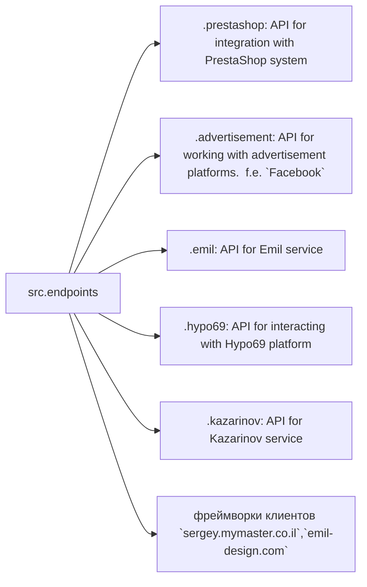

# Модуль конечных точек взаимодействия с потребителями данных

## Обзор

Модуль `endpoints` предоставляет реализацию API для взаимодействия с потребителями данных.  Каждый подмодуль представляет собой отдельный модуль, реализующий API для определенного сервиса.  Модуль `endpoints` включает подмодули для интеграции с различными системами потребителей, обеспечивая взаимодействие с внешними сервисами.

## Оглавление

* [Структура модуля](#структура-модуля)
* [Final Consumer Endpoints](#final-consumer-endpoints)
* [Описание модулей](#описание-модулей)
* [Установка и использование](#установка-и-использование)
* [Вклад в разработку](#вклад-в-разработку)


## Структура модуля



## Final Consumer Endpoints

* **1. PrestaShop**
    Интеграция с API PrestaShop. Использует стандартные API.

* **2. bots**
    Подмодуль для управления интеграцией с ботами Telegram и Discord.

* **3. emil**
    Подмодуль для интеграции с клиентом https://emil-design.com (prestashop + facebook).

* **4. kazarinov**
    Подмодуль для интеграции с поставщиком данных Kazarinov (pricelist creator, facebook promotion).


## Описание модулей

### `prestashop`

Модуль предназначен для интеграции с системой электронной коммерции PrestaShop. Реализует функционал взаимодействия с заказами, товарами и клиентами.

**Основные функции:**

- Создание, редактирование и удаление товаров.
- Управление заказами и пользователями.
(Здесь ожидаются более подробные описания методов,  используемых в модуле `prestashop`.)


### `advertisement`

Модуль предоставляет API для управления рекламными платформами, включая создание кампаний и аналитические отчеты.

**Основные функции:**

- Управление рекламными кампаниями.
- Сбор и обработка данных аналитики.
(Здесь ожидаются более подробные описания методов, используемых в модуле `advertisement`.)


### `emil`

Интерфейс для работы с сервисом Emil, предоставляющим API для обмена данными.

**Основные функции:**

- Обработка и отправка запросов в сервис.
- Сбор данных из API Emil.
(Здесь ожидаются более подробные описания методов, используемых в модуле `emil`.)


### `hypo69`

API для взаимодействия с платформой Hypo69, предоставляющей специфические бизнес-решения.

**Основные функции:**

- Получение данных о клиентах.
- Работа с пользовательскими отчетами.
(Здесь ожидаются более подробные описания методов, используемых в модуле `hypo69`.)


### `kazarinov`

Модуль для интеграции с сервисом Kazarinov. Поддерживает функционал аналитики и обмена данными.

**Основные функции:**

- Интеграция данных между системами.
- Создание отчетов и аналитика.
(Здесь ожидаются более подробные описания методов, используемых в модуле `kazarinov`.)


## Установка и использование

### Установка

Для начала работы убедитесь, что установлены все зависимости проекта. Используйте команду:

```bash
pip install -r requirements.txt
```

### Использование

Импортируйте нужный модуль в свой код:

```python
from src.endpoints.prestashop import PrestashopAPI
from src.endpoints.advertisement import AdvertisementAPI
```

Далее настройте и используйте методы в зависимости от вашего кейса.  (Пример использования методов должен быть добавлен здесь)


## Вклад в разработку

Если вы хотите внести изменения в модуль, соблюдайте следующие правила:

1. Используйте [PEP 8](https://peps.python.org/pep-0008/) для стиля кода.
2. Добавляйте тесты для нового функционала.
3. Оставляйте подробные комментарии к изменениям.

Для вопросов и предложений обращайтесь к владельцу репозитория или оставляйте комментарии в [Issues](#).