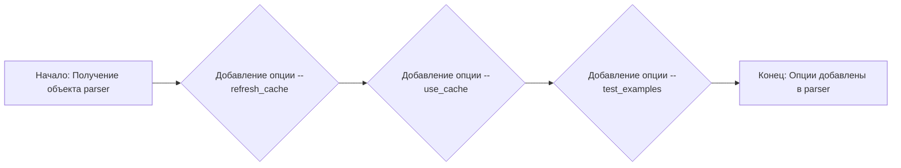
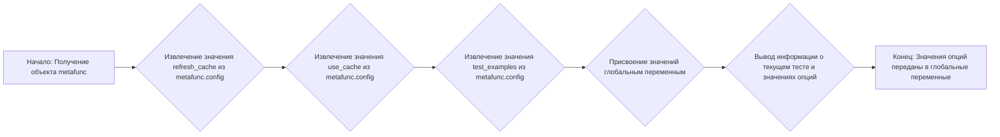

# Модуль настроек и опций для тестирования Tiny Troupe
=================================================================

Модуль предназначен для управления параметрами тестирования API Tiny Troupe, такими как обновление кэша, использование кэша и запуск примеров.

## Обзор

Этот модуль предоставляет хуки для pytest, позволяющие задавать глобальные параметры тестирования через командную строку. Это позволяет контролировать поведение тестов, например, при необходимости обновить кэш API или ускорить выполнение тестов за счет использования кэшированных данных.

## Подробнее

Файл `conftest.py` содержит определения pytest хуков, которые позволяют регистрировать параметры командной строки и использовать их для настройки тестовой среды. Это особенно полезно для управления поведением тестов в зависимости от потребностей: например, можно обновить кэш API для получения самых актуальных данных или использовать кэшированные данные для ускорения выполнения тестов.

## Функции

### `pytest_addoption`

```python
def pytest_addoption(parser):
    """
    Добавляет опции командной строки для управления поведением тестов.

    Args:
        parser: Объект парсера аргументов pytest.

    Returns:
        None
    """
    ...
```

**Назначение**: Добавляет опции командной строки, которые позволяют пользователю контролировать, как тесты будут использовать кэш API и запускать примеры.

**Параметры**:
- `parser`: Объект парсера аргументов pytest, используемый для добавления опций командной строки.

**Возвращает**:
- `None`

**Как работает функция**:

1.  Функция принимает объект `parser` от pytest.
2.  К этому объекту добавляются три опции командной строки:
    *   `--refresh_cache`: При указании, кэш API будет обновлен перед запуском тестов.
    *   `--use_cache`: При указании, тесты будут использовать кэш API для уменьшения количества вызовов к API.
    *   `--test_examples`: При указании, все примеры также будут перезапущены для проверки их работоспособности.
3.  Опции добавляются с помощью метода `addoption` объекта `parser`.



**Примеры**:
Запуск тестов с обновлением кэша:
```bash
pytest --refresh_cache
```
Запуск тестов с использованием кэша:
```bash
pytest --use_cache
```
Запуск тестов с перезапуском примеров:
```bash
pytest --test_examples
```

### `pytest_generate_tests`

```python
def pytest_generate_tests(metafunc):
    """
    Получает значения опций командной строки и передает их в глобальные переменные.

    Args:
        metafunc: Объект metafunc pytest.

    Returns:
        None
    """
    ...
```

**Назначение**: Получает значения опций командной строки, установленные пользователем, и передает их в глобальные переменные для дальнейшего использования в тестовых функциях.

**Параметры**:
- `metafunc`: Объект `metafunc` pytest, содержащий информацию о текущем тесте.

**Возвращает**:
- `None`

**Как работает функция**:

1.  Функция принимает объект `metafunc` от pytest.
2.  Из объекта `metafunc.config` извлекаются значения опций командной строки `--refresh_cache`, `--use_cache` и `--test_examples` с помощью метода `getoption`.
3.  Эти значения присваиваются глобальным переменным `refresh_cache`, `use_cache` и `test_examples`.
4.  Выводится информация о текущем тесте и значениях опций.



**Примеры**:

После запуска pytest с опциями, значения этих опций будут доступны через глобальные переменные:

```python
pytest --refresh_cache --use_cache --test_examples
```

```python
# Внутри тестовой функции:
def test_something():
    global refresh_cache, use_cache, test_examples
    if refresh_cache:
        # Обновить кэш
        ...
    if use_cache:
        # Использовать кэш
        ...