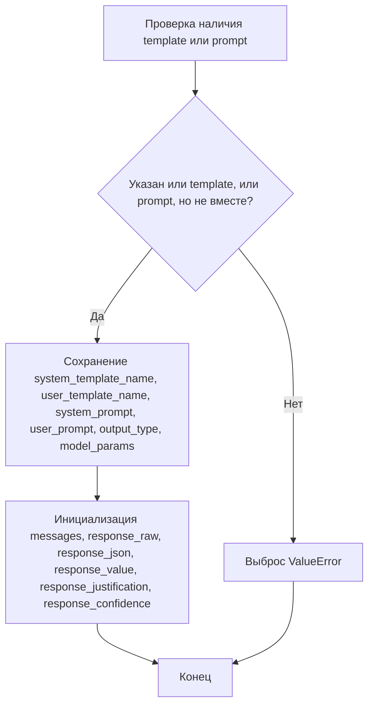
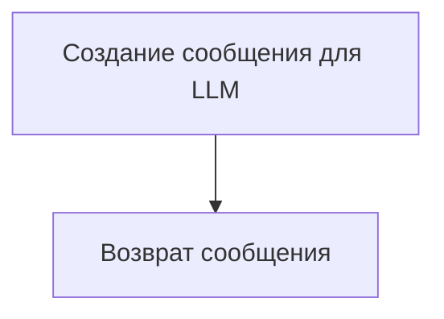
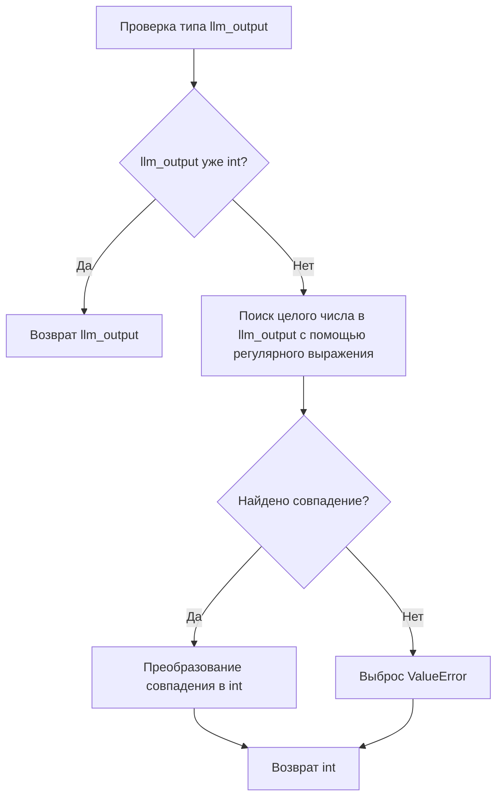
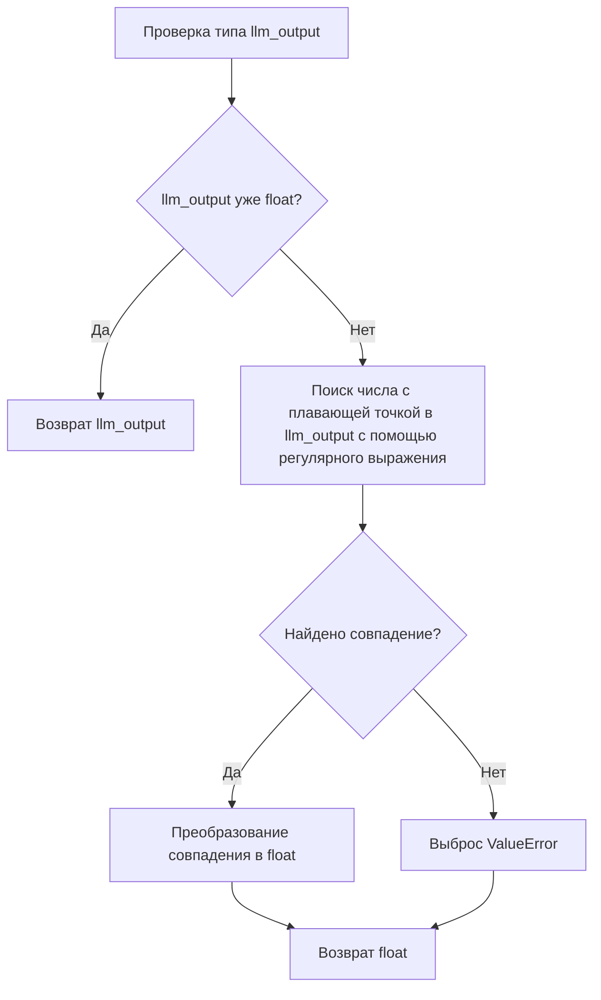
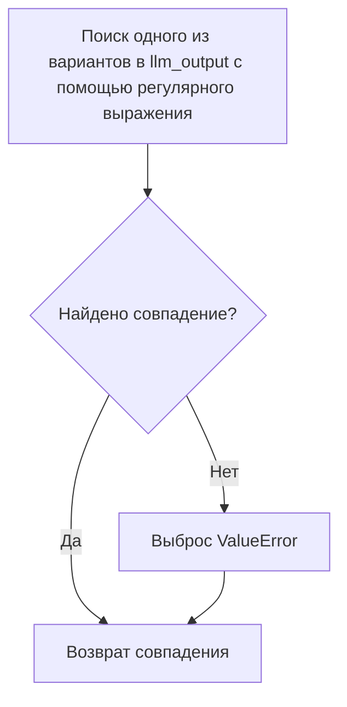
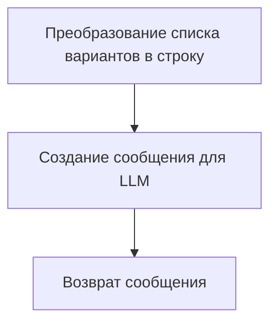
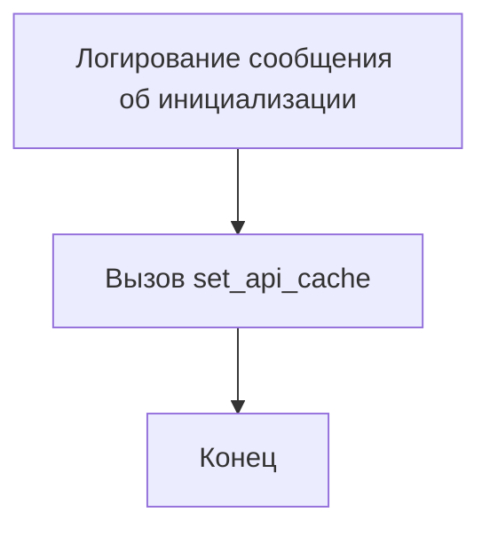
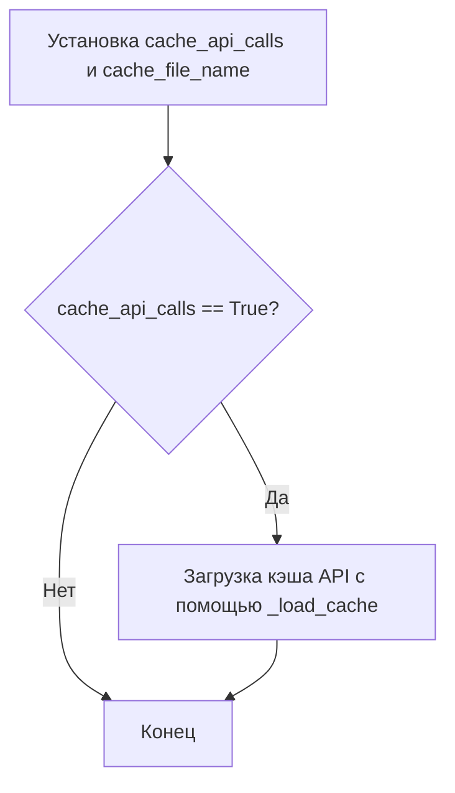
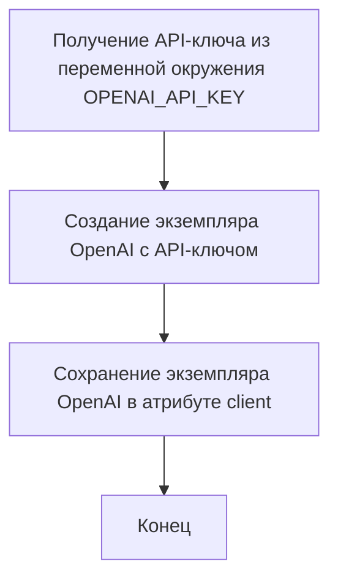

# Модуль для работы с OpenAI API
=================================================

Модуль содержит классы и функции для взаимодействия с OpenAI API, включая поддержку кэширования запросов, обработки различных типов данных и управления клиентами для разных типов API (OpenAI и Azure).

## Обзор

Этот модуль предоставляет инструменты для упрощения работы с OpenAI API, включая:

- Автоматическое кэширование API-вызовов для повышения производительности и снижения затрат.
- Преобразование типов данных для обеспечения соответствия между запросами и ответами API.
- Поддержку различных типов API, таких как OpenAI и Azure OpenAI Service.
- Обработку ошибок и повторные попытки для обеспечения надежности.

## Подробней

Модуль `openai_utils` предоставляет класс `OpenAIClient` для взаимодействия с OpenAI API. Он поддерживает кэширование API-вызовов, обработку различных типов данных и управление клиентами для разных типов API (OpenAI и Azure).
Модуль использует конфигурационный файл `config.ini` для получения параметров OpenAI API, таких как ключ API, модель, максимальное количество токенов и другие параметры.

## Содержание

- [LLMRequest](#LLMRequest)
- [LLMScalarWithJustificationResponse](#LLMScalarWithJustificationResponse)
- [OpenAIClient](#OpenAIClient)
- [AzureClient](#AzureClient)
- [Функции](#Функции)
  - [register_client](#register_client)
  - [_get_client_for_api_type](#_get_client_for_api_type)
  - [client](#client)
  - [force_api_type](#force_api_type)
  - [force_api_cache](#force_api_cache)

## Классы

### `LLMRequest`

**Описание**: Класс `LLMRequest` представляет собой запрос к языковой модели (LLM). Он содержит входные сообщения, конфигурацию модели и вывод модели.

**Аттрибуты**:

- `system_template_name` (str): Имя системного шаблона.
- `user_template_name` (str): Имя пользовательского шаблона.
- `system_prompt` (str): Системный запрос.
- `user_prompt` (str): Пользовательский запрос.
- `output_type` (type): Тип вывода модели.
- `model_params` (dict): Параметры модели.
- `model_output` (Any): Вывод модели.
- `messages` (list): Список сообщений для модели.
- `response_raw` (str): Необработанный ответ модели.
- `response_json` (dict): JSON-ответ модели.
- `response_value` (Any): Значение ответа модели.
- `response_justification` (str): Обоснование ответа модели.
- `response_confidence` (float): Уровень уверенности в ответе модели.

**Методы**:

- `__init__(self, system_template_name: str = None, system_prompt: str = None, user_template_name: str = None, user_prompt: str = None, output_type = None, **model_params)`: Инициализирует экземпляр `LLMRequest` с указанными системными и пользовательскими шаблонами или системными и пользовательскими запросами. Если указан шаблон, соответствующий запрос должен быть `None`, и наоборот.

- `call(self, **rendering_configs)`: Вызывает LLM модель с указанными конфигурациями рендеринга.

- `_coerce_to_bool(self, llm_output)`: Преобразует вывод LLM в логическое значение.

- `_request_bool_llm_message(self)`: Возвращает сообщение для запроса логического значения от LLM.

- `_coerce_to_integer(self, llm_output: str)`: Преобразует вывод LLM в целое число.

- `_request_integer_llm_message(self)`: Возвращает сообщение для запроса целого числа от LLM.

- `_coerce_to_float(self, llm_output: str)`: Преобразует вывод LLM в число с плавающей точкой.

- `_request_float_llm_message(self)`: Возвращает сообщение для запроса числа с плавающей точкой от LLM.

- `_coerce_to_enumerable(self, llm_output: str, options: list)`: Преобразует вывод LLM в одно из указанных значений перечисления.

- `_request_enumerable_llm_message(self, options: list)`: Возвращает сообщение для запроса одного из значений перечисления от LLM.

#### `__init__`
```python
    def __init__(self, system_template_name:str=None, system_prompt:str=None, 
                 user_template_name:str=None, user_prompt:str=None, 
                 output_type=None,\
                 **model_params):
        """
        Initializes an LLMCall instance with the specified system and user templates, or the system and user prompts.\n
        If a template is specified, the corresponding prompt must be None, and vice versa.\n
        """
```
**Назначение**: Инициализирует экземпляр класса `LLMRequest`.

**Параметры**:

- `system_template_name` (str, optional): Имя системного шаблона.
- `system_prompt` (str, optional): Системный запрос.
- `user_template_name` (str, optional): Имя пользовательского шаблона.
- `user_prompt` (str, optional): Пользовательский запрос.
- `output_type` (type, optional): Тип вывода модели.
- `model_params` (dict, optional): Дополнительные параметры модели.

**Как работает функция**:

1. Проверяет, что указан либо шаблон, либо запрос, но не оба одновременно.
2. Сохраняет имена шаблонов и тексты запросов.
3. Удаляет отступы в текстах запросов с помощью `textwrap.dedent`.
4. Сохраняет тип вывода и параметры модели.
5. Инициализирует пустой список сообщений и атрибуты для хранения ответов модели.



**Примеры**:

```python
request = LLMRequest(system_prompt="You are a helpful assistant.", user_prompt="What is 2+2?", output_type=int)
```

#### `call`
```python
    def call(self, **rendering_configs):\n
        """\n
        Calls the LLM model with the specified rendering configurations.\n
        Args:
            rendering_configs: The rendering configurations (template variables) to use when composing the initial messages.\n
        Returns:\n
            The content of the model response.\n
        """
```

**Назначение**: Вызывает LLM модель с указанными конфигурациями рендеринга.

**Параметры**:

- `rendering_configs` (dict, optional): Конфигурации рендеринга (переменные шаблона), используемые при составлении начальных сообщений.

**Возвращает**:

- Содержимое ответа модели.

**Как работает функция**:

1. Определяет, использовать ли шаблоны или прямые запросы для составления сообщений.
2. Если указаны шаблоны, вызывает `utils.compose_initial_LLM_messages_with_templates` для создания сообщений.
3. Если указаны прямые запросы, создает сообщения с ролями "system" и "user".
4. Настраивает типизацию для вывода, добавляя инструкции для модели о формате ответа (JSON с полями "value", "justification", "confidence").
5. Добавляет сообщение с указанием типа значения ("True"/"False" для bool, число для int, число с плавающей точкой для float, один из вариантов для перечисления).
6. Вызывает LLM модель с помощью `client().send_message` и передает сообщения и параметры модели.
7. Извлекает значение ответа из `model_output`.
8. Если указан тип вывода, извлекает JSON из ответа, а затем извлекает значения полей "value", "justification" и "confidence".
9. Преобразует значение к указанному типу с помощью методов `_coerce_to_bool`, `_coerce_to_integer`, `_coerce_to_float` или `_coerce_to_enumerable`.
10. Возвращает преобразованное значение.

```mermaid
graph TD
    A[Определение использования шаблонов или запросов] --> B{Использовать шаблоны?}
    B -- Да --> C[Вызов utils.compose_initial_LLM_messages_with_templates]
    B -- Нет --> D[Создание сообщений с ролями "system" и "user"]
    D --> E[Настройка типизации для вывода, добавление инструкций для модели]
    E --> F[Вызов LLM модели с помощью client().send_message]
    F --> G[Извлечение значения ответа из model_output]
    G --> H{Указан тип вывода?}
    H -- Да --> I[Извлечение JSON из ответа и значений полей "value", "justification", "confidence"]
    I --> J[Преобразование значения к указанному типу]
    H -- Нет --> J[Прямой возврат значения]
    J --> K[Конец]
```

**Примеры**:

```python
request = LLMRequest(system_prompt="You are a helpful assistant.", user_prompt="What is 2+2?", output_type=int)
result = request.call()
print(result)
```

#### `_coerce_to_bool`
```python
    def _coerce_to_bool(self, llm_output):\n
        """\n
        Coerces the LLM output to a boolean value.\n
        This method looks for the string "True", "False", "Yes", "No", "Positive", "Negative" in the LLM output, such that\n
          - case is neutralized;\n
          - the first occurrence of the string is considered, the rest is ignored. For example,  " Yes, that is true" will be considered "Yes";\n
          - if no such string is found, the method raises an error. So it is important that the prompts actually requests a boolean value. \n
        Args:\n
            llm_output (str, bool): The LLM output to coerce.\n
        Returns:\n
            The boolean value of the LLM output.\n
        """
```

**Назначение**: Преобразует вывод LLM в логическое значение.

**Параметры**:

- `llm_output` (str | bool): Вывод LLM для преобразования.

**Возвращает**:

- Логическое значение вывода LLM.

**Как работает функция**:

1. Проверяет, является ли вывод LLM уже логическим значением. Если да, возвращает его.
2. Ищет первое вхождение строк "True", "False", "Yes", "No", "Positive", "Negative" в выводе LLM, игнорируя регистр.
3. Если найдено совпадение, возвращает `True`, если совпадение "true", "yes" или "positive", и `False`, если совпадение "false", "no" или "negative".
4. Если совпадение не найдено, выбрасывает `ValueError`.

```mermaid
graph TD
    A[Проверка типа llm_output] --> B{llm_output уже bool?}
    B -- Да --> C[Возврат llm_output]
    B -- Нет --> D[Поиск "True", "False", "Yes", "No", "Positive", "Negative" в llm_output]
    D --> E{Найдено совпадение?}
    E -- Да --> F[Определение значения (True или False) на основе совпадения]
    F --> G[Возврат значения]
    E -- Нет --> H[Выброс ValueError]
    H --> G
```

**Примеры**:

```python
request = LLMRequest()
result = request._coerce_to_bool("Yes, that is true")
print(result)  # Вывод: True

result = request._coerce_to_bool("False")
print(result)  # Вывод: False
```

#### `_request_bool_llm_message`
```python
    def _request_bool_llm_message(self):\n
        return {"role": "user", \
                "content": "The `value` field you generate **must** be either \'True\' or \'False\'. This is critical for later processing. If you don\'t know the correct answer, just output \'False\'."}
```

**Назначение**: Возвращает сообщение для запроса логического значения от LLM.

**Возвращает**:

- Словарь, представляющий сообщение для LLM с инструкцией вернуть "True" или "False".

**Как работает функция**:

1. Создает словарь с ролью "user" и содержимым, которое инструктирует LLM вернуть значение "True" или "False" в поле `value`.
2. Возвращает созданный словарь.



**Примеры**:

```python
request = LLMRequest()
message = request._request_bool_llm_message()
print(message)
```

#### `_coerce_to_integer`
```python
    def _coerce_to_integer(self, llm_output:str):\n
        """\n
        Coerces the LLM output to an integer value.\n
        This method looks for the first occurrence of an integer in the LLM output, such that\n
          - the first occurrence of the integer is considered, the rest is ignored. For example,  "There are 3 cats" will be considered 3;\n
          - if no integer is found, the method raises an error. So it is important that the prompts actually requests an integer value. \n
        Args:\n
            llm_output (str, int): The LLM output to coerce.\n
        Returns:\n
            The integer value of the LLM output.\n
        """
```

**Назначение**: Преобразует вывод LLM в целое число.

**Параметры**:

- `llm_output` (str | int): Вывод LLM для преобразования.

**Возвращает**:

- Целое число, полученное из вывода LLM.

**Как работает функция**:

1. Проверяет, является ли вывод LLM уже целым числом. Если да, возвращает его.
2. Ищет первое вхождение целого числа в выводе LLM с помощью регулярного выражения.
3. Если найдено совпадение, преобразует его в целое число и возвращает.
4. Если совпадение не найдено, выбрасывает `ValueError`.



**Примеры**:

```python
request = LLMRequest()
result = request._coerce_to_integer("There are 3 cats")
print(result)  # Вывод: 3

result = request._coerce_to_integer("123")
print(result)  # Вывод: 123
```

#### `_request_integer_llm_message`
```python
    def _request_integer_llm_message(self):\n
        return {"role": "user", \
                "content": "The `value` field you generate **must** be an integer number (e.g., \'1\'). This is critical for later processing.."}
```

**Назначение**: Возвращает сообщение для запроса целого числа от LLM.

**Возвращает**:

- Словарь, представляющий сообщение для LLM с инструкцией вернуть целое число в поле `value`.

**Как работает функция**:

1. Создает словарь с ролью "user" и содержимым, которое инструктирует LLM вернуть целое число (например, '1') в поле `value`.
2. Возвращает созданный словарь.


**Примеры**:

```python
request = LLMRequest()
message = request._request_integer_llm_message()
print(message)
```

#### `_coerce_to_float`
```python
    def _coerce_to_float(self, llm_output:str):\n
        """\n
        Coerces the LLM output to a float value.\n
        This method looks for the first occurrence of a float in the LLM output, such that\n
          - the first occurrence of the float is considered, the rest is ignored. For example,  "The price is $3.50" will be considered 3.50;\n
          - if no float is found, the method raises an error. So it is important that the prompts actually requests a float value. \n
        Args:\n
            llm_output (str, float): The LLM output to coerce.\n
        Returns:\n
            The float value of the LLM output.\n
        """
```

**Назначение**: Преобразует вывод LLM в число с плавающей точкой.

**Параметры**:

- `llm_output` (str | float): Вывод LLM для преобразования.

**Возвращает**:

- Число с плавающей точкой, полученное из вывода LLM.

**Как работает функция**:

1. Проверяет, является ли вывод LLM уже числом с плавающей точкой. Если да, возвращает его.
2. Ищет первое вхождение числа с плавающей точкой в выводе LLM с помощью регулярного выражения.
3. Если найдено совпадение, преобразует его в число с плавающей точкой и возвращает.
4. Если совпадение не найдено, выбрасывает `ValueError`.



**Примеры**:

```python
request = LLMRequest()
result = request._coerce_to_float("The price is $3.50")
print(result)  # Вывод: 3.5

result = request._coerce_to_float("980.16")
print(result)  # Вывод: 980.16
```

#### `_request_float_llm_message`
```python
    def _request_float_llm_message(self):\n
        return {"role": "user", \
                "content": "The `value` field you generate **must** be a float number (e.g., \'980.16\'). This is critical for later processing."}
```

**Назначение**: Возвращает сообщение для запроса числа с плавающей точкой от LLM.

**Возвращает**:

- Словарь, представляющий сообщение для LLM с инструкцией вернуть число с плавающей точкой (например, '980.16') в поле `value`.

**Как работает функция**:

1. Создает словарь с ролью "user" и содержимым, которое инструктирует LLM вернуть число с плавающей точкой (например, '980.16') в поле `value`.
2. Возвращает созданный словарь.


**Примеры**:

```python
request = LLMRequest()
message = request._request_float_llm_message()
print(message)
```

#### `_coerce_to_enumerable`
```python
    def _coerce_to_enumerable(self, llm_output:str, options:list):\n
        """\n
        Coerces the LLM output to one of the specified options.\n
        This method looks for the first occurrence of one of the specified options in the LLM output, such that\n
          - the first occurrence of the option is considered, the rest is ignored. For example,  "I prefer cats" will be considered "cats";\n
          - if no option is found, the method raises an error. So it is important that the prompts actually requests one of the specified options. \n
        Args:\n
            llm_output (str): The LLM output to coerce.\n
            options (list): The list of options to consider.\n
        Returns:\n
            The option value of the LLM output.\n
        """
```

**Назначение**: Преобразует вывод LLM в одно из указанных значений перечисления.

**Параметры**:

- `llm_output` (str): Вывод LLM для преобразования.
- `options` (list): Список допустимых значений перечисления.

**Возвращает**:

- Значение перечисления, полученное из вывода LLM.

**Как работает функция**:

1. Ищет первое вхождение одного из указанных значений перечисления в выводе LLM с помощью регулярного выражения.
2. Если найдено совпадение, возвращает его.
3. Если совпадение не найдено, выбрасывает `ValueError`.



**Примеры**:

```python
request = LLMRequest()
options = ["cats", "dogs", "birds"]
result = request._coerce_to_enumerable("I prefer cats", options)
print(result)  # Вывод: cats

result = request._coerce_to_enumerable("dogs are the best", options)
print(result)  # Вывод: dogs
```

#### `_request_enumerable_llm_message`
```python
    def _request_enumerable_llm_message(self, options:list):\n
        options_list_as_string = \', \'.join([f"\'{o}\'" for o in options])\n
        return {"role": "user", \
                "content": f"The `value` field you generate **must** be exactly one of the following strings: {options_list_as_string}. This is critical for later processing."}
```

**Назначение**: Возвращает сообщение для запроса одного из значений перечисления от LLM.

**Параметры**:

- `options` (list): Список допустимых значений перечисления.

**Возвращает**:

- Словарь, представляющий сообщение для LLM с инструкцией вернуть одно из указанных значений перечисления в поле `value`.

**Как работает функция**:

1. Преобразует список допустимых значений перечисления в строку, разделенную запятыми и заключенную в кавычки.
2. Создает словарь с ролью "user" и содержимым, которое инструктирует LLM вернуть одно из указанных значений перечисления в поле `value`.
3. Возвращает созданный словарь.



**Примеры**:

```python
request = LLMRequest()
options = ["cats", "dogs", "birds"]
message = request._request_enumerable_llm_message(options)
print(message)
```

### `LLMScalarWithJustificationResponse`

**Описание**: Класс `LLMScalarWithJustificationResponse` представляет собой типизированный ответ от LLM (Language Learning Model).

**Аттрибуты**:

- `value` (str | int | float | bool): Значение ответа.
- `justification` (str): Обоснование или объяснение ответа.
- `confidence` (float): Уровень уверенности в ответе.

### `OpenAIClient`

**Описание**: Класс `OpenAIClient` является утилитой для взаимодействия с OpenAI API.

**Методы**:

- `__init__(self, cache_api_calls=default["cache_api_calls"], cache_file_name=default["cache_file_name"])`: Инициализирует экземпляр `OpenAIClient`.

- `set_api_cache(self, cache_api_calls, cache_file_name=default["cache_file_name"])`: Включает или отключает кэширование API-вызовов.

- `_setup_from_config(self)`: Настраивает конфигурации OpenAI API для этого клиента.

- `send_message(self, current_messages, model=default["model"], temperature=default["temperature"], max_tokens=default["max_tokens"], top_p=default["top_p"], frequency_penalty=default["frequency_penalty"], presence_penalty=default["presence_penalty"], stop=[], timeout=default["timeout"], max_attempts=default["max_attempts"], waiting_time=default["waiting_time"], exponential_backoff_factor=default["exponential_backoff_factor"], n=1, response_format=None, echo=False)`: Отправляет сообщение в OpenAI API и возвращает ответ.

- `_raw_model_call(self, model, chat_api_params)`: Вызывает OpenAI API с заданными параметрами. Подклассы должны переопределять этот метод для реализации собственных API-вызовов.

- `_raw_model_response_extractor(self, response)`: Извлекает ответ из ответа API. Подклассы должны переопределять этот метод для реализации собственного извлечения ответов.

- `_count_tokens(self, messages: list, model: str)`: Подсчитывает количество токенов OpenAI в списке сообщений с использованием tiktoken.

- `_save_cache(self)`: Сохраняет кэш API на диск.

- `_load_cache(self)`: Загружает кэш API с диска.

- `get_embedding(self, text, model=default["embedding_model"])`: Получает внедрение заданного текста с использованием указанной модели.

- `_raw_embedding_model_call(self, text, model)`: Вызывает OpenAI API для получения внедрения заданного текста. Подклассы должны переопределять этот метод для реализации собственных API-вызовов.

- `_raw_embedding_model_response_extractor(self, response)`: Извлекает внедрение из ответа API. Подклассы должны переопределять этот метод для реализации собственного извлечения ответов.

#### `__init__`
```python
    def __init__(self, cache_api_calls=default["cache_api_calls"], cache_file_name=default["cache_file_name"]) -> None:\n
        logger.debug("Initializing OpenAIClient")\n
        # should we cache api calls and reuse them?\n
        self.set_api_cache(cache_api_calls, cache_file_name)
```

**Назначение**: Инициализирует экземпляр класса `OpenAIClient`.

**Параметры**:

- `cache_api_calls` (bool, optional): Определяет, следует ли кэшировать вызовы API. По умолчанию берется из `default["cache_api_calls"]`.
- `cache_file_name` (str, optional): Имя файла для кэширования API-вызовов. По умолчанию берется из `default["cache_file_name"]`.

**Как работает функция**:

1. Логирует сообщение об инициализации клиента.
2. Вызывает метод `set_api_cache` для настройки кэширования API-вызовов.



**Примеры**:

```python
client = OpenAIClient(cache_api_calls=True, cache_file_name="my_cache.pickle")
```

#### `set_api_cache`
```python
    def set_api_cache(self, cache_api_calls, cache_file_name=default["cache_file_name"]):\n
        """\n
        Enables or disables the caching of API calls.\n
        Args:\n
        cache_file_name (str): The name of the file to use for caching API calls.\n
        """
```

**Назначение**: Включает или отключает кэширование API-вызовов.

**Параметры**:

- `cache_api_calls` (bool): Определяет, следует ли кэшировать вызовы API.
- `cache_file_name` (str, optional): Имя файла для кэширования API-вызовов. По умолчанию берется из `default["cache_file_name"]`.

**Как работает функция**:

1. Устанавливает значения атрибутов `cache_api_calls` и `cache_file_name`.
2. Если `cache_api_calls` равно `True`, загружает кэш API из файла с помощью метода `_load_cache`.



**Примеры**:

```python
client = OpenAIClient()
client.set_api_cache(True, "my_cache.pickle")
```

#### `_setup_from_config`
```python
    def _setup_from_config(self):\n
        """\n
        Sets up the OpenAI API configurations for this client.\n
        """
```

**Назначение**: Настраивает конфигурации OpenAI API для этого клиента.

**Как работает функция**:

1. Создает экземпляр класса `OpenAI` из библиотеки `openai`, используя API-ключ, полученный из переменной окружения `OPENAI_API_KEY`.
2. Сохраняет экземпляр `OpenAI` в атрибуте `client`.



**Примеры**:

```python
client = OpenAIClient()
client._setup_from_config()
```

#### `send_message`
```python
    def send_message(self,\n
                    current_messages,\n
                     model=default["model"],\n
                     temperature=default["temperature"],\n
                     max_tokens=default["max_tokens"],\n
                     top_p=default["top_p"],\n
                     frequency_penalty=default["frequency_penalty"],\n
                     presence_penalty=default["presence_penalty"],\n
                     stop=[],\n
                     timeout=default["timeout"],\n
                     max_attempts=default["max_attempts"],\n
                     waiting_time=default["waiting_time"],\n
                     exponential_backoff_factor=default["exponential_backoff_factor"],\n
                     n = 1,\n
                     response_format=None,\n
                     echo=False):\n
        """\n
        Sends a message to the OpenAI API and returns the response.\n
        Args:\n
        current_messages (list): A list of dictionaries representing the conversation history.\n
        model (str): The ID of the model to use for generating the response.\n
        temperature (float): Controls the "creativity" of the response. Higher values result in more diverse responses.\n
        max_tokens (int): The maximum number of tokens (words or punctuation marks) to generate in the response.\n
        top_p (float): Controls the "quality" of the response. Higher values result in more coherent responses.\n
        frequency_penalty (float): Controls the "repetition" of the response. Higher values result in less repetition.\n
        presence_penalty (float): Controls the "diversity" of the response. Higher values result in more diverse responses.\n
        stop (str): A string that, if encountered in the generated response, will cause the generation to stop.\n
        max_attempts (int): The maximum number of attempts to make before giving up on generating a response.\n
        timeout (int): The maximum number of seconds to wait for a response from the API.\n
        waiting_time (int): The number of seconds to wait between requests.\n
        exponential_backoff_factor (int): The factor by which to increase the waiting time between requests.\n
        n (int): The number of completions to generate.\n
        response_format: The format of the response, if any.\n
        Returns:\n
        A dictionary representing the generated response.\n
        """
```

**Назначение**: Отправляет сообщение в OpenAI API и возвращает ответ.

**Параметры**:

- `current_messages` (list): Список словарей, представляющих историю разговора.
- `model` (str, optional): ID модели для генерации ответа. По умолчанию берется из `default["model"]`.
- `temperature` (float, optional): Управляет "креативностью" ответа. Более высокие значения приводят к более разнообразным ответам. По умолчанию берется из `default["temperature"]`.
- `max_tokens` (int, optional): Максимальное количество токенов (слов или знаков пунктуации) для генерации в ответе. По умолчанию берется из `default["max_tokens"]`.
- `top_p` (float, optional): Управляет "качеством" ответа. Более высокие значения приводят к более связным ответам. По умолчанию берется из `default["top_p"]`.
- `frequency_penalty` (float, optional): Управляет "повторением" ответа. Более высокие значения приводят к меньшему повторению. По умолчанию берется из `default["frequency_penalty"]`.
- `presence_penalty` (float, optional): Управляет