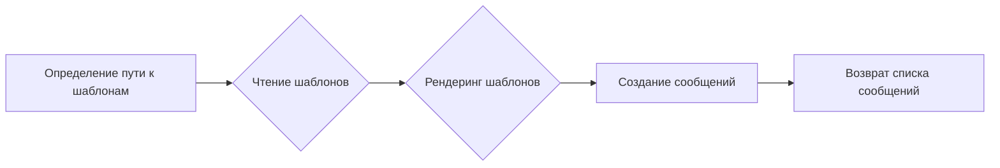
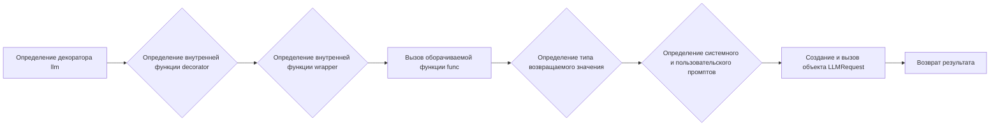
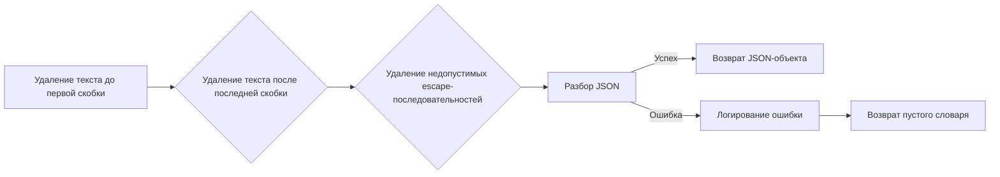
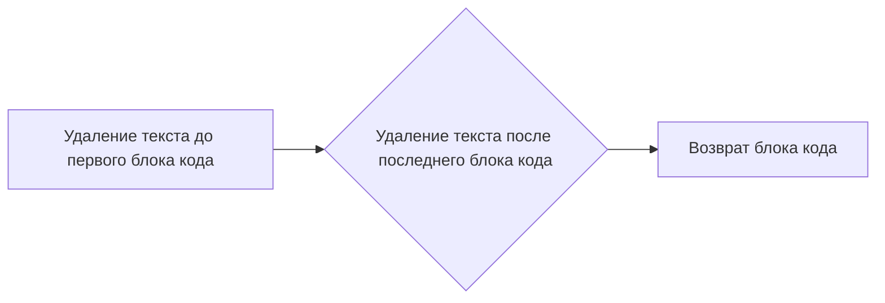
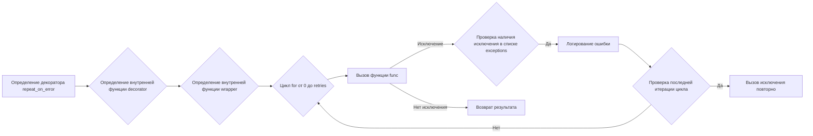
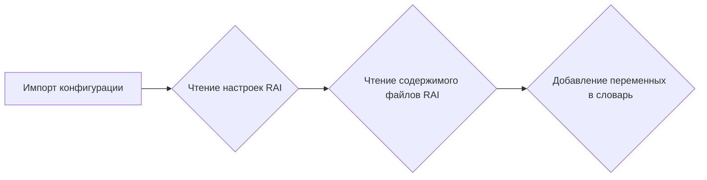

# Модуль для работы с большими языковыми моделями (LLM)
=======================================================

Модуль содержит утилиты для работы с большими языковыми моделями (LLM). Включает функции для составления входных сообщений,
извлечения JSON и кодовых блоков из ответов моделей, управления повторными вызовами при ошибках, добавления переменных шаблонов RAI,
а также утилиты для усечения текста.

## Оглавление
- [Обзор](#обзор)
- [Подробнее](#подробнее)
- [Функции](#функции)
    - [`compose_initial_LLM_messages_with_templates`](#compose_initial_llm_messages_with_templates)
    - [`llm`](#llm)
    - [`extract_json`](#extract_json)
    - [`extract_code_block`](#extract_code_block)
    - [`repeat_on_error`](#repeat_on_error)
    - [`add_rai_template_variables_if_enabled`](#add_rai_template_variables_if_enabled)
    - [`truncate_actions_or_stimuli`](#truncate_actions_or_stimuli)

## Обзор

Этот модуль предоставляет набор инструментов для упрощения взаимодействия с большими языковыми моделями (LLM). Он включает функции для подготовки входных данных, обработки выходных данных и управления поведением модели при возникновении ошибок.

## Подробнее

Модуль содержит функции для:
- Композиции начальных сообщений для LLM с использованием шаблонов.
- Преобразования функций в функции, основанные на LLM, с помощью декоратора `@llm`.
- Извлечения JSON и кодовых блоков из текстовых ответов LLM.
- Повторного выполнения функций при возникновении определенных исключений.
- Добавления переменных шаблонов, связанных с ответственностью в области искусственного интеллекта (RAI).
- Усечения текста в действиях или стимулах для соответствия ограничениям по длине.

## Функции

### `compose_initial_LLM_messages_with_templates`

```python
def compose_initial_LLM_messages_with_templates(system_template_name: str, user_template_name: str = None,
                                                base_module_folder: str = None,
                                                rendering_configs: dict = {}) -> list:
    """
    Composes the initial messages for the LLM model call, under the assumption that it always involves 
    a system (overall task description) and an optional user message (specific task description). 
    These messages are composed using the specified templates and rendering configurations.
    """
```

**Назначение**:
Составляет начальные сообщения для вызова LLM-модели, предполагая, что всегда есть системное сообщение (общее описание задачи) и опциональное пользовательское сообщение (конкретное описание задачи).
Эти сообщения составляются с использованием указанных шаблонов и конфигураций рендеринга.

**Параметры**:
- `system_template_name` (str): Имя файла шаблона для системного сообщения.
- `user_template_name` (str, optional): Имя файла шаблона для пользовательского сообщения. По умолчанию `None`.
- `base_module_folder` (str, optional): Базовая папка модуля, используемая для определения пути к шаблонам. По умолчанию `None`.
- `rendering_configs` (dict, optional): Словарь с конфигурациями рендеринга для шаблонов. По умолчанию `{}`.

**Возвращает**:
- `list`: Список сообщений, где каждое сообщение представляет собой словарь с ключами `role` и `content`.

**Как работает функция**:

1. **Определение пути к шаблонам**: Функция определяет путь к шаблонам системных и пользовательских сообщений на основе переданных параметров `base_module_folder` и `system_template_name`, `user_template_name`. Если `base_module_folder` не указан, используется папка `../prompts/`.
2. **Чтение шаблонов**: Функция читает содержимое файлов шаблонов, используя определенные пути.
3. **Рендеринг шаблонов**: Функция использует библиотеку `chevron` для рендеринга шаблонов с использованием переданных конфигураций рендеринга `rendering_configs`.
4. **Создание сообщений**: Функция создает список сообщений, где каждое сообщение представляет собой словарь с ключами `role` и `content`. Системное сообщение всегда добавляется в список, а пользовательское сообщение добавляется только в том случае, если указан `user_template_name`.



**Примеры**:
```python
# Пример использования с системным и пользовательским шаблонами
messages = compose_initial_LLM_messages_with_templates(
    system_template_name='system_prompt.md',
    user_template_name='user_prompt.md',
    base_module_folder='my_module',
    rendering_configs={'param1': 'value1', 'param2': 'value2'}
)

# Пример использования только с системным шаблоном
messages = compose_initial_LLM_messages_with_templates(
    system_template_name='system_prompt.md',
    rendering_configs={'param1': 'value1'}
)
```

### `llm`

```python
def llm(**model_overrides):
    """
    Decorator that turns the decorated function into an LLM-based function.
    The decorated function must either return a string (the instruction to the LLM),
    or the parameters of the function will be used instead as the instruction to the LLM.
    The LLM response is coerced to the function's annotated return type, if present.

    Usage example:
    @llm(model="gpt-4-0613", temperature=0.5, max_tokens=100)
    def joke():
        return "Tell me a joke."
    """
```

**Назначение**:
Декоратор, который преобразует декорируемую функцию в функцию на основе LLM. Декорируемая функция должна либо возвращать строку (инструкцию для LLM),
либо параметры функции будут использоваться в качестве инструкции для LLM. Ответ LLM приводится к аннотированному возвращаемому типу функции, если он присутствует.

**Параметры**:
- `**model_overrides`: Переопределения параметров модели LLM, таких как `model`, `temperature`, `max_tokens`.

**Как работает функция**:

1. **Определение декоратора**: Функция `llm` является декоратором, который принимает параметры модели LLM (`model_overrides`).
2. **Определение внутренней функции `decorator`**: Внутри `llm` определяется функция `decorator`, которая принимает функцию `func` в качестве аргумента.
3. **Определение внутренней функции `wrapper`**: Внутри `decorator` определяется функция `wrapper`, которая оборачивает функцию `func`.
4. **Вызов оборачиваемой функции**: Функция `wrapper` вызывает функцию `func` с переданными аргументами и ключевыми аргументами. Результат вызова сохраняется в переменной `result`.
5. **Определение типа возвращаемого значения**: Функция `wrapper` определяет тип возвращаемого значения функции `func`, используя `inspect.signature`. Если аннотация возвращаемого типа отсутствует, по умолчанию используется `str`.
6. **Определение системного и пользовательского промптов**: Функция `wrapper` определяет системный и пользовательский промпты для LLM. Системный промпт берется из docstring функции `func`, если он присутствует. Пользовательский промпт формируется на основе результата вызова функции `func`. Если `result` является строкой, он используется в качестве инструкции для LLM. В противном случае, параметры функции используются в качестве инструкции.
7. **Создание и вызов объекта `LLMRequest`**: Функция `wrapper` создает объект `LLMRequest` с использованием системного промпта, пользовательского промпта, типа возвращаемого значения и параметров модели LLM. Затем вызывается метод `call` объекта `LLMRequest` для выполнения запроса к LLM.
8. **Возврат результата**: Функция `wrapper` возвращает результат вызова метода `call` объекта `LLMRequest`.



**Примеры**:
```python
from tinytroupe.openai_utils import LLMRequest

@llm(model="gpt-4-0613", temperature=0.5, max_tokens=100)
def joke():
    """Tell me a joke."""
    return "Расскажи мне анекдот."

@llm(model="gpt-3.5-turbo", temperature=0.7)
def summarize(text: str, max_length: int = 100) -> str:
    """Summarize the given text to a maximum length."""
    return f"Summarize the following text to {max_length} words: {text}"

# Пример вызова функции joke
joke_text = joke()

# Пример вызова функции summarize
summary = summarize(text="Длинный текст для суммирования", max_length=50)
```

### `extract_json`

```python
def extract_json(text: str) -> dict:
    """
    Extracts a JSON object from a string, ignoring: any text before the first 
    opening curly brace; and any Markdown opening (```json) or closing(```) tags.
    """
```

**Назначение**:
Извлекает JSON-объект из строки, игнорируя: любой текст перед первой открывающей фигурной скобкой; и любые открывающие (`\`\`\`json`) или закрывающие (`\`\`\`) теги Markdown.

**Параметры**:
- `text` (str): Строка, из которой нужно извлечь JSON-объект.

**Возвращает**:
- `dict`: Извлеченный JSON-объект в виде словаря. Если извлечение не удалось, возвращается пустой словарь `{}`.

**Вызывает исключения**:
- `json.JSONDecodeError`: Если строка не содержит допустимый JSON-объект.

**Как работает функция**:

1. **Удаление текста до первой скобки**: Функция использует регулярное выражение для удаления любого текста до первой открывающей фигурной или квадратной скобки.
2. **Удаление текста после последней скобки**: Функция использует регулярное выражение для удаления любого текста после последней закрывающей фигурной или квадратной скобки.
3. **Удаление недопустимых escape-последовательностей**: Функция заменяет недопустимые escape-последовательности (`\\'`) на одинарные кавычки (`'`) и (`\\,`) на запятые (`,`).
4. **Разбор JSON**: Функция использует `json.loads` с параметром `strict=False` для разбора JSON-объекта. `strict=False` позволяет корректно обрабатывать новые строки, табуляции и другие специальные символы.
5. **Обработка ошибок**: Если при разборе JSON возникает исключение, функция логирует ошибку и возвращает пустой словарь.



**Примеры**:

```python
from src.logger import logger

# Пример извлечения JSON из строки с окружающим текстом
text = "Некоторый текст перед JSON {\"ключ\": \"значение\"} Некоторый текст после JSON"
json_object = extract_json(text)
print(json_object)  # Вывод: {'ключ': 'значение'}

# Пример извлечения JSON из строки с тегами Markdown
text = "```json\n{\"ключ\": \"значение\"}\n```"
json_object = extract_json(text)
print(json_object)  # Вывод: {'ключ': 'значение'}

# Пример извлечения JSON из строки с недопустимыми escape-последовательностями
text = "{\"ключ\\\": \\\"значение\\\"}"
json_object = extract_json(text)
print(json_object)

# Пример обработки ошибки при извлечении JSON
text = "Недопустимый JSON"
json_object = extract_json(text)
print(json_object)
```

### `extract_code_block`

```python
def extract_code_block(text: str) -> str:
    """
    Extracts a code block from a string, ignoring any text before the first 
    opening triple backticks and any text after the closing triple backticks.
    """
```

**Назначение**:
Извлекает блок кода из строки, игнорируя любой текст перед первыми открывающими тройными обратными кавычками и любой текст после закрывающих тройных обратных кавычек.

**Параметры**:
- `text` (str): Строка, из которой нужно извлечь блок кода.

**Возвращает**:
- `str`: Извлеченный блок кода. Если извлечение не удалось, возвращается пустая строка `""`.

**Как работает функция**:

1. **Удаление текста до первого блока кода**: Функция использует регулярное выражение для удаления любого текста до первых открывающих тройных обратных кавычек.
2. **Удаление текста после последнего блока кода**: Функция использует регулярное выражение для удаления любого текста после последних закрывающих тройных обратных кавычек.
3. **Возврат блока кода**: Функция возвращает извлеченный блок кода.



**Примеры**:

```python
# Пример извлечения блока кода из строки с окружающим текстом
text = "Некоторый текст перед блоком кода ```python\nprint('Hello, world!')\n``` Некоторый текст после блоком кода"
code_block = extract_code_block(text)
print(code_block)  # Вывод: ```python\nprint('Hello, world!')\n```

# Пример извлечения блока кода из строки без окружающего текста
text = "```python\nprint('Hello, world!')\n```"
code_block = extract_code_block(text)
print(code_block)  # Вывод: ```python\nprint('Hello, world!')\n```

# Пример извлечения блока кода из строки без закрывающих кавычек
text = "Некоторый текст перед блоком кода ```python\nprint('Hello, world!')"
code_block = extract_code_block(text)
print(code_block)  # Вывод: пустая строка ""
```

### `repeat_on_error`

```python
def repeat_on_error(retries: int, exceptions: list):
    """
    Decorator that repeats the specified function call if an exception among those specified occurs, 
    up to the specified number of retries. If that number of retries is exceeded, the
    exception is raised. If no exception occurs, the function returns normally.

    Args:
        retries (int): The number of retries to attempt.
        exceptions (list): The list of exception classes to catch.
    """
```

**Назначение**:
Декоратор, который повторяет вызов указанной функции, если возникает исключение из числа указанных, до указанного количества повторных попыток. Если это количество попыток превышено, исключение вызывается. Если исключение не возникает, функция возвращается нормально.

**Параметры**:
- `retries` (int): Количество повторных попыток.
- `exceptions` (list): Список классов исключений, которые нужно перехватывать.

**Как работает функция**:

1. **Определение декоратора**: Функция `repeat_on_error` является декоратором, который принимает количество повторных попыток (`retries`) и список исключений (`exceptions`) в качестве аргументов.
2. **Определение внутренней функции `decorator`**: Внутри `repeat_on_error` определяется функция `decorator`, которая принимает функцию `func` в качестве аргумента.
3. **Определение внутренней функции `wrapper`**: Внутри `decorator` определяется функция `wrapper`, которая оборачивает функцию `func`.
4. **Повторный вызов функции**: Функция `wrapper` выполняет цикл `for` от `0` до `retries`. В каждой итерации цикла функция `func` вызывается с переданными аргументами и ключевыми аргументами.
5. **Обработка исключений**: Если при вызове функции `func` возникает исключение, которое содержится в списке `exceptions`, исключение перехватывается. В журнал записывается сообщение об ошибке. Если это последняя итерация цикла, исключение вызывается повторно. В противном случае, цикл продолжается.
6. **Возврат результата**: Если при вызове функции `func` не возникает исключение, функция возвращает результат вызова.



**Примеры**:

```python
from src.logger import logger
import time

class MyException(Exception):
    pass

@repeat_on_error(retries=3, exceptions=[MyException])
def my_func():
    """Функция, которая может вызывать исключение MyException."""
    print("Вызов функции my_func")
    raise MyException("Произошла ошибка")

try:
    my_func()
except MyException as ex:
    logger.error("Исключение не обработано", ex, exc_info=True)

@repeat_on_error(retries=2, exceptions=[ValueError, TypeError])
def convert_to_int(value):
    """Попытка преобразования значения в int с повторами при ошибках типов."""
    print(f"Попытка преобразования: {value}")
    return int(value)

try:
    result = convert_to_int("abc")
    print(f"Результат: {result}")
except Exception as ex:
    logger.error(f"Преобразование не удалось после нескольких попыток: {ex}", exc_info=True)
```

### `add_rai_template_variables_if_enabled`

```python
def add_rai_template_variables_if_enabled(template_variables: dict) -> dict:
    """
    Adds the RAI template variables to the specified dictionary, if the RAI disclaimers are enabled.
    These can be configured in the config.ini file. If enabled, the variables will then load the RAI disclaimers from the 
    appropriate files in the prompts directory. Otherwise, the variables will be set to None.

    Args:
        template_variables (dict): The dictionary of template variables to add the RAI variables to.

    Returns:
        dict: The updated dictionary of template variables.
    """
```

**Назначение**:
Добавляет переменные шаблона RAI в указанный словарь, если включены отказ от ответственности RAI.
Они могут быть настроены в файле `config.ini`. Если они включены, переменные загрузят отказ от ответственности RAI из
соответствующих файлов в каталоге `prompts`. В противном случае переменные будут установлены в `None`.

**Параметры**:
- `template_variables` (dict): Словарь переменных шаблона, в который нужно добавить переменные RAI.

**Возвращает**:
- `dict`: Обновленный словарь переменных шаблона.

**Как работает функция**:

1. **Импорт конфигурации**: Функция импортирует модуль `config` из `tinytroupe` для доступа к настройкам конфигурации.
2. **Чтение настроек RAI**: Функция читает настройки `RAI_HARMFUL_CONTENT_PREVENTION` и `RAI_COPYRIGHT_INFRINGEMENT_PREVENTION` из файла `config.ini`. Эти настройки определяют, включены ли отказ от ответственности RAI для вредоносного контента и нарушения авторских прав соответственно.
3. **Чтение содержимого файлов RAI**: Функция читает содержимое файлов `rai_harmful_content_prevention.md` и `rai_copyright_infringement_prevention.md`, содержащих отказ от ответственности RAI.
4. **Добавление переменных в словарь**: Если соответствующая настройка RAI включена, функция добавляет переменную в словарь `template_variables`, присваивая ей значение содержимого файла. В противном случае переменной присваивается значение `None`.



**Примеры**:

```python
# Пример использования функции
template_variables = {}
updated_template_variables = add_rai_template_variables_if_enabled(template_variables)
print(updated_template_variables)

# Пример содержимого config.ini
# [Simulation]
# RAI_HARMFUL_CONTENT_PREVENTION = True
# RAI_COPYRIGHT_INFRINGEMENT_PREVENTION = False
```

### `truncate_actions_or_stimuli`

```python
def truncate_actions_or_stimuli(list_of_actions_or_stimuli: Collection[dict], max_content_length: int) -> Collection[str]:
    """
    Truncates the content of actions or stimuli at the specified maximum length. Does not modify the original list.

    Args:
        list_of_actions_or_stimuli (Collection[dict]): The list of actions or stimuli to truncate.
        max_content_length (int): The maximum length of the content.

    Returns:
        Collection[str]: The truncated list of actions or stimuli. It is a new list, not a reference to the original list, 
        to avoid unexpected side effects.
    """
```

**Назначение**:
Усекает содержимое действий или стимулов до указанной максимальной длины. Не изменяет исходный список.

**Параметры**:
- `list_of_actions_or_stimuli` (Collection[dict]): Список действий или стимулов для усечения.
- `max_content_length` (int): Максимальная длина содержимого.

**Возвращает**:
- `Collection[str]`: Усеченный список действий или стимулов. Это новый список, а не ссылка на исходный список, чтобы избежать неожиданных побочных эффектов.

**Как работает функция**:

1. **Клонирование списка**: Функция создает глубокую копию списка `list_of_actions_or_stimuli`, чтобы не изменять исходный список.
2. **Итерация по элементам списка**: Функция перебирает элементы клонированного списка.
3. **Проверка наличия ключа "content"**: Для каждого элемента проверяется наличие ключа "content". Если ключ отсутствует, элемент пропускается.
4. **Проверка наличия ключей "action", "stimulus" или "stimuli"**: Если ключ "content" присутствует, проверяется наличие ключей "action", "stimulus" или "stimuli" в содержимом элемента.
5. **Усечение содержимого**: В зависимости от наличия ключей "action", "stimulus" или "stimuli", функция извлекает соответствующее содержимое и усекает его до указанной максимальной длины, используя функцию `break_text_at_length`.
6. **Возврат усеченного списка**: Функция возвращает клонированный список с усеченным содержимым.

```mermaid
graph LR
    A[Клонирование списка] --> B{Итерация по элементам списка}
    B --> C{Проверка наличия ключа "content"}
    C -- Да --> D{Проверка наличия ключей "action", "stimulus" или "stimuli"}
    D --> E[Усечение содержимого]
    E --> B
    C -- Нет --> B
    B --> F[Возврат усеченного списка]
```

**Примеры**:

```python
from tinytroupe.utils.rendering import break_text_at_length

# Пример использования функции
actions = [
    {"role": "user", "content": {"action": {"content": "Длинное описание действия", "type": "действие"}}},
    {"role": "system", "content": {"stimulus": {"content": "Длинное описание стимула", "type": "стимул"}}},
    {"role": "user", "content": {"stimuli": [{"content": "Длинное описание стимула 1", "type": "стимул"}, {"content": "Длинное описание стимула 2", "type": "стимул"}]}}
]

max_length = 20
truncated_actions = truncate_actions_or_stimuli(actions, max_length)
print(truncated_actions)

# Пример содержимого элемента списка после усечения
# {"role": "user", "content": {"action": {"content": "Длинное описание де", "type": "действие"}}}