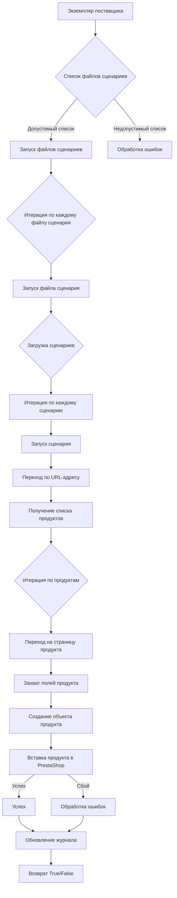

# Модуль `src.scenario`

## Обзор

Модуль `src.scenario` предназначен для автоматизации взаимодействия с поставщиками с использованием сценариев, описанных в файлах JSON. Он оптимизирует процесс извлечения и обработки данных о продуктах с веб-сайтов поставщиков и синхронизирует эту информацию с базой данных (например, PrestaShop). Модуль включает в себя функциональность для чтения сценариев, взаимодействия с веб-сайтами, обработки данных, ведения журналов выполнения и организации всего рабочего процесса.

## Содержание

* [Модуль `src.scenario`](#module-src-scenario)
* [Обзор](#overview)
* [Основные функции модуля](#основные-функции-модуля)
* [Основные компоненты модуля](#основные-компоненты-модуля)
    * [`run_scenario_files(s, scenario_files_list)`](#run_scenario_files-s-scenario_files_list)
    * [`run_scenario_file(s, scenario_file)`](#run_scenario_file-s-scenario_file)
    * [`run_scenario(s, scenario)`](#run_scenario-s-scenario)
    * [`dump_journal(s, journal)`](#dump_journal-s-journal)
    * [`main()`](#main)
* [Пример сценария](#пример-сценария)
* [Принцип работы](#как-это-работает)

## Основные функции модуля

1. **Чтение сценариев**: Загрузка сценариев из файлов JSON, содержащих информацию о продуктах и URL-адреса на веб-сайте поставщика.
2. **Взаимодействие с веб-сайтами**: Обработка URL-адресов из сценариев для извлечения данных о продуктах.
3. **Обработка данных**: Преобразование извлеченных данных в формат, подходящий для базы данных, и сохранение их.
4. **Ведение журнала выполнения**: Ведение журналов с подробной информацией о выполнении сценария и результатах для отслеживания прогресса и выявления ошибок.



## Основные компоненты модуля

### `run_scenario_files(s, scenario_files_list)`

**Описание**: Принимает список файлов сценариев и выполняет их последовательно, вызывая функцию `run_scenario_file` для каждого файла.

**Параметры**:
- `s`: Объект настроек (например, для подключения к базе данных).
- `scenario_files_list` (list): Список путей к файлам сценариев.

**Возвращает**:
- `None`

**Вызывает исключения**:
- `FileNotFoundError`: Если файл сценария не найден.
- `JSONDecodeError`: Если файл сценария содержит недопустимый JSON.

**Как работает функция**:

1. Функция `run_scenario_files` принимает два параметра: `s` (объект настроек) и `scenario_files_list` (список путей к файлам сценариев).
2. Она итерируется по каждому `scenario_file` в `scenario_files_list`.
3. Для каждого файла вызывается функция `run_scenario_file`, которой передаются параметры `s` и `scenario_file`.
4. Функция завершается после обработки всех файлов в списке.

```ascii
Начало
  ↓
Итерация по scenario_files_list
  ↓
run_scenario_file(s, scenario_file)
  ↓
Конец
```

**Примеры**:
```python
# Пример вызова функции run_scenario_files
s = {}  # Объект настроек
scenario_files_list = ['scenario1.json', 'scenario2.json']
run_scenario_files(s, scenario_files_list)
```

### `run_scenario_file(s, scenario_file)`

**Описание**: Загружает сценарии из указанного файла и вызывает `run_scenario` для каждого сценария в файле.

**Параметры**:
- `s`: Объект настроек.
- `scenario_file` (str): Путь к файлу сценария.

**Возвращает**:
- `None`

**Вызывает исключения**:
- `FileNotFoundError`: Если файл сценария не найден.
- `JSONDecodeError`: Если файл сценария содержит недопустимый JSON.
- `Exception`: При любых других проблемах во время выполнения сценария.

**Как работает функция**:

1. Функция `run_scenario_file` принимает два параметра: `s` (объект настроек) и `scenario_file` (путь к файлу сценария).
2. Функция пытается открыть и загрузить JSON-данные из `scenario_file`.
3. Если загрузка прошла успешно, функция итерируется по каждому сценарию в загруженных данных.
4. Для каждого сценария вызывается функция `run_scenario`, которой передаются параметры `s` и `scenario`.
5. Функция завершается после обработки всех сценариев в файле.

```ascii
Начало
  ↓
Загрузка JSON из scenario_file
  ↓
Итерация по сценариям
  ↓
run_scenario(s, scenario)
  ↓
Конец
```

**Примеры**:
```python
# Пример вызова функции run_scenario_file
s = {}  # Объект настроек
scenario_file = 'scenario.json'
run_scenario_file(s, scenario_file)
```

### `run_scenario(s, scenario)`

**Описание**: Обрабатывает индивидуальный сценарий, переходя по URL-адресу, извлекая данные о продукте и сохраняя их в базу данных.

**Параметры**:
- `s`: Объект настроек.
- `scenario` (dict): Словарь, содержащий сценарий (например, с URL-адресом и категориями).

**Возвращает**:
- `None`

**Вызывает исключения**:
- `requests.exceptions.RequestException`: Если есть проблемы с запросом к веб-сайту.
- `Exception`: При любых других проблемах во время обработки сценария.

**Как работает функция**:

1. Функция `run_scenario` принимает два параметра: `s` (объект настроек) и `scenario` (словарь, содержащий информацию о сценарии).
2. Функция извлекает URL-адрес из словаря `scenario`.
3. Функция переходит по указанному URL-адресу и извлекает данные о продукте (подробности этого процесса не раскрываются).
4. Функция сохраняет извлеченные данные в базу данных (метод сохранения не уточняется).
5. Функция завершается после обработки сценария.

```ascii
Начало
  ↓
Извлечение URL-адреса из scenario
  ↓
Переход по URL-адресу
  ↓
Извлечение данных о продукте
  ↓
Сохранение данных в базу данных
  ↓
Конец
```

**Примеры**:
```python
# Пример вызова функции run_scenario
s = {}  # Объект настроек
scenario = {'url': 'https://example.com/product/123', 'category': 'кремы'}
run_scenario(s, scenario)
```

### `dump_journal(s, journal)`

**Описание**: Сохраняет журнал выполнения в файл для последующего анализа.

**Параметры**:
- `s`: Объект настроек.
- `journal` (list): Список записей журнала выполнения.

**Возвращает**:
- `None`

**Вызывает исключения**:
- `Exception`: Если есть проблемы с записью в файл.

**Как работает функция**:

1. Функция `dump_journal` принимает два параметра: `s` (объект настроек) и `journal` (список записей журнала выполнения).
2. Функция открывает файл для записи (имя файла и местоположение определяются настройками в объекте `s`).
3. Функция записывает содержимое журнала (`journal`) в открытый файл.
4. Функция закрывает файл.
5. Функция завершается после записи журнала.

```ascii
Начало
  ↓
Открытие файла для записи
  ↓
Запись журнала в файл
  ↓
Закрытие файла
  ↓
Конец
```

**Примеры**:
```python
# Пример вызова функции dump_journal
s = {}  # Объект настроек (должен содержать параметры для записи в файл)
journal = ['Запись 1', 'Запись 2']
dump_journal(s, journal)
```

### `main()`

**Описание**: Основная функция для запуска модуля.

**Параметры**:
- `None`

**Возвращает**:
- `None`

**Вызывает исключения**:
- `Exception`: При любых критических ошибках во время выполнения.

**Как работает функция**:

1. Функция `main` не принимает параметров.
2. Функция выполняет основную логику модуля, включая чтение сценариев, взаимодействие с веб-сайтами, обработку данных и сохранение результатов. (Подробности не раскрываются).
3. Функция обрабатывает любые критические ошибки, возникающие во время выполнения.
4. Функция завершается после завершения основной логики.

```ascii
Начало
  ↓
Выполнение основной логики модуля
  ↓
Обработка ошибок
  ↓
Конец
```

**Примеры**:
```python
# Пример вызова функции main
main()
```

## Пример сценария

Пример сценария JSON описывает взаимодействие с категориями продуктов на веб-сайте. Он включает URL-адрес, название категории и идентификаторы категорий в базе данных PrestaShop.

```json
{
    "scenarios": {
        "mineral+creams": {
            "url": "https://example.com/category/mineral-creams/",
            "name": "mineral+creams",
            "presta_categories": {
                "default_category": 12345,
                "additional_categories": [12346, 12347]
            }
        }
    }
}
```

## Как это работает

Модуль предназначен для автоматизации процесса получения и обработки данных о продуктах с веб-сайтов поставщиков. Он использует сценарии, описанные в файлах JSON, для определения того, какие URL-адреса необходимо посетить, какие данные извлечь и как их преобразовать для хранения в базе данных PrestaShop.  Основная идея заключается в настройке различных параметров для каждого поставщика или типа продукта, чтобы автоматизировать процесс синхронизации данных.