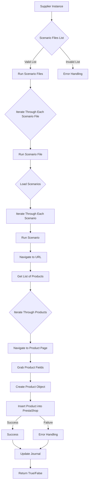

# Модуль `src.scenario`

## Обзор

Модуль `src.scenario` предназначен для автоматизации взаимодействия с поставщиками с использованием сценариев, описанных в файлах JSON. Он оптимизирует процесс извлечения и обработки данных о продуктах с веб-сайтов поставщиков и синхронизации этой информации с базой данных (например, PrestaShop). Модуль включает функциональность для чтения сценариев, взаимодействия с веб-сайтами, обработки данных, ведения журналов выполнения и организации всего рабочего процесса.

## Содержание

* [Модуль `src.scenario`](#module-src-scenario)
* [Обзор](#overview)
* [Основные функции модуля](#core-functions-of-the-module)
* [Основные компоненты модуля](#main-components-of-the_module)
    * [`run_scenario_files(s, scenario_files_list)`](#run_scenario_files-s-scenario_files_list)
    * [`run_scenario_file(s, scenario_file)`](#run_scenario_file-s-scenario_file)
    * [`run_scenario(s, scenario)`](#run_scenario-s-scenario)
    * [`dump_journal(s, journal)`](#dump_journal-s-journal)
    * [`main()`](#main)
* [Пример сценария](#example-scenario)
* [Как это работает](#how-it-works)

## Подорбней

Этот модуль автоматизирует взаимодействие с поставщиками, используя сценарии, описанные в JSON-файлах. Он упрощает извлечение и обработку данных о продуктах с веб-сайтов поставщиков и синхронизирует эту информацию с базой данных, например, PrestaShop.
Модуль `src.scenario` играет важную роль в проекте `hypotez`, обеспечивая автоматизированный процесс получения и обработки данных о товарах от поставщиков. Он позволяет снизить ручной труд, уменьшить количество ошибок и повысить эффективность работы с данными о товарах.

## Основные функции модуля

1. **Чтение сценариев**: Загрузка сценариев из JSON-файлов, содержащих информацию о продуктах и URL-адреса на веб-сайте поставщика.
2. **Взаимодействие с веб-сайтами**: Обработка URL-адресов из сценариев для извлечения данных о продуктах.
3. **Обработка данных**: Преобразование извлеченных данных в формат, подходящий для базы данных, и сохранение их.
4. **Ведение журнала выполнения**: Ведение журналов с подробностями выполнения сценариев и результатами для отслеживания прогресса и выявления ошибок.

## Как это работает



## Основные компоненты модуля

### `run_scenario_files(s, scenario_files_list)`

**Описание**: Принимает список файлов сценариев и выполняет их последовательно, вызывая функцию `run_scenario_file` для каждого файла.

```python
def run_scenario_files(s, scenario_files_list):
    """
    Args:
        s: A settings object (e.g., for database connection).
        scenario_files_list (list): A list of paths to scenario files.

    Returns:
        None

    Raises:
        FileNotFoundError: If a scenario file is not found.
        JSONDecodeError: If a scenario file contains invalid JSON.

     **Как работает функция**:
        Функция принимает список файлов сценариев и выполняет их последовательно. Для каждого файла сценария вызывается функция `run_scenario_file`, которая загружает сценарии из файла и выполняет их.

    """
    ...
```

**Параметры**:
- `s`: Объект настроек (например, для подключения к базе данных).
- `scenario_files_list` (list): Список путей к файлам сценариев.

**Возвращает**:
- `None`

**Вызывает исключения**:
- `FileNotFoundError`: Если файл сценария не найден.
- `JSONDecodeError`: Если файл сценария содержит неверный JSON.

**Примеры**:
```python
# Пример использования функции run_scenario_files
settings = {...} # Объект настроек
scenario_files = ['scenario1.json', 'scenario2.json']
run_scenario_files(settings, scenario_files)
```

### `run_scenario_file(s, scenario_file)`

**Описание**: Загружает сценарии из указанного файла и вызывает `run_scenario` для каждого сценария в файле.

```python
def run_scenario_file(s, scenario_file):
    """
    Args:
        s: A settings object.
        scenario_file (str): Path to the scenario file.

    Returns:
        None

    Raises:
        FileNotFoundError: If the scenario file is not found.
        JSONDecodeError: If the scenario file contains invalid JSON.
        Exception: For any other issues during scenario execution.

     **Как работает функция**:
        Функция принимает путь к файлу сценария, загружает сценарии из этого файла и выполняет их, вызывая функцию `run_scenario` для каждого сценария.

    """
    ...
```

**Параметры**:
- `s`: Объект настроек.
- `scenario_file` (str): Путь к файлу сценария.

**Возвращает**:
- `None`

**Вызывает исключения**:
- `FileNotFoundError`: Если файл сценария не найден.
- `JSONDecodeError`: Если файл сценария содержит неверный JSON.
- `Exception`: При любых других проблемах во время выполнения сценария.

**Примеры**:
```python
# Пример использования функции run_scenario_file
settings = {...} # Объект настроек
scenario_file = 'scenario1.json'
run_scenario_file(settings, scenario_file)
```

### `run_scenario(s, scenario)`

**Описание**: Обрабатывает отдельный сценарий, переходя по URL-адресу, извлекая данные о продукте и сохраняя их в базе данных.

```python
def run_scenario(s, scenario):
    """
    Args:
        s: A settings object.
        scenario (dict): A dictionary containing the scenario (e.g., with URL and categories).

    Returns:
        None

    Raises:
        requests.exceptions.RequestException: If there are issues with the website request.
        Exception: For any other problems during scenario processing.

     **Как работает функция**:
        Функция принимает объект настроек и словарь, содержащий сценарий. Она переходит по URL-адресу, извлекает данные о продукте и сохраняет их в базе данных.

    """
    ...
```

**Параметры**:
- `s`: Объект настроек.
- `scenario` (dict): Словарь, содержащий сценарий (например, с URL-адресом и категориями).

**Возвращает**:
- `None`

**Вызывает исключения**:
- `requests.exceptions.RequestException`: Если есть проблемы с запросом к веб-сайту.
- `Exception`: При любых других проблемах во время обработки сценария.

**Примеры**:
```python
# Пример использования функции run_scenario
settings = {...} # Объект настроек
scenario = {
    "url": "https://example.com/category/mineral-creams/",
    "name": "mineral+creams",
    "presta_categories": {
        "default_category": 12345,
        "additional_categories": [12346, 12347]
    }
}
run_scenario(settings, scenario)
```

### `dump_journal(s, journal)`

**Описание**: Сохраняет журнал выполнения в файл для последующего анализа.

```python
def dump_journal(s, journal):
    """
    Args:
        s: A settings object.
        journal (list): A list of execution log entries.

    Returns:
        None

    Raises:
        Exception: If there are issues writing to the file.

     **Как работает функция**:
        Функция сохраняет журнал выполнения в файл для последующего анализа.

    """
    ...
```

**Параметры**:
- `s`: Объект настроек.
- `journal` (list): Список записей журнала выполнения.

**Возвращает**:
- `None`

**Вызывает исключения**:
- `Exception`: Если есть проблемы с записью в файл.

**Примеры**:
```python
# Пример использования функции dump_journal
settings = {...} # Объект настроек
journal = [...] # Список записей журнала выполнения
dump_journal(settings, journal)
```

### `main()`

**Описание**: Основная функция для запуска модуля.

```python
def main():
    """
    Args:
        None

    Returns:
        None

    Raises:
        Exception: For any critical errors during execution.

     **Как работает функция**:
        Функция является точкой входа в модуль. Она выполняет основные задачи модуля, такие как чтение сценариев, обработка данных и ведение журнала выполнения.

    """
    ...
```

**Параметры**:
- `None`

**Возвращает**:
- `None`

**Вызывает исключения**:
- `Exception`: При любых критических ошибках во время выполнения.

**Примеры**:
```python
# Пример использования функции main
main()
```

## Пример сценария

Пример сценария JSON описывает взаимодействие с категориями продуктов на веб-сайте. Он включает в себя URL-адрес, название категории и идентификаторы категорий в базе данных PrestaShop.

```json
{
    "scenarios": {
        "mineral+creams": {
            "url": "https://example.com/category/mineral-creams/",
            "name": "mineral+creams",
            "presta_categories": {
                "default_category": 12345,
                "additional_categories": [12346, 12347]
            }
        }
    }
}