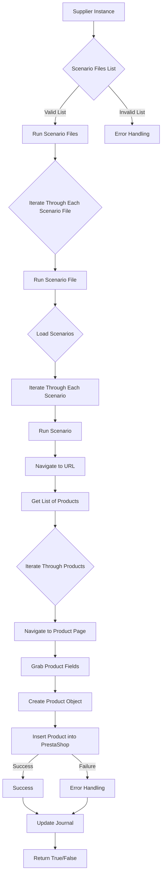
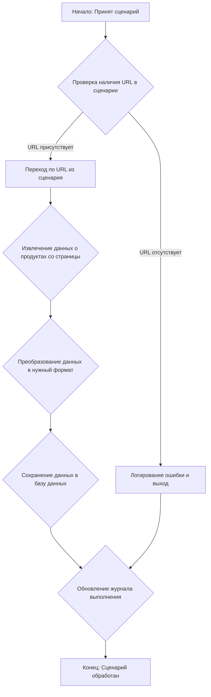

# Модуль `src.scenario`

## Обзор

Модуль `src.scenario` предназначен для автоматизации взаимодействия с поставщиками, используя сценарии, описанные в JSON-файлах. Он адаптирует процесс извлечения и обработки данных о продуктах с веб-сайтов поставщиков и синхронизирует эту информацию с базой данных (например, PrestaShop).  Модуль включает чтение сценариев, взаимодействие с веб-сайтами, обработку данных, запись журнала выполнения и организацию всего процесса.

## Оглавление

* [Модуль `src.scenario`](#модуль-srcscenario)
* [Обзор](#обзор)
* [Основные функции модуля](#основные-функции-модуля)
* [Основные компоненты модуля](#основные-компоненты-модуля)
    * [`run_scenario_files(s, scenario_files_list)`](#run_scenario_files-s-scenario_files_list)
    * [`run_scenario_file(s, scenario_file)`](#run_scenario_file-s-scenario_file)
    * [`run_scenario(s, scenario)`](#run_scenario-s-scenario)
    * [`dump_journal(s, journal)`](#dump_journal-s-journal)
    * [`main()`](#main)
* [Пример сценария](#пример-сценария)
* [Как это работает](#как-это-работает)


## Основные функции модуля

1. **Чтение сценариев**: Загрузка сценариев из JSON-файлов, содержащих информацию о продуктах и их URL на сайте поставщика.
2. **Взаимодействие с веб-сайтами**:  Обработка URL-адресов из сценариев для извлечения данных о продуктах.
3. **Обработка данных**: Преобразование извлечённых данных в формат, подходящий для базы данных, и сохранение в неё.
4. **Запись журнала выполнения**: Ведение журнала с деталями выполнения сценариев и результатами работы для отслеживания процесса и выявления ошибок.



## Основные компоненты модуля

### `run_scenario_files(s, scenario_files_list)`

**Описание**: Принимает список файлов сценариев и выполняет их по очереди, вызывая функцию `run_scenario_file` для каждого файла.

**Параметры**:
- `s`: Объект настроек (например, для соединения с базой данных).
- `scenario_files_list` (list): Список путей к файлам сценариев.

**Возвращает**:
- None

**Вызывает исключения**:
- `FileNotFoundError`: Если файл сценария не найден.
- `JSONDecodeError`: Если файл сценария содержит невалидный JSON.

**Как работает функция**:
Функция `run_scenario_files` принимает список файлов сценариев (`scenario_files_list`) и объект настроек `s`. Затем она итерируется по списку файлов и для каждого файла вызывает функцию `run_scenario_file`, передавая ей объект настроек и текущий файл сценария. Если во время выполнения `run_scenario_file` возникает исключение, оно перехватывается, и в журнал добавляется запись об ошибке.

### `run_scenario_file(s, scenario_file)`

**Описание**: Загружает сценарии из указанного файла и вызывает `run_scenario` для каждого сценария в файле.

**Параметры**:
- `s`: Объект настроек.
- `scenario_file` (str): Путь к файлу сценария.

**Возвращает**:
- None

**Вызывает исключения**:
- `FileNotFoundError`: Если файл сценария не найден.
- `JSONDecodeError`: Если файл сценария содержит невалидный JSON.
- `Exception`: При любых других проблемах при работе со сценариями.

**Как работает функция**:
Функция `run_scenario_file` принимает объект настроек `s` и путь к файлу сценария `scenario_file`. Она пытается открыть и прочитать файл сценария, предполагая, что он содержит JSON-данные. Если чтение файла проходит успешно, она десериализует JSON в объект Python (словарь) и затем итерируется по сценариям, вызывая функцию `run_scenario` для каждого сценария, передавая ей объект настроек и текущий сценарий.  Если в процессе возникают исключения, такие как отсутствие файла или невалидный JSON, они перехватываются и логируются.

### `run_scenario(s, scenario)`

**Описание**: Обрабатывает отдельный сценарий. Переходит по URL, извлекает данные о продуктах и сохраняет их в базе данных.

**Параметры**:
- `s`: Объект настроек.
- `scenario` (dict): Словарь, содержащий сценарий (например, с URL, категориями).

**Возвращает**:
- None

**Вызывает исключения**:
- `requests.exceptions.RequestException`: Если есть проблемы с запросом к веб-сайту.
- `Exception`: При любых других проблемах в процессе обработки сценария.

**Как работает функция**:



Функция `run_scenario` выполняет следующие шаги:
1. **Проверка наличия URL**: Сначала проверяет, указан ли URL в переданном сценарии. Если URL отсутствует, то фиксирует ошибку в журнале и завершает выполнение.
2. **Переход по URL**: Если URL указан, функция пытается перейти по этому адресу, используя библиотеку `requests`.
3. **Извлечение данных о продуктах**: После успешного перехода по URL извлекаются данные о продуктах.
4. **Преобразование данных**: Извлеченные данные преобразуются в формат, необходимый для записи в базу данных.
5. **Сохранение данных в базу данных**: Преобразованные данные сохраняются в базу данных.
6. **Обновление журнала**: В журнал выполнения добавляется запись о результате выполнения сценария.

### `dump_journal(s, journal)`

**Описание**: Сохраняет журнал выполнения сценариев в файл для последующего анализа.

**Параметры**:
- `s`: Объект настроек.
- `journal` (list): Список записей журнала выполнения.

**Возвращает**:
- None

**Вызывает исключения**:
- `Exception`: При проблемах с записью в файл.

**Как работает функция**:
Функция `dump_journal` принимает объект настроек `s` и список записей журнала `journal`. Она пытается открыть файл журнала (имя файла берётся из настроек) и записать туда JSON-представление журнала. Если запись в файл проходит успешно, функция завершается. В случае возникновения исключений, они перехватываются и логируются.

### `main()`

**Описание**: Основная функция для запуска модуля.

**Параметры**:
- None

**Возвращает**:
- None

**Вызывает исключения**:
- `Exception`: При любых критических ошибках во время выполнения.

**Как работает функция**:
Функция `main` является точкой входа в модуль. Она выполняет следующие шаги:
1. **Загрузка настроек**: Загружает настройки из конфигурационного файла.
2. **Инициализация объектов**: Инициализирует необходимые объекты, такие как объект для работы с базой данных.
3. **Запуск сценариев**: Запускает выполнение сценариев, используя `run_scenario_files`.
4. **Обработка результатов**: Обрабатывает результаты выполнения сценариев и записывает их в журнал.
5. **Завершение работы**: Выполняет необходимые действия для завершения работы модуля.

## Пример сценария

Пример сценария JSON описывает взаимодействие с категориями продуктов на веб-сайте. Он содержит URL, имя категории и идентификаторы категорий в базе данных PrestaShop.

```json
{
    "scenarios": {
        "минеральные+кремы": {
            "url": "https://example.com/category/mineral-creams/",
            "name": "минеральные+кремы",
            "presta_categories": {
                "default_category": 12345,
                "additional_categories": [12346, 12347]
            }
        }
    }
}
```

## Как это работает

Модуль загружает сценарии, извлекает данные с веб-сайтов, обрабатывает их и сохраняет в базе данных.  Он ведёт журнал выполнения для отслеживания процесса и выявления ошибок.  В целом, модуль автоматизирует взаимодействие с поставщиками, улучшая эффективность и надежность процесса.