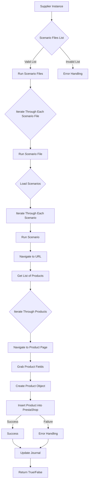

# Модуль `src.scenario`

## Обзор

Модуль `src.scenario` предназначен для автоматизации взаимодействия с поставщиками, используя сценарии, описанные в JSON-файлах. Он адаптирует процесс извлечения и обработки данных о продуктах с веб-сайтов поставщиков и синхронизирует эту информацию с базой данных (например, PrestaShop). Модуль включает чтение сценариев, взаимодействие с веб-сайтами, обработку данных, запись журнала выполнения и организацию всего процесса.

## Подробней

Этот модуль автоматизирует процесс получения информации о товарах от поставщиков и загрузки её в базу данных PrestaShop. Он упрощает взаимодействие с различными источниками данных, обеспечивая согласованность и актуальность информации о продуктах. Модуль особенно полезен для работы с большим объемом данных, поскольку позволяет автоматизировать рутинные операции и снизить вероятность ошибок.

## Оглавление

* [Модуль `src.scenario`](#модуль-srcscenario)
* [Обзор](#обзор)
* [Подробней](#подробней)
* [Основные функции модуля](#основные-функции-модуля)
* [Основные компоненты модуля](#основные-компоненты-модуля)
    * [`run_scenario_files(s, scenario_files_list)`](#run_scenario_files-s-scenario_files_list)
    * [`run_scenario_file(s, scenario_file)`](#run_scenario_file-s-scenario_file)
    * [`run_scenario(s, scenario)`](#run_scenario-s-scenario)
    * [`dump_journal(s, journal)`](#dump_journal-s-journal)
    * [`main()`](#main)
* [Пример сценария](#пример-сценария)
* [Как это работает](#как-это-работает)

## Основные функции модуля

1. **Чтение сценариев**: Загрузка сценариев из JSON-файлов, содержащих информацию о продуктах и их URL на сайте поставщика.
2. **Взаимодействие с веб-сайтами**: Обработка URL-адресов из сценариев для извлечения данных о продуктах.
3. **Обработка данных**: Преобразование извлечённых данных в формат, подходящий для базы данных, и сохранение в неё.
4. **Запись журнала выполнения**: Ведение журнала с деталями выполнения сценариев и результатами работы для отслеживания процесса и выявления ошибок.



## Основные компоненты модуля

### `run_scenario_files(s, scenario_files_list)`

**Назначение**: Принимает список файлов сценариев и последовательно выполняет их, вызывая функцию `run_scenario_file` для каждого файла.

**Параметры**:
- `s`: Объект настроек, содержащий информацию, необходимую для работы с базой данных и другими сервисами.
- `scenario_files_list` (list): Список путей к файлам сценариев. Каждый путь указывает на JSON-файл, содержащий один или несколько сценариев.

**Возвращает**:
- `None`

**Вызывает исключения**:
- `FileNotFoundError`: Если один из файлов сценариев, указанных в списке, не найден.
- `JSONDecodeError`: Если один из файлов сценариев содержит невалидный JSON.

**Как работает функция**:
1. Функция `run_scenario_files` принимает список файлов сценариев `scenario_files_list`.
2. Для каждого `scenario_file` в `scenario_files_list` вызывается функция `run_scenario_file`, которая отвечает за загрузку и выполнение сценариев из данного файла.

```ascii
Начало --> Проверка списка файлов сценариев
Проверка списка файлов сценариев -- Список валидный --> Выполнение сценариев из каждого файла
Проверка списка файлов сценариев -- Список не валидный --> Обработка ошибки
Выполнение сценариев из каждого файла --> Завершение
```

**Примеры**:
```python
# Пример вызова функции с корректным списком файлов
run_scenario_files(settings, ['scenario1.json', 'scenario2.json'])

# Пример вызова функции с некорректным списком файлов (файл не существует)
run_scenario_files(settings, ['scenario1.json', 'nonexistent_scenario.json'])
```

### `run_scenario_file(s, scenario_file)`

**Назначение**: Загружает сценарии из указанного файла и выполняет каждый из них, вызывая функцию `run_scenario` для каждого сценария.

**Параметры**:
- `s`: Объект настроек.
- `scenario_file` (str): Путь к файлу сценария. Этот файл должен содержать JSON с описанием одного или нескольких сценариев.

**Возвращает**:
- `None`

**Вызывает исключения**:
- `FileNotFoundError`: Если файл сценария не найден.
- `JSONDecodeError`: Если файл сценария содержит невалидный JSON.
- `Exception`: При любых других проблемах, возникающих при работе со сценариями.

**Как работает функция**:
1. Функция `run_scenario_file` принимает путь к файлу сценария `scenario_file`.
2. Загружает сценарии из указанного файла.
3. Для каждого сценария в файле вызывается функция `run_scenario`, которая обрабатывает отдельный сценарий.

```ascii
Начало --> Загрузка сценариев из файла
Загрузка сценариев из файла -- Файл загружен успешно --> Выполнение каждого сценария
Загрузка сценариев из файла -- Ошибка загрузки файла --> Обработка ошибки
Выполнение каждого сценария --> Завершение
```

**Примеры**:
```python
# Пример вызова функции с корректным путем к файлу сценария
run_scenario_file(settings, 'scenario1.json')

# Пример вызова функции с некорректным путем к файлу сценария (файл не существует)
run_scenario_file(settings, 'nonexistent_scenario.json')
```

### `run_scenario(s, scenario)`

**Назначение**: Обрабатывает отдельный сценарий. Переходит по URL, извлекает данные о продуктах и сохраняет их в базе данных.

**Параметры**:
- `s`: Объект настроек.
- `scenario` (dict): Словарь, содержащий сценарий (например, с URL, категориями).

**Возвращает**:
- `None`

**Вызывает исключения**:
- `requests.exceptions.RequestException`: Если возникают проблемы с запросом к веб-сайту.
- `Exception`: При любых других проблемах в процессе обработки сценария.

**Как работает функция**:
1. Функция `run_scenario` принимает словарь `scenario`, содержащий описание сценария.
2. Извлекает URL из сценария и переходит по этому URL.
3. Извлекает данные о продуктах со страницы.
4. Сохраняет данные о продуктах в базе данных.

```ascii
Начало --> Извлечение URL из сценария
Извлечение URL из сценария --> Переход по URL
Переход по URL --> Извлечение данных о продуктах
Извлечение данных о продуктах --> Сохранение данных в базе данных
Сохранение данных в базе данных --> Завершение
```

**Примеры**:
```python
# Пример вызова функции с корректтным сценарием
scenario_data = {
    "url": "https://example.com/category/mineral-creams/",
    "name": "минеральные+кремы",
    "presta_categories": {
        "default_category": 12345,
        "additional_categories": [12346, 12347]
    }
}
run_scenario(settings, scenario_data)

# Пример вызова функции с некорректным сценарием (неверный URL)
scenario_data = {
    "url": "invalid_url",
    "name": "минеральные+кремы",
    "presta_categories": {
        "default_category": 12345,
        "additional_categories": [12346, 12347]
    }
}
run_scenario(settings, scenario_data)
```

### `dump_journal(s, journal)`

**Назначение**: Сохраняет журнал выполнения сценариев в файл для последующего анализа.

**Параметры**:
- `s`: Объект настроек.
- `journal` (list): Список записей журнала выполнения.

**Возвращает**:
- `None`

**Вызывает исключения**:
- `Exception`: При проблемах с записью в файл.

**Как работает функция**:
1. Функция `dump_journal` принимает список записей журнала `journal`.
2. Записывает этот журнал в файл для последующего анализа и отслеживания процесса выполнения сценариев.

```ascii
Начало --> Получение списка записей журнала
Получение списка записей журнала --> Запись журнала в файл
Запись журнала в файл --> Завершение
```

**Примеры**:
```python
# Пример вызова функции с журналом
journal_data = [
    {"scenario": "scenario1", "status": "success", "details": "Processed 10 products"},
    {"scenario": "scenario2", "status": "failure", "details": "Failed to connect to URL"}
]
dump_journal(settings, journal_data)

# Пример вызова функции с пустым журналом
dump_journal(settings, [])
```

### `main()`

**Назначение**: Основная функция для запуска модуля.

**Параметры**:
- `None`

**Возвращает**:
- `None`

**Вызывает исключения**:
- `Exception`: При любых критических ошибках во время выполнения.

**Как работает функция**:
1. Функция `main` является точкой входа для запуска модуля.
2. Она выполняет основные действия, необходимые для инициализации и запуска обработки сценариев.

```ascii
Начало --> Инициализация настроек
Инициализация настроек --> Запуск обработки сценариев
Запуск обработки сценариев --> Завершение
```

**Примеры**:
```python
# Пример вызова функции main
main()
```

## Пример сценария

Пример сценария JSON описывает взаимодействие с категориями продуктов на веб-сайте. Он содержит URL, имя категории и идентификаторы категорий в базе данных PrestaShop.

```json
{
    "scenarios": {
        "минеральные+кремы": {
            "url": "https://example.com/category/mineral-creams/",
            "name": "минеральные+кремы",
            "presta_categories": {
                "default_category": 12345,
                "additional_categories": [12346, 12347]
            }
        }
    }
}
```

## Как это работает

Модуль загружает сценарии, извлекает данные с веб-сайтов, обрабатывает их и сохраняет в базе данных. Он ведёт журнал выполнения для отслеживания процесса и выявления ошибок. В целом, модуль автоматизирует взаимодействие с поставщиками, улучшая эффективность и надежность процесса.