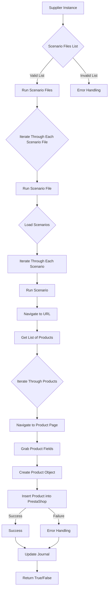

# Модуль `src.scenario`

## Обзор

Модуль `src.scenario` предназначен для автоматизации взаимодействия с поставщиками, используя сценарии, описанные в JSON-файлах. Он адаптирует процесс извлечения и обработки данных о продуктах с веб-сайтов поставщиков и синхронизирует эту информацию с базой данных (например, PrestaShop).  Модуль включает чтение сценариев, взаимодействие с веб-сайтами, обработку данных, запись журнала выполнения и организацию всего процесса.

## Подробней

Модуль `src.scenario` играет важную роль в автоматизации процесса сбора данных о товарах от поставщиков и их интеграции в базу данных PrestaShop. Это позволяет снизить трудозатраты и повысить точность данных, а также обеспечить актуальность информации о товарах.

## Оглавление

* [Модуль `src.scenario`](#модуль-srcscenario)
* [Обзор](#обзор)
* [Подробней](#подробней)
* [Основные функции модуля](#основные-функции-модуля)
* [Основные компоненты модуля](#основные-компоненты-модуля)
    * [`run_scenario_files(s, scenario_files_list)`](#run_scenario_files-s-scenario_files_list)
    * [`run_scenario_file(s, scenario_file)`](#run_scenario_file-s-scenario_file)
    * [`run_scenario(s, scenario)`](#run_scenario-s-scenario)
    * [`dump_journal(s, journal)`](#dump_journal-s-journal)
    * [`main()`](#main)
* [Пример сценария](#пример-сценария)
* [Как это работает](#как-это-работает)

## Основные функции модуля

1. **Чтение сценариев**: Загрузка сценариев из JSON-файлов, содержащих информацию о продуктах и их URL на сайте поставщика.
2. **Взаимодействие с веб-сайтами**:  Обработка URL-адресов из сценариев для извлечения данных о продуктах.
3. **Обработка данных**: Преобразование извлечённых данных в формат, подходящий для базы данных, и сохранение в неё.
4. **Запись журнала выполнения**: Ведение журнала с деталями выполнения сценариев и результатами работы для отслеживания процесса и выявления ошибок.



## Основные компоненты модуля

### `run_scenario_files(s, scenario_files_list)`

**Описание**: Принимает список файлов сценариев и выполняет их по очереди, вызывая функцию `run_scenario_file` для каждого файла.

**Параметры**:
- `s`: Объект настроек, содержащий параметры, необходимые для соединения с базой данных и другими сервисами.
- `scenario_files_list` (list): Список путей к файлам сценариев, которые необходимо выполнить.

**Возвращает**:
- `None`: Функция ничего не возвращает.

**Вызывает исключения**:
- `FileNotFoundError`: Возникает, если один из файлов сценариев, указанных в `scenario_files_list`, не найден.
- `JSONDecodeError`: Возникает, если файл сценария содержит невалидный JSON.
- `Exception`: Возникает при любых других проблемах во время выполнения.

**Как работает функция**:

1. Функция `run_scenario_files` получает список файлов сценариев `scenario_files_list` и объект настроек `s`.
2. Для каждого файла сценария из списка вызывается функция `run_scenario_file`, которая отвечает за загрузку и выполнение сценариев из этого файла.
3. В случае возникновения исключений `FileNotFoundError` или `JSONDecodeError`, функция перехватывает их и логирует информацию об ошибке.
4. Если происходит другое исключение, оно также перехватывается, логируется, и выполнение функции завершается.

```
A[Начало]
|
B[Перебор файлов сценариев из scenario_files_list]
|
C[Вызов run_scenario_file для каждого файла]
|
D[Обработка исключений FileNotFoundError, JSONDecodeError, Exception]
|
E[Логирование ошибок]
|
F[Завершение]
```

**Примеры**:

```python
# Пример вызова функции с корректным списком файлов
run_scenario_files(settings, ['scenario1.json', 'scenario2.json'])

# Пример вызова функции с несуществующим файлом
run_scenario_files(settings, ['scenario1.json', 'nonexistent_scenario.json'])
```

### `run_scenario_file(s, scenario_file)`

**Описание**: Загружает сценарии из указанного файла и вызывает `run_scenario` для каждого сценария в файле.

**Параметры**:
- `s`: Объект настроек.
- `scenario_file` (str): Путь к файлу сценария.

**Возвращает**:
- `None`: Функция ничего не возвращает.

**Вызывает исключения**:
- `FileNotFoundError`: Если файл сценария не найден.
- `JSONDecodeError`: Если файл сценария содержит невалидный JSON.
- `Exception`: При любых других проблемах при работе со сценариями.

**Как работает функция**:

1. Функция `run_scenario_file` получает путь к файлу сценария `scenario_file` и объект настроек `s`.
2. Она пытается открыть и загрузить JSON-данные из указанного файла.
3. Если загрузка прошла успешно, функция итерируется по каждому сценарию в загруженных данных и вызывает функцию `run_scenario` для выполнения каждого сценария.
4. В случае возникновения исключений `FileNotFoundError` или `JSONDecodeError`, функция перехватывает их и логирует информацию об ошибке.
5. Если происходит другое исключение, оно также перехватывается, логируется, и выполнение функции завершается.

```
A[Начало]
|
B[Открытие и загрузка JSON-данных из scenario_file]
|
C[Перебор сценариев в загруженных данных]
|
D[Вызов run_scenario для каждого сценария]
|
E[Обработка исключений FileNotFoundError, JSONDecodeError, Exception]
|
F[Логирование ошибок]
|
G[Завершение]
```

**Примеры**:

```python
# Пример вызова функции с корректным файлом сценария
run_scenario_file(settings, 'scenario1.json')

# Пример вызова функции с несуществующим файлом сценария
run_scenario_file(settings, 'nonexistent_scenario.json')
```

### `run_scenario(s, scenario)`

**Описание**: Обрабатывает отдельный сценарий. Переходит по URL, извлекает данные о продуктах и сохраняет их в базе данных.

**Параметры**:
- `s`: Объект настроек.
- `scenario` (dict): Словарь, содержащий сценарий (например, с URL, категориями).

**Возвращает**:
- `None`: Функция ничего не возвращает.

**Вызывает исключения**:
- `requests.exceptions.RequestException`: Если есть проблемы с запросом к веб-сайту.
- `Exception`: При любых других проблемах в процессе обработки сценария.

**Как работает функция**:

1. Функция `run_scenario` получает словарь `scenario`, содержащий информацию о сценарии, и объект настроек `s`.
2. Она извлекает URL из сценария и использует его для получения данных с веб-сайта.
3. Функция выполняет необходимые действия для извлечения данных о продуктах (например, скрапинг веб-страницы).
4. Извлеченные данные преобразуются в нужный формат и сохраняются в базе данных.
5. В случае возникновения исключений `requests.exceptions.RequestException`, `Exception`, функция перехватывает их и логирует информацию об ошибке.

```
A[Начало]
|
B[Извлечение URL из сценария]
|
C[Получение данных с веб-сайта по URL]
|
D[Извлечение данных о продуктах]
|
E[Преобразование данных в нужный формат]
|
F[Сохранение данных в базе данных]
|
G[Обработка исключений requests.exceptions.RequestException, Exception]
|
H[Логирование ошибок]
|
I[Завершение]
```

**Примеры**:

```python
# Пример вызова функции с корректтным сценарием
scenario = {
    "url": "https://example.com/category/mineral-creams/",
    "name": "минеральные+кремы",
    "presta_categories": {
        "default_category": 12345,
        "additional_categories": [12346, 12347]
    }
}
run_scenario(settings, scenario)

# Пример вызова функции с некорректным URL
scenario = {
    "url": "invalid_url",
    "name": "минеральные+кремы",
    "presta_categories": {
        "default_category": 12345,
        "additional_categories": [12346, 12347]
    }
}
run_scenario(settings, scenario)
```

### `dump_journal(s, journal)`

**Описание**: Сохраняет журнал выполнения сценариев в файл для последующего анализа.

**Параметры**:
- `s`: Объект настроек.
- `journal` (list): Список записей журнала выполнения.

**Возвращает**:
- `None`: Функция ничего не возвращает.

**Вызывает исключения**:
- `Exception`: При проблемах с записью в файл.

**Как работает функция**:

1. Функция `dump_journal` получает список записей журнала `journal` и объект настроек `s`.
2. Она открывает файл журнала и записывает в него записи из списка `journal`.
3. В случае возникновения исключения при записи в файл, функция перехватывает его и логирует информацию об ошибке.

```
A[Начало]
|
B[Открытие файла журнала]
|
C[Запись записей из journal в файл]
|
D[Обработка исключения Exception при записи в файл]
|
E[Логирование ошибок]
|
F[Завершение]
```

**Примеры**:

```python
# Пример вызова функции с корректным журналом
journal = [
    {"scenario": "scenario1", "status": "success"},
    {"scenario": "scenario2", "status": "failure"}
]
dump_journal(settings, journal)

# Пример вызова функции с пустым журналом
dump_journal(settings, [])
```

### `main()`

**Описание**: Основная функция для запуска модуля.

**Параметры**:
- `None`: Функция не принимает параметров.

**Возвращает**:
- `None`: Функция ничего не возвращает.

**Вызывает исключения**:
- `Exception`: При любых критических ошибках во время выполнения.

**Как работает функция**:

1. Функция `main` является точкой входа в модуль.
2. Она выполняет необходимые действия для инициализации и запуска процесса обработки сценариев.
3. В случае возникновения критических ошибок, функция перехватывает их и логирует информацию об ошибке.

```
A[Начало]
|
B[Инициализация]
|
C[Запуск процесса обработки сценариев]
|
D[Обработка исключения Exception при критических ошибках]
|
E[Логирование ошибок]
|
F[Завершение]
```

**Примеры**:

```python
# Пример вызова функции
main()
```

## Пример сценария

Пример сценария JSON описывает взаимодействие с категориями продуктов на веб-сайте. Он содержит URL, имя категории и идентификаторы категорий в базе данных PrestaShop.

```json
{
    "scenarios": {
        "минеральные+кремы": {
            "url": "https://example.com/category/mineral-creams/",
            "name": "минеральные+кремы",
            "presta_categories": {
                "default_category": 12345,
                "additional_categories": [12346, 12347]
            }
        }
    }
}
```

## Как это работает

Модуль загружает сценарии, извлекает данные с веб-сайтов, обрабатывает их и сохраняет в базе данных.  Он ведёт журнал выполнения для отслеживания процесса и выявления ошибок.  В целом, модуль автоматизирует взаимодействие с поставщиками, улучшая эффективность и надежность процесса.