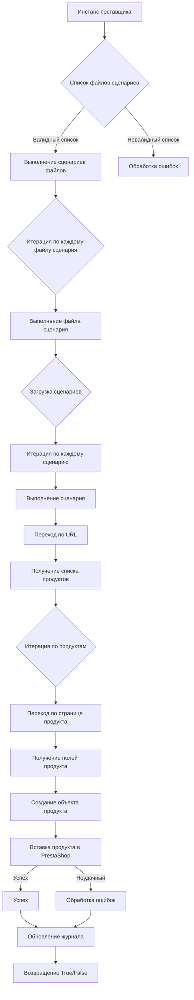

# Модуль `src.scenario`

## Обзор

Модуль `src.scenario` предназначен для автоматизации взаимодействия с поставщиками с помощью сценариев, описанных в JSON-файлах. Он оптимизирует процесс извлечения и обработки данных о продуктах с веб-сайтов поставщиков и синхронизации этой информации с базой данных (например, PrestaShop). Модуль включает функциональность для чтения сценариев, взаимодействия с веб-сайтами, обработки данных, ведения журнала выполнения и организации всего рабочего процесса.

## Оглавление

* [Модуль `src.scenario`](#модуль-src-scenario)
* [Обзор](#обзор)
* [Основные функции модуля](#основные-функции-модуля)
* [Основные компоненты модуля](#основные-компоненты-модуля)
    * [`run_scenario_files(s, scenario_files_list)`](#run_scenario_files-s-scenario_files_list)
    * [`run_scenario_file(s, scenario_file)`](#run_scenario_file-s-scenario_file)
    * [`run_scenario(s, scenario)`](#run_scenario-s-scenario)
    * [`dump_journal(s, journal)`](#dump_journal-s-journal)
    * [`main()`](#main)
* [Пример сценария](#пример-сценария)
* [Как это работает](#как-это-работает)

## Основные функции модуля

1. **Чтение сценариев**: Загрузка сценариев из JSON-файлов, содержащих информацию о продуктах и URL-адреса на веб-сайте поставщика.
2. **Взаимодействие с веб-сайтами**: Обработка URL-адресов из сценариев для извлечения данных о продуктах.
3. **Обработка данных**: Преобразование извлеченных данных в формат, подходящий для базы данных, и сохранение их.
4. **Ведение журнала выполнения**: Поддержание журналов с деталями выполнения сценария и результатами для отслеживания прогресса и выявления ошибок.



## Основные компоненты модуля

### `run_scenario_files(s, scenario_files_list)`

**Описание**: Принимает список файлов сценариев и выполняет их последовательно, вызывая функцию `run_scenario_file` для каждого файла.

**Параметры**:
- `s`: Объект настроек (например, для подключения к базе данных).
- `scenario_files_list` (список): Список путей к файлам сценариев.

**Возвращает**:
- `None`

**Возможные исключения**:
- `FileNotFoundError`: Если файл сценария не найден.
- `JSONDecodeError`: Если файл сценария содержит невалидный JSON.


### `run_scenario_file(s, scenario_file)`

**Описание**: Загружает сценарии из указанного файла и вызывает `run_scenario` для каждого сценария в файле.

**Параметры**:
- `s`: Объект настроек.
- `scenario_file` (строка): Путь к файлу сценария.

**Возвращает**:
- `None`

**Возможные исключения**:
- `FileNotFoundError`: Если файл сценария не найден.
- `JSONDecodeError`: Если файл сценария содержит невалидный JSON.
- `Exception`: При любых других проблемах во время выполнения сценария.


### `run_scenario(s, scenario)`

**Описание**: Обрабатывает отдельный сценарий, переходя по URL, извлекая данные о продуктах и сохраняя их в базе данных.

**Параметры**:
- `s`: Объект настроек.
- `scenario` (словарь): Словарь, содержащий сценарий (например, с URL и категориями).

**Возвращает**:
- `None`

**Возможные исключения**:
- `requests.exceptions.RequestException`: Если возникают проблемы с запросом к веб-сайту.
- `Exception`: При любых других проблемах во время обработки сценария.


### `dump_journal(s, journal)`

**Описание**: Сохраняет журнал выполнения в файл для последующего анализа.

**Параметры**:
- `s`: Объект настроек.
- `journal` (список): Список записей журнала выполнения.

**Возвращает**:
- `None`

**Возможные исключения**:
- `Exception`: Если возникают проблемы с записью в файл.


### `main()`

**Описание**: Главная функция для запуска модуля.

**Параметры**:
- Нет

**Возвращает**:
- `None`

**Возможные исключения**:
- `Exception`: При любых критических ошибках во время выполнения.


## Пример сценария

Пример JSON-сценария описывает взаимодействие с категориями продуктов на веб-сайте. Он включает URL, название категории и идентификаторы категорий в базе данных PrestaShop.

```json
{
    "scenarios": {
        "mineral+creams": {
            "url": "https://example.com/category/mineral-creams/",
            "name": "mineral+creams",
            "presta_categories": {
                "default_category": 12345,
                "additional_categories": [12346, 12347]
            }
        }
    }
}
```