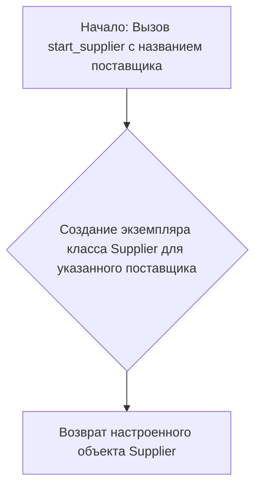

# Модуль `amazon_murano_glass`

## Обзор

Модуль предназначен для запуска сценария сбора данных о муранском стекле с сайта Amazon. Он использует класс `Supplier` для управления процессом сбора и сохранения данных в формате, совместимом с PrestaShop.

## Подробней

Этот модуль является частью экспериментов по автоматизации сбора данных с различных онлайн-платформ для последующей загрузки в PrestaShop. Он использует предопределенный сценарий (`scenario['Murano Glass']`) для навигации по сайту Amazon, извлечения информации о товарах и категориях, и их сохранения.

## Функции

### `start_supplier`

```python
def start_supplier(supplier: str) -> Supplier:
    """
    Инициализирует и возвращает экземпляр класса Supplier для указанного поставщика.

    Args:
        supplier (str): Название поставщика.

    Returns:
        Supplier: Объект класса Supplier, настроенный для работы с указанным поставщиком.

    Raises:
        Exception: Если возникает ошибка при инициализации поставщика.

    Example:
        >>> s = start_supplier('amazon')
    """
    ...
```

**Назначение**:
Функция `start_supplier` создает и возвращает экземпляр класса `Supplier`, который используется для управления процессом сбора данных с сайта определенного поставщика.

**Параметры**:
- `supplier` (str): Строка, представляющая название поставщика, для которого необходимо создать объект `Supplier`. В данном случае это `'amazon'`.

**Возвращает**:
- `Supplier`: Объект класса `Supplier`, настроенный для работы с указанным поставщиком.

**Как работает функция**:



1.  Функция принимает строку с названием поставщика (`'amazon'`).
2.  Создает экземпляр класса `Supplier` для указанного поставщика.
3.  Возвращает созданный и настроенный объект `Supplier`.

**Примеры**:

```python
s = start_supplier('amazon')
```

## Переменные

### `s`

```python
s = start_supplier('amazon')
```

Переменная `s` является экземпляром класса `Supplier`, созданным с помощью функции `start_supplier('amazon')`. Этот объект используется для запуска сценария сбора данных и управления процессом сбора.

### `scenario`

```python
from dict_scenarios import scenario
```

Переменная `scenario` импортируется из модуля `dict_scenarios` и представляет собой словарь, содержащий различные сценарии сбора данных. В данном случае используется сценарий `'Murano Glass'`.

### `k`

```python
k = list(s.current_scenario['presta_categories']['default_category'].keys())[0]
```

Переменная `k` получает первый ключ из словаря, расположенного по пути `s.current_scenario['presta_categories']['default_category']`. Этот ключ, вероятно, представляет собой идентификатор категории в PrestaShop.

## Основной код

```python
s.run_scenario(scenario['Murano Glass'])
```

Вызов метода `run_scenario` объекта `s` (класса `Supplier`) с передачей сценария `'Murano Glass'`. Этот метод запускает процесс сбора данных в соответствии с определенным сценарием.