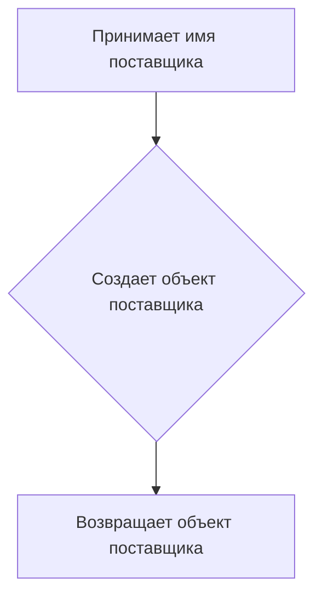

# Модуль `amazon_murano_glass.py`

## Обзор

Модуль `amazon_murano_glass.py` представляет собой экспериментальный сценарий для поставщика 'amazon' в рамках проекта `hypotez`. Он предназначен для запуска сценария 'Murano Glass', определенного в `dict_scenarios.py`, и инициализации основных переменных и объектов, необходимых для выполнения этого сценария.

## Подробней

Этот файл содержит код для автоматизации работы с поставщиком 'amazon' и выполнения заданного сценария, связанного с категорией Murano Glass. Модуль использует функции из `header.py` для запуска поставщика и `dict_scenarios.py` для получения сценария.

## Функции

### `start_supplier`

```python
def start_supplier(supplier: str) -> Supplier:
    """
    Инициализирует и возвращает объект поставщика.

    Args:
        supplier (str): Название поставщика.

    Returns:
        Supplier: Объект поставщика.
    """
    ...
```

**Назначение**:
Функция `start_supplier` создает и инициализирует объект поставщика (`Supplier`) с указанным именем.

**Параметры**:
- `supplier` (str): Строка, представляющая имя поставщика, которого необходимо инициализировать.

**Возвращает**:
- `Supplier`: Объект поставщика, созданный и инициализированный на основе переданного имени.

**Как работает функция**:

1. Функция принимает имя поставщика в качестве аргумента.
2. Создает объект поставщика на основе этого имени.
3. Возвращает созданный объект поставщика для дальнейшего использования.



**Примеры**:

```python
s = start_supplier('amazon')
```

В этом примере создается объект поставщика с именем 'amazon', который затем присваивается переменной `s`.

## Переменные

### `s`

```python
s = start_supplier('amazon')
```

**Назначение**:
`s` - это экземпляр класса `Supplier`, представляющий поставщика 'amazon'.

### `scenario`

```python
from dict_scenarios import scenario
```

**Назначение**:
Импортирует словарь `scenario` из модуля `dict_scenarios`, который содержит различные сценарии, включая 'Murano Glass'.

### `k`

```python
k = list(s.current_scenario['presta_categories']['default_category'].keys())[0]
```

**Назначение**:
`k` - это первый ключ из словаря `default_category`, который находится внутри `presta_categories` текущего сценария.

**Как работает переменная**:

1. `s.current_scenario` получает текущий сценарий, запущенный для поставщика.
2. `['presta_categories']['default_category']` обращается к вложенному словарю, содержащему категории.
3. `.keys()` получает список ключей из этого словаря.
4. `list(...)` преобразует полученные ключи в список.
5. `[0]` извлекает первый элемент из списка ключей.