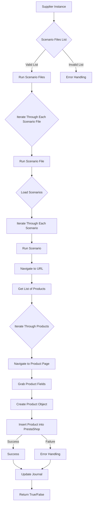

# Документация для модуля `scenario_executor.mmd`

## Обзор

Данный модуль содержит описание графа выполнения сценариев. Он описывает последовательность действий, которые выполняются для запуска и обработки сценариев, включая загрузку файлов сценариев, навигацию по URL-адресам, извлечение данных о продуктах и их вставку в PrestaShop.

## Содержание

- [Обзор](#обзор)
- [Граф выполнения](#граф-выполнения)

## Граф выполнения

    
### Описание узлов

- **A (Supplier Instance)**: Начальная точка, представляющая экземпляр поставщика.
- **B (Scenario Files List)**: Получение списка файлов сценариев.
- **C (Run Scenario Files)**: Запуск сценариев из валидного списка файлов.
- **D (Error Handling)**: Обработка ошибок, возникших при обработке невалидного списка файлов.
- **E (Iterate Through Each Scenario File)**: Итерация по каждому файлу сценария.
- **F (Run Scenario File)**: Запуск обработки отдельного файла сценария.
- **G (Load Scenarios)**: Загрузка сценариев из файла.
- **H (Iterate Through Each Scenario)**: Итерация по каждому сценарию в загруженном списке.
- **I (Run Scenario)**: Запуск обработки отдельного сценария.
- **J (Navigate to URL)**: Навигация по URL-адресу, указанному в сценарии.
- **K (Get List of Products)**: Получение списка товаров с целевой страницы.
- **L (Iterate Through Products)**: Итерация по списку товаров.
- **M (Navigate to Product Page)**: Навигация на страницу отдельного товара.
- **N (Grab Product Fields)**: Извлечение необходимых полей товара.
- **O (Create Product Object)**: Создание объекта товара на основе извлечённых данных.
- **P (Insert Product into PrestaShop)**: Вставка объекта товара в PrestaShop.
- **Q (Success)**: Успешная обработка товара.
- **R (Error Handling)**: Обработка ошибок при вставке товара.
- **S (Update Journal)**: Обновление журнала о результатах обработки.
- **T (Return True/False)**: Возврат результата выполнения сценария (успех или неудача).

### Описание связей

-   `-->`: Поток управления.
-   `-- Valid List -->`: Поток управления по валидному списку файлов.
-   `-- Invalid List -->`: Поток управления по невалидному списку файлов.
-   `-- Success -->`: Поток управления при успешном выполнении операции.
-   `-- Failure -->`: Поток управления при неудачном выполнении операции.