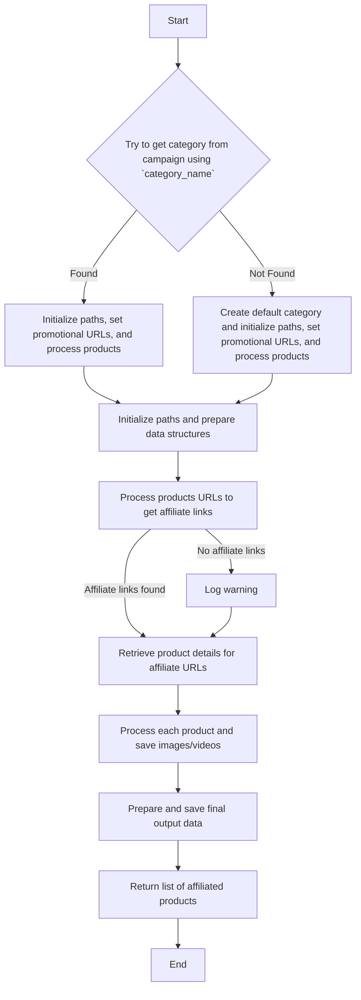

# Модуль `affiliated_products_generator`

## Обзор

Модуль `affiliated_products_generator.py` предназначен для сбора полных данных о товарах с AliExpress, включая партнерские ссылки, изображения и видео. Класс `AliAffiliatedProducts` предоставляет методы для обработки списков ID товаров или URL, получения партнерских ссылок, загрузки изображений и видео, а также сохранения данных о товарах в формате JSON. Модуль также включает функционал для создания HTML-шаблонов для рекламных кампаний.

## Содержание

- [Класс `AliAffiliatedProducts`](#класс-aliaffiliatedproducts)
    - [Метод `__init__`](#метод-__init__)
    - [Метод `process_affiliate_products`](#метод-process_affiliate_products)

## Класс `AliAffiliatedProducts`

**Описание**: Класс для сбора полных данных о товарах с AliExpress, включая партнерские ссылки, изображения и видео.
    
### Метод `__init__`

**Описание**: Инициализирует класс `AliAffiliatedProducts`.

**Параметры**:
- `language` (str | dict, optional): Язык для кампании. По умолчанию `'EN'`.
- `currency` (str, optional): Валюта для кампании. По умолчанию `'USD'`.

**Возвращает**:
- `None`

### Метод `process_affiliate_products`

**Описание**: Обрабатывает список ID товаров или URL и возвращает список товаров с партнерскими ссылками и сохраненными изображениями.

**Параметры**:
- `prod_ids` (list[str]): Список URL-адресов или ID товаров.
- `category_root` (Path | str): Корневой путь для сохранения данных категории.

**Возвращает**:
- `list[SimpleNamespace]`: Список обработанных товаров с партнерскими ссылками и сохраненными изображениями.

**Вызывает исключения**:
- `Exception`: Если имя категории не найдено в кампании.

**Примечания**:
- Извлекает содержимое страниц из URL-адресов.
- Обрабатывает партнерские ссылки и сохраняет изображения/видео.
- Генерирует и сохраняет данные кампании и выходные файлы.

**Блок-схема**:

