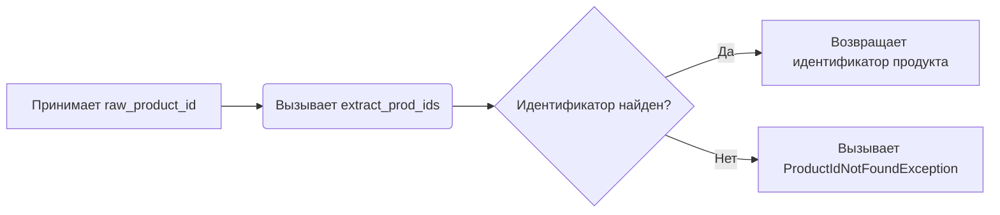

# Модуль для извлечения идентификатора продукта AliExpress

## Обзор

Модуль предназначен для извлечения идентификатора продукта из различных форматов входных данных, таких как URL-адреса или строки, содержащие идентификатор. Основная функция модуля - `get_product_id`, которая использует функцию `extract_prod_ids` для поиска и извлечения идентификатора.

## Подробнее

Этот модуль важен для работы с API AliExpress, так как позволяет получить идентификатор продукта из различных источников. Он использует функцию `extract_prod_ids` из модуля `src.suppliers.aliexpress.utils.extract_product_id` для извлечения идентификатора продукта.

## Функции

### `get_product_id`

```python
def get_product_id(raw_product_id: str) -> str:
    """Returns the product ID from a given text. Raises ProductIdNotFoundException on fail."""
    return extract_prod_ids(raw_product_id)
```

**Назначение**: Извлекает идентификатор продукта из предоставленной строки.

**Параметры**:
- `raw_product_id` (str): Строка, содержащая идентификатор продукта или URL.

**Возвращает**:
- `str`: Идентификатор продукта.

**Вызывает исключения**:
- `ProductIdNotFoundException`: Если идентификатор продукта не найден.

**Как работает функция**:
1. Функция принимает строку `raw_product_id` в качестве входных данных.
2. Вызывает функцию `extract_prod_ids` с переданной строкой.
3. Возвращает извлеченный идентификатор продукта.



**Примеры**:

```python
#Пример 1: Извлечение идентификатора продукта из строки
product_id = get_product_id("1234567890")
print(product_id)  # Вывод: 1234567890

#Пример 2: Извлечение идентификатора продукта из URL
product_id = get_product_id("https://www.aliexpress.com/item/1234567890.html")
print(product_id)  # Вывод: 1234567890

#Пример 3: Если идентификатор продукта не найден
try:
    product_id = get_product_id("Some random text")
except ProductIdNotFoundException as ex:
    print(f"Error: {ex}")  # Вывод: Error: Product id not found: Some random text