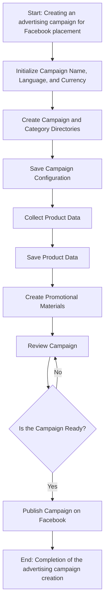
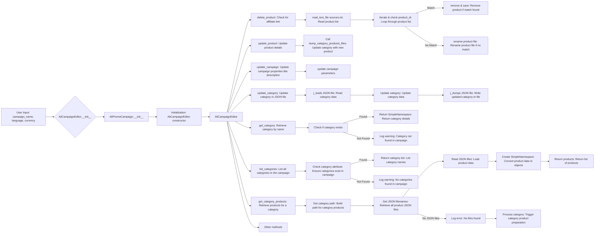
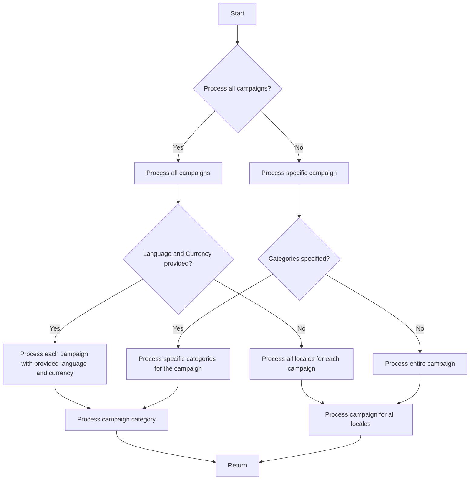

# Модуль `src.suppliers.aliexpress.campaign`

## Обзор

Модуль `campaign` предназначен для управления процессом создания и публикации рекламных кампаний на Facebook. Он включает в себя функциональность для инициализации параметров кампании (название, язык, валюта), создания структуры каталогов, сохранения конфигураций для новой кампании, сбора и сохранения данных о продуктах с использованием `ali` или `html`, генерации рекламных материалов, просмотра кампании и публикации её на Facebook.

## Подробнее

Модуль предоставляет инструменты для автоматизации и управления всеми этапами создания рекламной кампании, начиная с инициализации основных параметров и заканчивая публикацией готовой кампании на платформе Facebook. Это позволяет упростить процесс и уменьшить количество ручных операций, необходимых для запуска рекламной кампании.

## Классы

В данном коде классы отсутствуют.

## Функции

В данном коде функции отсутствуют. Здесь представлено описание логики работы модуля в виде диаграмм.

### Диаграмма 1: Создание рекламной кампании для размещения на Facebook

**Как работает процесс создания рекламной кампании:**

1.  **Начало**: Процесс начинается.
2.  **Инициализация деталей кампании**: Определяются название, язык и валюта кампании. Например: Название кампании: "Летняя распродажа", Язык: "Русский", Валюта: "USD".
3.  **Создание каталогов кампании и категорий**: Создаются необходимые каталоги или файлы для кампании. Например: Создается структура папок в файловой системе для хранения ресурсов кампании.
4.  **Сохранение конфигурации кампании**: Сохраняются инициализированные детали кампании. Например: Данные записываются в базу данных или файл конфигурации.
5.  **Сбор данных о продуктах**: Собираются данные, связанные с продуктами, которые будут продвигаться в рамках кампании. Например: Получение идентификаторов продуктов, описаний, изображений и цен из системы инвентаризации.
6.  **Сохранение данных о продуктах**: Сохраненные данные о продуктах. Например: Данные записываются в таблицу базы данных, предназначенную для продуктов кампании.
7.  **Создание рекламных материалов**: Создаются или выбираются графика, баннеры и другие рекламные ресурсы. Например: Изображения и описания адаптированы для привлечения клиентов.
8.  **Просмотр кампании**: Процесс просмотра подтверждает, что компоненты кампании готовы. Например: Проверка человеком или системой оценивает качество и полноту всех компонентов кампании.
9.  **Кампания готова?**: Проверка, чтобы определить, является ли кампания полной и готовой к публикации. Например: Логический флаг сигнализирует «Да», если все на месте, в противном случае «Нет», вызывая возврат к предыдущему шагу для внесения исправлений.
10. **Публикация кампании**: Кампания публикуется на платформе и готова к маркетинговым усилиям. Например: Вызываются API для публикации кампании на соответствующей платформе.
11. **Конец**: Процесс создания кампании завершен.

### Диаграмма 2: Редактирование кампании

**Как работает процесс редактирования рекламной кампании:**

1.  **Ввод пользовательских данных**: Пользователь вводит название кампании, язык и валюту.
2.  **Инициализация AliCampaignEditor**: Вызывается конструктор `AliCampaignEditor` с передачей параметров кампании.
3.  **Инициализация AliPromoCampaign**: Вызывается конструктор `AliPromoCampaign`.
4.  **Инициализация конструктора AliCampaignEditor**: Происходит инициализация конструктора `AliCampaignEditor`.
5.  **Выбор метода AliCampaignEditor**: Выбирается метод для редактирования кампании.
6.  **Удаление продукта (delete_product)**: Проверяется наличие партнерской ссылки, читается список продуктов из файла `sources.txt`, перебирается список и проверяется `product_id`.
    *   Если `product_id` совпадает, продукт удаляется и изменения сохраняются.
    *   Если `product_id` не совпадает, файл продукта переименовывается.
7.  **Обновление продукта (update_product)**: Обновляются детали продукта и вызывается `dump_category_products_files` для обновления категории новым продуктом.
8.  **Обновление кампании (update_campaign)**: Обновляются свойства кампании, такие как описание и другие параметры.
9.  **Обновление категории (update_category)**: Обновляется категория в JSON-файле. Читаются данные категории, обновляются данные и записываются обратно в файл.
10. **Получение категории (get_category)**: Получение категории по имени. Проверяется, существует ли категория.
    *   Если категория существует, возвращаются детали категории в виде `SimpleNamespace`.
    *   Если категория не существует, регистрируется предупреждение о том, что категория не найдена в кампании.
11. **Получение списка категорий (list_categories)**: Получение списка всех категорий в кампании. Проверяется атрибут категории.
    *   Если категории существуют, возвращается список имен категорий.
    *   Если категории не существуют, регистрируется предупреждение о том, что категории не найдены в кампании.
12. **Получение продуктов категории (get_category_products)**: Получение продуктов для указанной категории.
    *   Строится путь к продуктам категории.
    *   Получаются имена всех JSON-файлов продуктов.
    *   Читаются JSON-файлы и загружаются данные продуктов.
    *   Данные продуктов преобразуются в объекты `SimpleNamespace` и возвращается список продуктов.
    *   Если JSON-файлы не найдены, регистрируется ошибка и запускается процесс подготовки продуктов категории.
13. **Другие методы (Other methods)**: Другие методы для управления кампанией.

### Диаграмма 3: Подготовка кампании

**Как работает процесс подготовки рекламной кампании:**

1.  **Начало**: Процесс начинается.
2.  **Обработать все кампании?**: Проверяется, нужно ли обработать все кампании.
    *   Если да, то переходим к обработке всех кампаний.
    *   Если нет, то переходим к обработке конкретной кампании.
3.  **Предоставлены язык и валюта?**: Проверяется, предоставлены ли язык и валюта.
    *   Если да, то обрабатываем каждую кампанию с предоставленными языком и валютой.
    *   Если нет, то обрабатываем все локали для каждой кампании.
4.  **Указаны категории?**: Проверяется, указаны ли категории.
    *   Если да, то обрабатываем конкретные категории для кампании.
    *   Если нет, то обрабатываем всю кампанию.
5.  **Обработка категории кампании**: Обрабатывается категория кампании.
6.  **Обработка кампании для всех локалей**: Обрабатывается кампания для всех локалей.
7.  **Возврат**: Процесс завершается.