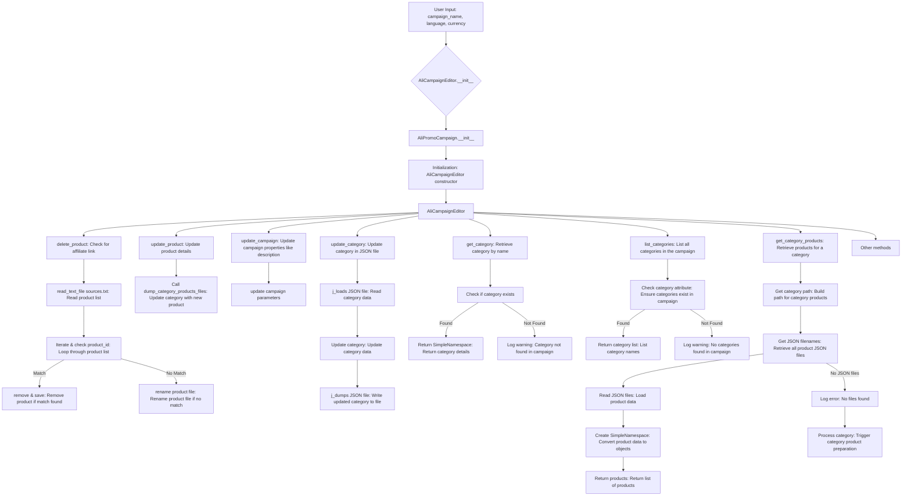
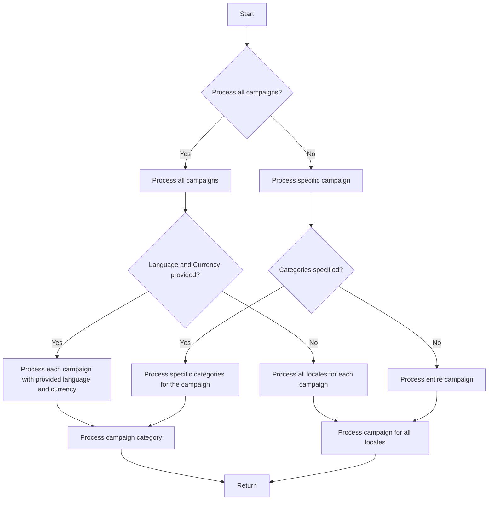

# Модуль `campaign`

## Обзор

Модуль `campaign` предназначен для управления процессом создания и публикации рекламных кампаний в Facebook. Он включает в себя функциональность для инициализации параметров кампании (имя, язык, валюта), создания структуры каталогов, сохранения конфигураций для новой кампании, сбора и сохранения данных о продуктах через `ali` или `html`, создания рекламных материалов, просмотра кампании и публикации ее в Facebook.

## Подробней

Модуль `campaign` является ключевым компонентом системы `hypotez`, отвечающим за автоматизацию процесса создания и управления рекламными кампаниями на платформе Facebook. Он упрощает задачи, связанные с настройкой кампании, сбором данных о продуктах и генерацией рекламных материалов, что позволяет пользователям эффективно продвигать свои товары.

## Классы

### `AliCampaignEditor`

**Описание**: Класс `AliCampaignEditor` предназначен для редактирования рекламных кампаний AliExpress. Он предоставляет методы для добавления, удаления и обновления информации о продуктах и категориях в рамках кампании.

**Принцип работы**:
Класс `AliCampaignEditor` инициализируется с использованием параметров кампании и предоставляет интерфейс для выполнения операций редактирования. Он использует другие модули и классы проекта для чтения, записи и обработки данных, связанных с рекламными кампаниями.

**Методы**:
- `__init__`: Инициализирует экземпляр класса `AliCampaignEditor`.
- `delete_product`: Удаляет продукт из кампании.
- `update_product`: Обновляет информацию о продукте в кампании.
- `update_campaign`: Обновляет параметры кампании, такие как описание.
- `update_category`: Обновляет данные категории в JSON-файле.
- `get_category`: Извлекает категорию по имени.
- `list_categories`: Перечисляет все категории в кампании.
- `get_category_products`: Извлекает продукты для заданной категории.

**Параметры**:
- `campaign_name` (str): Имя кампании.
- `language` (str): Язык кампании.
- `currency` (str): Валюта кампании.

**Примеры**
- Пример создания инстанса класса
```python
campaign_editor = AliCampaignEditor(campaign_name='SummerSale', language='ru', currency='RUB')
```
## Диаграмма Mermaid



## Функции

### `prepare_campaign`

**Назначение**: Функция `prepare_campaign` предназначена для подготовки рекламной кампании к запуску, обеспечивая обработку всех необходимых данных и ресурсов.

**Параметры**:
- `campaign_name` (str): Имя кампании.
- `language` (str): Язык кампании.
- `currency` (str): Валюта кампании.
- `categories` (Optional[List[str]], optional): Список категорий для обработки. По умолчанию `None`.
- `all_campaigns` (bool, optional): Флаг, указывающий на необходимость обработки всех кампаний. По умолчанию `False`.

**Возвращает**:
- `None`: Функция не возвращает явного значения.

**Как работает функция**:

1. **Проверка необходимости обработки всех кампаний**:
   Функция проверяет, установлен ли флаг `all_campaigns`. Если флаг установлен, функция переходит к обработке всех кампаний. В противном случае функция продолжает обработку конкретной кампании, указанной в параметре `campaign_name`.

2. **Обработка всех кампаний**:
   Если установлен флаг `all_campaigns`, функция проверяет, предоставлены ли язык и валюта.
   - Если язык и валюта предоставлены, функция обрабатывает каждую кампанию с указанным языком и валютой.
   - Если язык и валюта не предоставлены, функция обрабатывает все локали для каждой кампании.

3. **Обработка конкретной кампании**:
   Если флаг `all_campaigns` не установлен, функция проверяет, указаны ли категории для обработки.
   - Если категории указаны, функция обрабатывает только указанные категории для кампании.
   - Если категории не указаны, функция обрабатывает всю кампанию целиком.

4. **Обработка категорий**:
   В зависимости от указанных параметров, функция вызывает соответствующие методы для обработки категорий кампании.
   - Если указаны конкретные категории, функция обрабатывает только их.
   - Если категории не указаны, функция обрабатывает все категории, связанные с кампанией.

**Примеры**:
- Подготовка конкретной кампании с указанными категориями:
```python
prepare_campaign(campaign_name='SummerSale', language='ru', currency='RUB', categories=['shoes', 'bags'])
```

- Подготовка всех кампаний для определенного языка и валюты:
```python
prepare_campaign(language='en', currency='USD', all_campaigns=True)
```

## Диаграмма Mermaid

