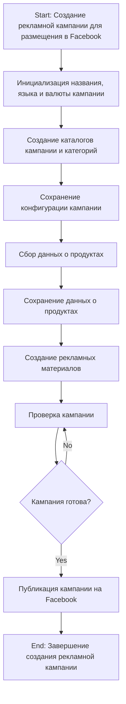
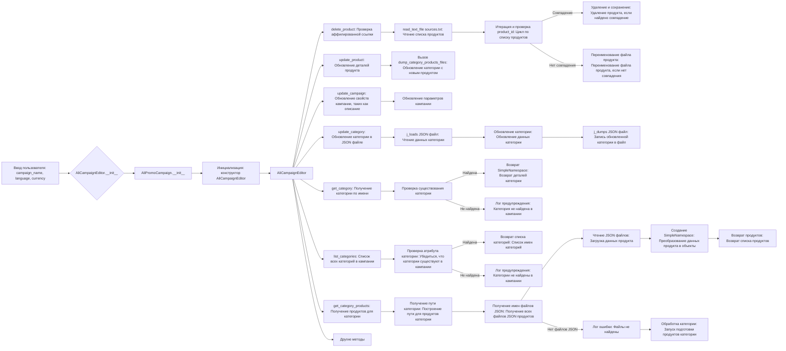

# Модуль `src.suppliers.aliexpress.campaign`

## Обзор

Модуль `campaign` предназначен для управления процессом создания и публикации рекламных кампаний на Facebook. Он включает в себя функциональность для инициализации параметров кампании (название, язык, валюта), создания структуры каталогов, сохранения конфигурации для новой кампании, сбора и сохранения данных о продуктах с помощью `ali` или `html`, генерации рекламных материалов, проверки кампании и публикации ее на Facebook.

## Оглавление

1. [Обзор](#обзор)
2. [Логика создания кампании](#логика-создания-кампании)
3. [Логика редактирования кампании](#логика-редактирования-кампании)
4. [Логика подготовки кампании](#логика-подготовки-кампании)

## Логика создания кампании



- **Шаг 1**: Старт - Начало процесса.

- **Шаг 2**: Инициализация деталей кампании - Определяется название кампании, язык и валюта. Пример: Название кампании: "Летняя распродажа", Язык: "Русский", Валюта: "USD".

- **Шаг 3**: Создание каталогов кампании и категорий - Создаются необходимые каталоги или файлы для кампании. Пример: Создается структура папок в файловой системе для хранения активов кампании.

- **Шаг 4**: Сохранение конфигурации кампании - Сохранены инициализированные детали кампании. Пример: Данные записываются в базу данных или файл конфигурации.

- **Шаг 5**: Сбор данных о продуктах - Собираются данные о продуктах, которые будут продвигаться в рамках кампании. Пример: Идентификаторы продуктов, описания, изображения и цены берутся из системы инвентаризации.

- **Шаг 6**: Сохранение данных о продуктах - Сохранены собранные данные о продуктах. Пример: Данные записываются в таблицу базы данных, предназначенную для продуктов кампании.

- **Шаг 7**: Создание рекламных материалов - Сгенерированы или выбраны графические материалы, баннеры и другие рекламные активы. Пример: Изображения и описания адаптированы для привлечения клиентов.

- **Шаг 8**: Проверка кампании - Процесс проверки подтверждает, что компоненты кампании готовы. Пример: Проверка человеком или системой оценивает качество и полноту всех компонентов кампании.

- **Шаг 9**: Кампания готова? - Проверка для определения, завершена ли кампания и готова ли она к публикации. Пример: Булев флаг сигнализирует "Да", если все на месте, иначе "Нет", инициируя возврат к предыдущему шагу для внесения исправлений.

- **Шаг 10**: Публикация кампании - Кампания запускается на платформе, готовая к маркетинговым усилиям. Пример: Выполняются вызовы API для публикации кампании на соответствующей платформе.

- **Шаг 11**: Завершение - Процесс создания кампании завершен.

## Логика редактирования кампании



## Логика подготовки кампании

```mermaid
flowchart TD
    A[Начало] --> B{Обработать все кампании?}
    B -->|Да| C[Обработать все кампании]
    B -->|Нет| D[Обработать конкретную кампанию]
    
    C --> E{Язык и валюта предоставлены?}
    E -->|Да| F[Обработать каждую кампанию с предоставленным языком и валютой]
    E -->|Нет| G[Обработать все локали для каждой кампании]
    
    D --> H{Категории указаны?}
    H -->|Да| I[Обработать конкретные категории для кампании]
    H -->|Нет| J[Обработать всю кампанию]
    
    F --> K[Обработать категорию кампании]
    G --> L[Обработать кампанию для всех локалей]
    I --> K
    J --> L
    
    K --> M[Возврат]
    L --> M
    ```