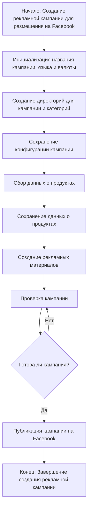

# Модуль `campaign`

## Обзор

Модуль `campaign` предназначен для управления процессом создания и публикации рекламных кампаний на Фейсбук. Он включает функционал для инициализации параметров кампании (название, язык, валюта), создания структуры директорий, сохранения конфигураций для новой кампании, сбора и сохранения данных о продуктах через `ali` или `html`, генерации рекламных материалов, проверки кампании и публикации ее на Facebook.

## Функции

### `initialize_campaign`

**Описание**: Инициализирует параметры новой рекламной кампании.

**Параметры**:
- `campaign_name` (str): Название кампании.
- `language` (str): Язык кампании.
- `currency` (str): Валюта кампании.

**Возвращает**:
- `dict`: Словарь с параметрами кампании. Возвращает `None` при ошибке.

**Вызывает исключения**:
- `ValueError`: Если передан некорректный тип данных или значение для параметров.
- `OtherError`:  В случае других ошибок.

### `create_directories`

**Описание**: Создает структуру директорий для кампании.

**Параметры**:
- `campaign_name` (str): Название кампании.

**Возвращает**:
- `bool`: `True`, если директории успешно созданы, `False` в противном случае.

**Вызывает исключения**:
- `IOError`: Если возникает ошибка при работе с файловой системой.

### `save_config`

**Описание**: Сохраняет конфигурацию кампании в файл.

**Параметры**:
- `campaign_config` (dict): Словарь с конфигурацией кампании.
- `filepath` (str): Путь к файлу для сохранения.

**Возвращает**:
- `bool`: `True`, если конфигурация успешно сохранена, `False` в противном случае.

**Вызывает исключения**:
- `IOError`: Если возникает ошибка при работе с файлом.

### `collect_product_data`

**Описание**: Сбор данных о продуктах.

**Параметры**:
- `source` (str): Источник данных ('ali' или 'html').
- `params` (dict, optional): Дополнительные параметры для сбора данных. По умолчанию `None`.

**Возвращает**:
- `list`: Список данных о продуктах. Возвращает `None` при ошибке.

**Вызывает исключения**:
- `ValueError`: Если источник данных некорректный.
- `DataError`: При проблемах с получением данных.

### `generate_ads`

**Описание**: Генерирует рекламные материалы.

**Параметры**:
- `product_data` (list): Список данных о продуктах.

**Возвращает**:
- `list`: Список рекламных материалов. Возвращает `None` при ошибке.

**Вызывает исключения**:
- `ValueError`: Если данные о продуктах некорректны или пустые.
- `GenerationError`: При проблемах с генерацией рекламных материалов.

### `verify_campaign`

**Описание**: Проверяет кампанию перед публикацией.

**Параметры**:
- `campaign_data` (dict): Данные о кампании.

**Возвращает**:
- `bool`: `True`, если кампания прошла проверку, `False` в противном случае.

**Вызывает исключения**:
- `VerificationError`: При проблемах с проверкой.

### `publish_campaign`

**Описание**: Публикует кампанию на Facebook.

**Параметры**:
- `campaign_data` (dict): Данные о кампании.

**Возвращает**:
- `bool`: `True`, если кампания опубликована успешно, `False` в противном случае.

**Вызывает исключения**:
- `APIError`: При ошибках в API Facebook.
- `NetworkError`: При проблемах с сетевым соединением.