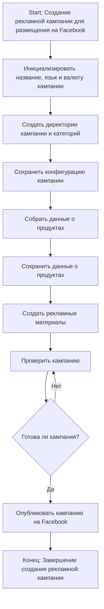
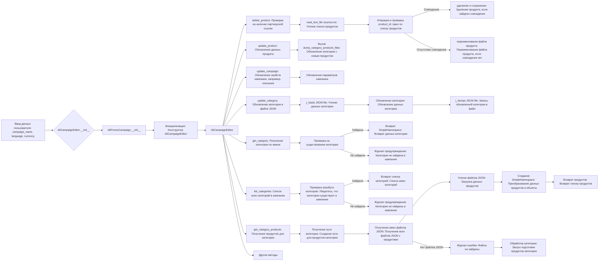
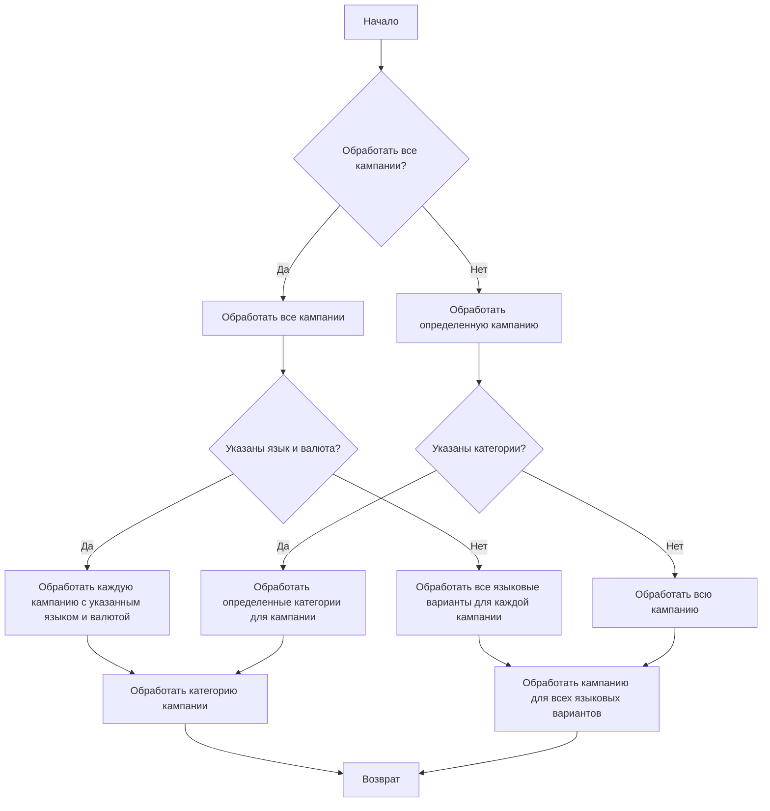

# Модуль `src.suppliers.aliexpress.campaign`

## Обзор

Модуль `campaign` предназначен для управления процессом создания и публикации рекламных кампаний на Facebook. Он включает функциональность для инициализации параметров кампании (название, язык, валюта), создания директорий, сохранения конфигурации новой кампании, сбора и сохранения данных о продуктах через `ali` или `html`, генерации рекламных материалов, проверки кампании и ее публикации на Facebook.

**Этапы создания кампании:**

- **Шаг 1**: Начало - Процесс начинается.
- **Шаг 2**: Инициализация данных кампании - Определяются имя кампании, язык и валюта. Пример: Название кампании: "Летняя распродажа", Язык: "Русский", Валюта: "RUB"
- **Шаг 3**: Создание директорий кампании и категорий - Создаются необходимые директории или файлы для кампании. Пример: Создается структура каталогов на файловой системе для хранения активов кампании.
- **Шаг 4**: Сохранение конфигурации кампании - Сохранены инициализированные данные кампании. Пример: Данные записываются в базу данных или конфигурационный файл.
- **Шаг 5**: Сбор данных о продуктах - Сбор данных, связанных с продуктами, которые будут рекламироваться в рамках кампании. Пример: Идентификаторы продуктов, описания, изображения и цены извлекаются из системы инвентаризации.
- **Шаг 6**: Сохранение данных о продуктах - Сохранены собранные данные о продуктах. Пример: Данные записываются в таблицу базы данных, предназначенную для продуктов кампании.
- **Шаг 7**: Создание рекламных материалов - Создаются или выбираются графические элементы, баннеры и другие рекламные активы. Пример: Изображения и описания подбираются для привлечения клиентов.
- **Шаг 8**: Проверка кампании - Процесс проверки подтверждает готовность компонентов кампании. Пример: Человек или система проверяют качество и полноту всех компонентов кампании.
- **Шаг 9**: Готова ли кампания? - Проверка, чтобы определить, завершена ли кампания и готова к публикации. Пример: Логический флаг указывает "Да", если все готово, в противном случае "Нет", что приводит к циклу возврата к предыдущему шагу для внесения исправлений.
- **Шаг 10**: Публикация кампании - Кампания публикуется на платформе, готовая к маркетинговым усилиям. Пример: Выполняются API-вызовы для публикации кампании на соответствующей платформе.
- **Шаг 11**: Конец - Процесс создания кампании завершен.

## Редактирование кампании

## Подготовка кампании

