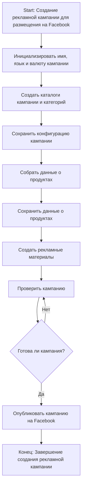
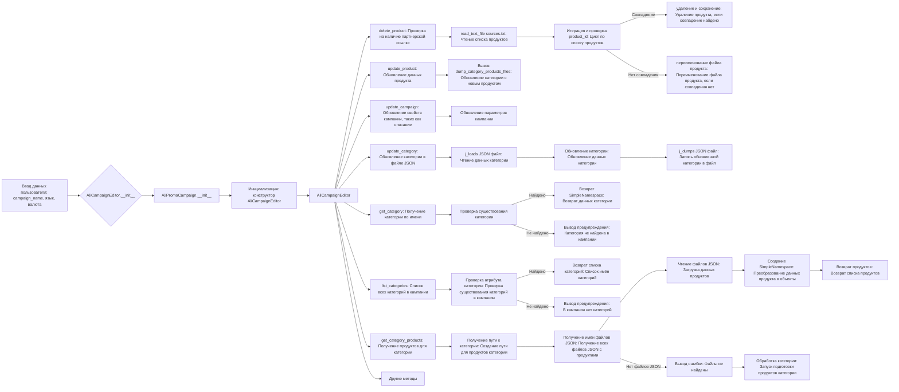
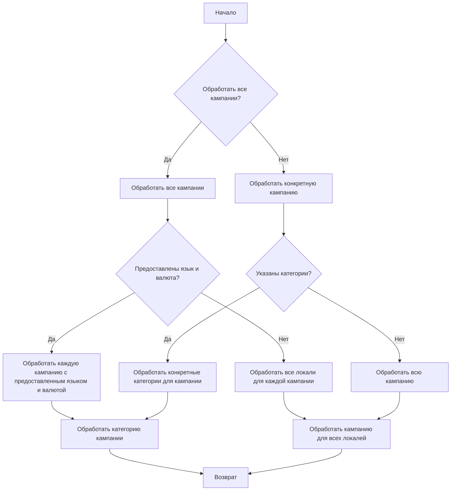

# Модуль `src.suppliers.aliexpress.campaign`

## Обзор

Модуль `src.suppliers.aliexpress.campaign` предназначен для управления процессом создания и публикации рекламных кампаний на Facebook. Он включает функциональность для инициализации параметров кампании (название, язык, валюта), создания структуры каталогов, сохранения конфигурации новой кампании, сбора и сохранения данных о продуктах через `ali` или `html`, генерации рекламных материалов, проверки кампании и её публикации на Facebook.

* **Шаг 1**: Начало - процесс запускается.

* **Шаг 2**: Инициализация данных кампании - определяются название, язык и валюта кампании. Пример: Название кампании: "Летняя распродажа", Язык: "Русский", Валюта: "RUB"

* **Шаг 3**: Создание каталогов кампании и категорий - создаются необходимые каталоги или файлы для кампании. Пример: Создаётся структура папок на файловой системе для хранения активов кампании.

* **Шаг 4**: Сохранение конфигурации кампании - сохранены инициализированные данные кампании. Пример: Данные записываются в базу данных или конфигурационный файл.

* **Шаг 5**: Сбор данных о продуктах - собираются данные о продуктах, которые будут рекламироваться в рамках кампании. Пример: ID продукта, описания, изображения и цены извлекаются из системы инвентаризации.

* **Шаг 6**: Сохранение данных о продуктах - сохранены собранные данные о продуктах. Пример: Данные записываются в таблицу базы данных, предназначенную для продуктов кампании.

* **Шаг 7**: Создание рекламных материалов - генерируются или выбираются графические изображения, баннеры и другие рекламные активы. Пример: Изображения и описания подбираются для привлечения клиентов.

* **Шаг 8**: Проверка кампании - процесс проверки подтверждает готовность компонентов кампании. Пример: Человек или система проверяют качество и полноту всех компонентов кампании.

* **Шаг 9**: Готова ли кампания? - проверка, чтобы определить, завершена ли кампания и готова ли она к публикации. Пример: Логическая переменная сигнализирует "Да", если всё готово, в противном случае "Нет", что запускает цикл возврата к предыдущему шагу для внесения исправлений.

* **Шаг 10**: Публикация кампании - кампания запускается в работу на платформе, готова к маркетинговым действиям. Пример: Выполняются API-запросы для публикации кампании на соответствующей платформе.

* **Шаг 11**: Конец - процесс создания кампании завершен.

## Редактирование кампании

## Подготовка кампании

