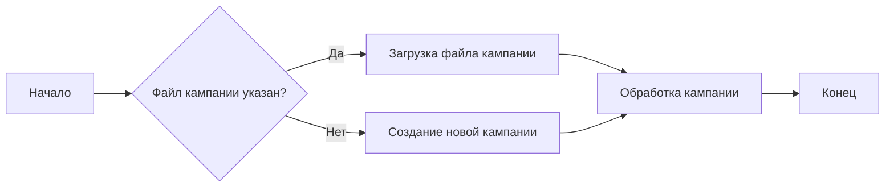
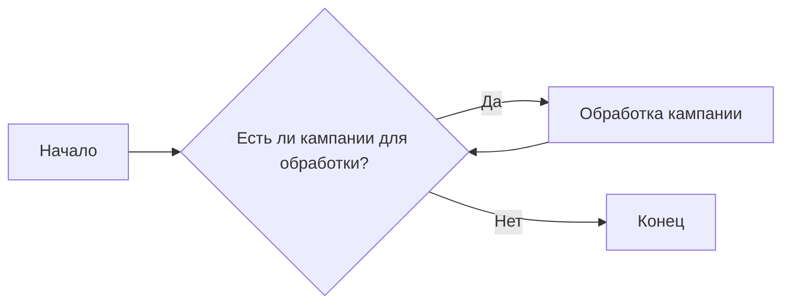

# Модуль `prepare_all_campaigns.py`

## Обзор

Модуль предназначен для подготовки и обработки рекламных кампаний AliExpress для различных языков. Он использует названия категорий, извлеченные из директорий, для настройки и запуска кампаний.

## Подробней

Модуль `prepare_all_campaigns.py` предназначен для автоматизации процесса подготовки рекламных кампаний для AliExpress. Он позволяет запускать кампании для разных языков и валют, используя названия категорий, полученные из директорий. Модуль импортирует необходимые функции из других модулей проекта, таких как `process_all_campaigns` и `main_process` из `src.suppliers.aliexpress.campaign.prepare_campaigns`, чтобы упростить процесс запуска и управления кампаниями.
В коде присутствует закомментированный код, который отображает структуру данных для языков и валют, а также примеры вызовов функций для запуска кампаний.

## Функции

### `process_campaign`

```python
def process_campaign(campaign_name: str, language: str, currency: str, campaign_file: Optional[str] = None) -> None:
    """
    Выполняет подготовку и обработку рекламной кампании.

    Args:
        campaign_name (str): Название кампании.
        language (str): Язык кампании.
        currency (str): Валюта кампании.
        campaign_file (Optional[str], optional): Путь к файлу кампании. По умолчанию `None`.

    Returns:
        None

    Raises:
        Exception: Если возникает ошибка при подготовке или обработке кампании.
    """
    ...
```

**Назначение**: Подготавливает и обрабатывает рекламную кампанию для заданного языка и валюты.

**Параметры**:
- `campaign_name` (str): Название кампании. Используется для идентификации кампании.
- `language` (str): Язык, на котором будет проводиться кампания (например, `'EN'`, `'HE'`, `'RU'`).
- `currency` (str): Валюта, в которой будет проводиться кампания (например, `'USD'`, `'ILS'`).
- `campaign_file` (Optional[str], optional): Путь к файлу кампании. Если файл не указан (`None`), будет создана новая кампания. По умолчанию `None`.

**Возвращает**:
- `None`: Функция ничего не возвращает.

**Вызывает исключения**:
- `Exception`: Функция может вызывать исключения, если в процессе подготовки или обработки кампании произойдет ошибка.

**Как работает функция**:
1. Функция принимает название кампании, язык, валюту и путь к файлу кампании (если есть).
2. Если файл кампании не указан, будет создана новая кампания с указанным именем и параметрами.
3. Функция использует предоставленные параметры для настройки и запуска рекламной кампании.



**Примеры**:

```python
process_campaign(campaign_name='rc', language='EN', currency='USD')
process_campaign(campaign_name='rc', language='HE', currency='ILS', campaign_file='path/to/campaign.json')
```

### `main_process`

```python
def main_process(arg1: str, arg2: list) -> None:
    """
    Выполняет основной процесс обработки кампаний.

    Args:
        arg1 (str): Первый аргумент процесса.
        arg2 (list): Список аргументов для процесса.

    Returns:
        None

    Raises:
        Exception: Если возникает ошибка во время выполнения основного процесса.
    """
    ...
```

**Назначение**: Выполняет основной процесс обработки кампаний, передавая параметры `arg1` и `arg2`.

**Параметры**:
- `arg1` (str): Первый аргумент процесса. В предоставленном коде передается строка `'brands'`.
- `arg2` (list): Список аргументов для процесса. В предоставленном коде передается список `['mrgreen']`.

**Возвращает**:
- `None`: Функция ничего не возвращает.

**Вызывает исключения**:
- `Exception`: Функция может вызывать исключения, если в процессе обработки произойдет ошибка.

**Как работает функция**:
1. Функция принимает два аргумента: строку `arg1` и список `arg2`.
2. Функция использует эти аргументы для выполнения основного процесса обработки кампаний.


**Примеры**:

```python
main_process('brands', ['mrgreen'])
```

### `process_all_campaigns`

```python
def process_all_campaigns() -> None:
    """
    Выполняет обработку всех рекламных кампаний.

    Returns:
        None

    Raises:
        Exception: Если возникает ошибка во время обработки кампаний.
    """
    ...
```

**Назначение**: Выполняет обработку всех рекламных кампаний.

**Параметры**:
- Отсутствуют

**Возвращает**:
- `None`: Функция ничего не возвращает.

**Вызывает исключения**:
- `Exception`: Функция может вызывать исключения, если в процессе обработки произойдет ошибка.

**Как работает функция**:
1. Функция выполняет итерацию по всем доступным рекламным кампаниям.
2. Для каждой кампании она выполняет необходимые шаги обработки.
3. Функция предназначена для автоматического запуска обработки всех кампаний без необходимости указывать их вручную.



**Примеры**:

```python
process_all_campaigns()