# Модуль: `src.suppliers.aliexpress.campaign.ali_campaign_editor_jupyter_widgets.py`

## Обзор

Модуль предоставляет Jupyter widgets для редактора кампаний AliExpress. Он содержит класс `JupyterCampaignEditorWidgets`, который обеспечивает интерфейс для взаимодействия с кампаниями AliExpress, включая выбор кампаний, категорий и языков, а также выполнение действий, таких как инициализация редакторов, сохранение кампаний и отображение продуктов.

## Подробнее

Этот модуль предназначен для использования в Jupyter notebooks для упрощения управления кампаниями AliExpress. Он предоставляет набор widgets, которые позволяют пользователям выбирать кампании, категории и языки, а также выполнять различные действия, связанные с управлением кампаниями, такие как сохранение кампаний и отображение продуктов.

## Классы

### `JupyterCampaignEditorWidgets`

**Описание**: Класс предоставляет widgets для редактора кампаний AliExpress.

**Принцип работы**:
Класс `JupyterCampaignEditorWidgets` инициализирует набор widgets, включая выпадающие списки для выбора кампании, категории и языка, а также кнопки для выполнения различных действий. Он также устанавливает callbacks для обработки изменений в widgets и выполняет соответствующие действия.

**Атрибуты**:
- `language` (str): Выбранный язык.
- `currency` (str): Выбранная валюта.
- `campaign_name` (str): Выбранное имя кампании.
- `category_name` (str): Выбранное имя категории.
- `category` (SimpleNamespace): Выбранная категория.
- `campaign_editor` (AliCampaignEditor): Редактор кампании AliExpress.
- `products` (list[SimpleNamespace]): Список продуктов.
- `campaigns_directory` (str): Путь к директории кампаний.
- `campaign_name_dropdown` (widgets.Dropdown): Выпадающий список для выбора имени кампании.
- `category_name_dropdown` (widgets.Dropdown): Выпадающий список для выбора категории.
- `language_dropdown` (widgets.Dropdown): Выпадающий список для выбора языка и валюты.
- `initialize_button` (widgets.Button): Кнопка для инициализации редактора кампании.
- `save_button` (widgets.Button): Кнопка для сохранения кампании.
- `show_products_button` (widgets.Button): Кнопка для отображения продуктов.
- `open_spreadsheet_button` (widgets.Button): Кнопка для открытия Google Spreadsheet.

**Методы**:

- `__init__`: Инициализирует widgets и настраивает редактор кампании.
- `initialize_campaign_editor`: Инициализирует редактор кампании на основе выбранной кампании и категории.
- `update_category_dropdown`: Обновляет выпадающий список категорий на основе выбранной кампании.
- `on_campaign_name_change`: Обрабатывает изменения в выпадающем списке имен кампаний.
- `on_category_change`: Обрабатывает изменения в выпадающем списке категорий.
- `on_language_change`: Обрабатывает изменения в выпадающем списке языков.
- `save_campaign`: Сохраняет кампанию и ее категории.
- `show_products`: Отображает продукты в выбранной категории.
- `open_spreadsheet`: Открывает Google Spreadsheet в браузере.
- `setup_callbacks`: Устанавливает callbacks для widgets.
- `display_widgets`: Отображает widgets для взаимодействия в Jupyter notebook.

## Функции

### `__init__`

```python
def __init__(self):
    """Initialize the widgets and set up the campaign editor.

    Sets up the widgets for selecting campaigns, categories, and languages. Also sets up
    default values and callbacks for the widgets.
    """
    ...
```

**Назначение**: Инициализация экземпляра класса `JupyterCampaignEditorWidgets`.

**Как работает функция**:

1.  **Определение пути к директории кампаний**: Определяет путь к директории кампаний на Google Drive, используя `gs.path.google_drive`, `"aliexpress"` и `"campaigns"`.
2.  **Проверка существования директории**: Проверяет, существует ли директория кампаний, и вызывает исключение `FileNotFoundError`, если директория не найдена.
3.  **Инициализация выпадающих списков**:
    *   `campaign_name_dropdown`: Инициализирует выпадающий список для выбора имени кампании, заполняя его названиями поддиректорий из директории кампаний.
    *   `category_name_dropdown`: Инициализирует пустой выпадающий список для выбора категории.
    *   `language_dropdown`: Инициализирует выпадающий список для выбора языка и валюты, используя данные из `locales`.
4.  **Инициализация кнопок**: Инициализирует кнопки для выполнения различных действий:
    *   `initialize_button`: Инициализирует кнопку для инициализации редактора кампании.
    *   `save_button`: Инициализирует кнопку для сохранения кампании.
    *   `show_products_button`: Инициализирует кнопку для отображения продуктов.
    *   `open_spreadsheet_button`: Инициализирует кнопку для открытия Google Spreadsheet.
5.  **Настройка callbacks**: Вызывает метод `setup_callbacks` для установки обработчиков событий для widgets.
6.  **Инициализация редактора кампании**: Вызывает метод `initialize_campaign_editor` для инициализации редактора кампании с значениями по умолчанию.

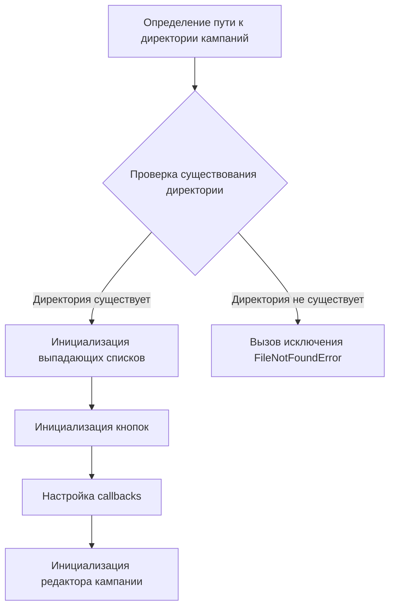

**Примеры**:

```python
editor_widgets: JupyterCampaignEditorWidgets = JupyterCampaignEditorWidgets()
editor_widgets.display_widgets()
```

### `initialize_campaign_editor`

```python
def initialize_campaign_editor(self, _):
    """Initialize the campaign editor.

    Args:
        _: Unused argument, required for button callback.

    Sets up the campaign editor based on the selected campaign and category.
    """
    ...
```

**Назначение**: Инициализация редактора кампании.

**Параметры**:
- `_`: Неиспользуемый аргумент, необходимый для callback кнопки.

**Как работает функция**:

1.  **Получение значений из выпадающих списков**: Получает значения выбранных кампании, категории и языка из соответствующих выпадающих списков. Если значение не выбрано, устанавливает его в `None`.
2.  **Разделение языка и валюты**: Разделяет строку, содержащую язык и валюту, на отдельные значения.
3.  **Проверка имени кампании**: Проверяет, выбрано ли имя кампании. Если имя кампании выбрано, выполняет следующие действия:
    *   **Обновление выпадающего списка категорий**: Вызывает метод `update_category_dropdown` для обновления выпадающего списка категорий на основе выбранной кампании.
    *   **Инициализация редактора кампании**: Инициализирует экземпляр класса `AliCampaignEditor` с выбранными именем кампании, языком и валютой.
    *   **Получение категории и продуктов**: Если выбрана категория, вызывает методы `get_category` и `get_category_products` для получения информации о категории и списке продуктов.
4.  **Вывод предупреждения**: Если имя кампании не выбрано, выводит предупреждение в лог с использованием `logger.warning`.

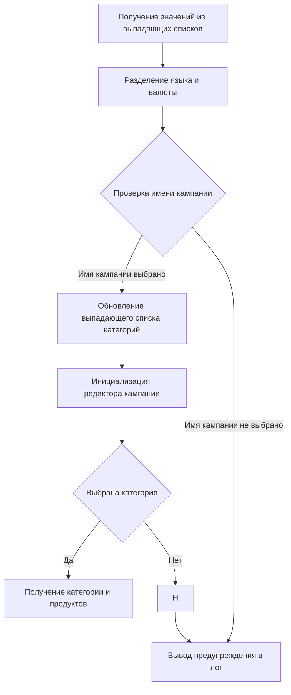

**Примеры**:

```python
self.initialize_campaign_editor(None)
```

### `update_category_dropdown`

```python
def update_category_dropdown(self, campaign_name: str):
    """Update the category dropdown based on the selected campaign.

    Args:
        campaign_name (str): The name of the campaign.

    Example:
        >>> self.update_category_dropdown("SummerSale")
    """
    ...
```

**Назначение**: Обновление выпадающего списка категорий на основе выбранной кампании.

**Параметры**:
- `campaign_name` (str): Имя кампании.

**Как работает функция**:

1.  **Определение пути к директории категорий**: Определяет путь к директории категорий для выбранной кампании.
2.  **Получение списка категорий**: Вызывает функцию `get_directory_names` для получения списка названий поддиректорий (категорий) из директории категорий.
3.  **Обновление выпадающего списка категорий**: Устанавливает список категорий в качестве опций для выпадающего списка `category_name_dropdown`.

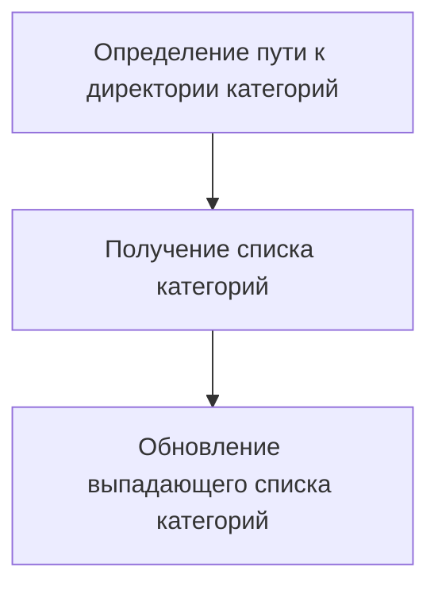

**Примеры**:

```python
self.update_category_dropdown("SummerSale")
```

### `on_campaign_name_change`

```python
def on_campaign_name_change(self, change: dict[str, str]):
    """Handle changes in the campaign name dropdown.

    Args:
        change (dict[str, str]): The change dictionary containing the new value.

    Example:
        >>> self.on_campaign_name_change({'new': 'SummerSale'})
    """
    ...
```

**Назначение**: Обработка изменений в выпадающем списке имен кампаний.

**Параметры**:
- `change` (dict[str, str]): Словарь изменений, содержащий новое значение.

**Как работает функция**:

1.  **Получение нового имени кампании**: Извлекает новое имя кампании из словаря `change`.
2.  **Обновление имени кампании**: Обновляет атрибут `campaign_name` новым значением.
3.  **Обновление выпадающего списка категорий**: Вызывает метод `update_category_dropdown` для обновления выпадающего списка категорий на основе нового имени кампании.
4.  **Повторная инициализация редактора кампании**: Вызывает метод `initialize_campaign_editor` для повторной инициализации редактора кампании с новым именем кампании.

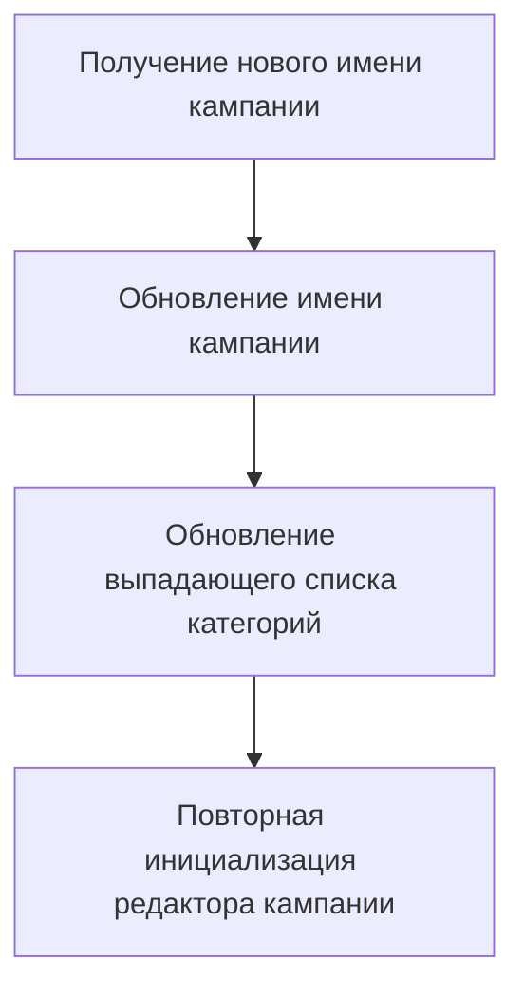

**Примеры**:

```python
self.on_campaign_name_change({'new': 'SummerSale'})
```

### `on_category_change`

```python
def on_category_change(self, change: dict[str, str]):
    """Handle changes in the category dropdown.

    Args:
        change (dict[str, str]): The change dictionary containing the new value.

    Example:
        >>> self.on_category_change({'new': 'Electronics'})
    """
    ...
```

**Назначение**: Обработка изменений в выпадающем списке категорий.

**Параметры**:
- `change` (dict[str, str]): Словарь изменений, содержащий новое значение.

**Как работает функция**:

1.  **Получение нового имени категории**: Извлекает новое имя категории из словаря `change`.
2.  **Обновление имени категории**: Обновляет атрибут `category_name` новым значением.
3.  **Повторная инициализация редактора кампании**: Вызывает метод `initialize_campaign_editor` для повторной инициализации редактора кампании с новым именем категории.

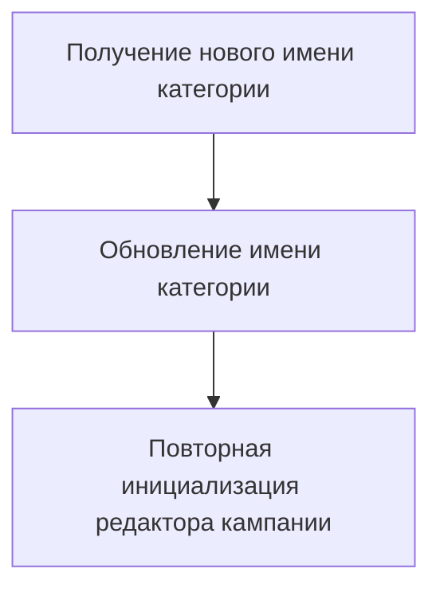

**Примеры**:

```python
self.on_category_change({'new': 'Electronics'})
```

### `on_language_change`

```python
def on_language_change(self, change: dict[str, str]):
    """Handle changes in the language dropdown.

    Args:
        change (dict[str, str]): The change dictionary containing the new value.

    Example:
        >>> self.on_language_change({'new': 'EN USD'})
    """
    ...
```

**Назначение**: Обработка изменений в выпадающем списке языков.

**Параметры**:
- `change` (dict[str, str]): Словарь изменений, содержащий новое значение.

**Как работает функция**:

1.  **Получение нового значения языка и валюты**: Извлекает новую строку, содержащую язык и валюту, из словаря `change`.
2.  **Разделение языка и валюты**: Разделяет строку на отдельные значения языка и валюты.
3.  **Повторная инициализация редактора кампании**: Вызывает метод `initialize_campaign_editor` для повторной инициализации редактора кампании с новыми значениями языка и валюты.

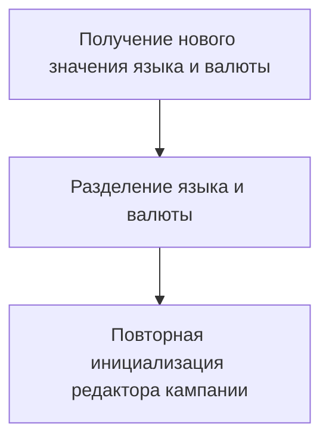

**Примеры**:

```python
self.on_language_change({'new': 'EN USD'})
```

### `save_campaign`

```python
def save_campaign(self, _):
    """Save the campaign and its categories.

    Args:
        _: Unused argument, required for button callback.

    Example:
        >>> self.save_campaign(None)
    """
    ...
```

**Назначение**: Сохранение кампании и ее категорий.

**Параметры**:
- `_`: Неиспользуемый аргумент, необходимый для callback кнопки.

**Как работает функция**:

1.  **Получение значений из выпадающих списков**: Получает значения выбранных кампании, категории и языка из соответствующих выпадающих списков.
2.  **Разделение языка и валюты**: Разделяет строку, содержащую язык и валюту, на отдельные значения.
3.  **Проверка имени кампании и языка**: Проверяет, выбраны ли имя кампании и язык. Если имя кампании и язык выбраны, выполняет следующие действия:
    *   **Инициализация редактора кампании**: Инициализирует экземпляр класса `AliCampaignEditor` с выбранными именем кампании, именем категории (если выбрана), языком и валютой.
    *   **Сохранение категорий из worksheet**: Пытается вызвать метод `save_categories_from_worksheet` для сохранения категорий из Google Sheets.
    *   **Обработка исключений**: Если происходит исключение при сохранении кампании, выводит сообщение об ошибке в лог с использованием `logger.error`.
4.  **Вывод предупреждения**: Если имя кампании или язык не выбраны, выводит предупреждение в лог с использованием `logger.warning`.

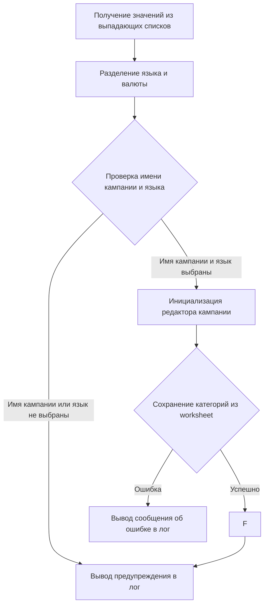

**Примеры**:

```python
self.save_campaign(None)
```

### `show_products`

```python
def show_products(self, _):
    """Display the products in the selected category.

    Args:
        _: Unused argument, required for button callback.

    Example:
        >>> self.show_products(None)
    """
    ...
```

**Назначение**: Отображение продуктов в выбранной категории.

**Параметры**:
- `_`: Неиспользуемый аргумент, необходимый для callback кнопки.

**Как работает функция**:

1.  **Получение имени кампании и категории**: Получает значения выбранных кампании и категории из соответствующих выпадающих списков.
2.  **Инициализация редактора кампании**: Пытается инициализировать экземпляр класса `AliCampaignEditor` с выбранными именем кампании, языком и валютой.
3.  **Установка worksheet продуктов**: Вызывает метод `set_products_worksheet` для установки worksheet продуктов для выбранной категории.
4.  **Обработка исключений**: Если происходит исключение при отображении продуктов, выводит сообщение об ошибке в лог с использованием `logger.error`.

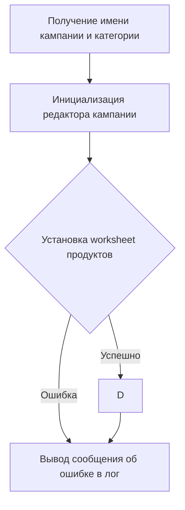

**Примеры**:

```python
self.show_products(None)
```

### `open_spreadsheet`

```python
def open_spreadsheet(self, _):
    """Open the Google Spreadsheet in a browser.

    Args:
        _: Unused argument, required for button callback.

    Example:
        >>> self.open_spreadsheet(None)
    """
    ...
```

**Назначение**: Открытие Google Spreadsheet в браузере.

**Параметры**:
- `_`: Неиспользуемый аргумент, необходимый для callback кнопки.

**Как работает функция**:

1.  **Проверка инициализации редактора кампании**: Проверяет, был ли инициализирован редактор кампании.
2.  **Открытие Spreadsheet**: Если редактор кампании был инициализирован, строит URL для Google Spreadsheet и открывает его в браузере с помощью `webbrowser.open`.
3.  **Вывод сообщения**: Если редактор кампании не был инициализирован, выводит сообщение "Please initialize the campaign editor first.".

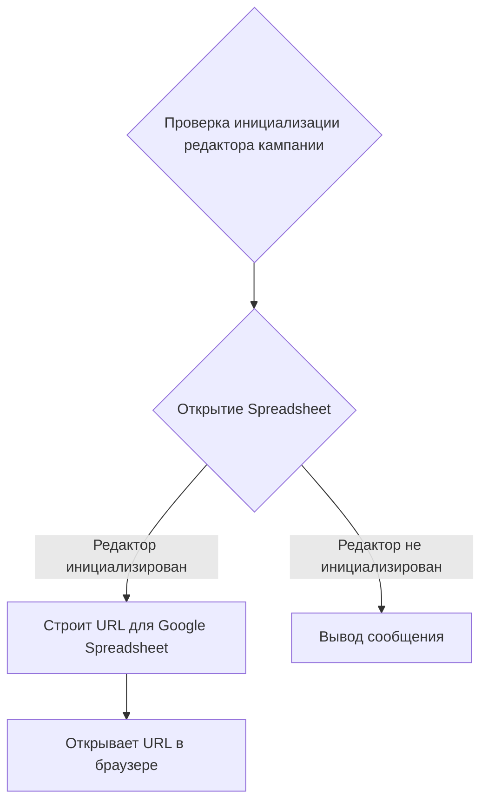

**Примеры**:

```python
self.open_spreadsheet(None)
```

### `setup_callbacks`

```python
def setup_callbacks(self):
    """Set up callbacks for the widgets."""
    ...
```

**Назначение**: Установка обработчиков событий для widgets.

**Как работает функция**:

1.  **Установка обработчика для изменения имени кампании**: Устанавливает метод `on_campaign_name_change` в качестве обработчика события изменения значения в выпадающем списке `campaign_name_dropdown`.
2.  **Установка обработчика для изменения категории**: Устанавливает метод `on_category_change` в качестве обработчика события изменения значения в выпадающем списке `category_name_dropdown`.
3.  **Установка обработчика для изменения языка**: Устанавливает метод `on_language_change` в качестве обработчика события изменения значения в выпадающем списке `language_dropdown`.
4.  **Установка обработчика для нажатия кнопки инициализации**: Устанавливает метод `initialize_campaign_editor` в качестве обработчика события нажатия на кнопку `initialize_button`.
5.  **Установка обработчика для нажатия кнопки сохранения**: Устанавливает метод `save_campaign` в качестве обработчика события нажатия на кнопку `save_button`.
6.  **Установка обработчика для нажатия кнопки отображения продуктов**: Устанавливает метод `show_products` в качестве обработчика события нажатия на кнопку `show_products_button`.
7.  **Установка обработчика для нажатия кнопки открытия spreadsheet**: Устанавливает метод `open_spreadsheet` в качестве обработчика события нажатия на кнопку `open_spreadsheet_button`.

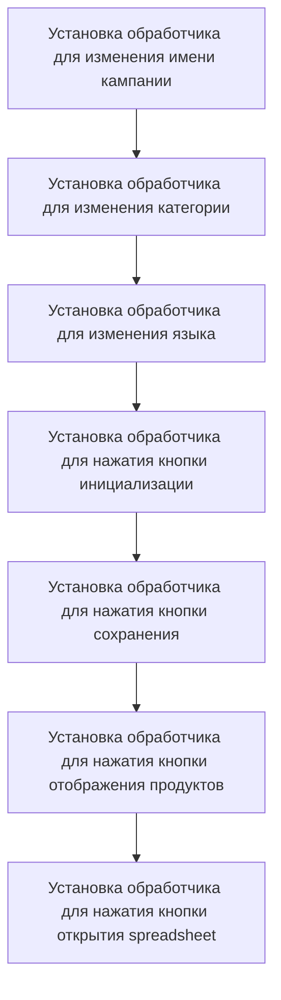

**Примеры**:

```python
self.setup_callbacks()
```

### `display_widgets`

```python
def display_widgets(self):
    """Display the widgets for interaction in the Jupyter notebook.

    Initializes the campaign editor automatically with the first campaign selected.

    Example:
        >>> self.display_widgets()
    """
    ...
```

**Назначение**: Отображение widgets для взаимодействия в Jupyter notebook.

**Как работает функция**:

1.  **Отображение widgets**: Отображает выпадающие списки и кнопки для взаимодействия в Jupyter notebook с помощью функции `display`.
2.  **Инициализация редактора кампании**: Вызывает метод `initialize_campaign_editor` для инициализации редактора кампании с первым выбранным именем кампании.

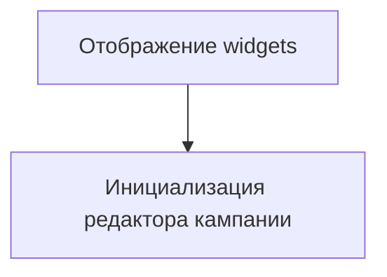

**Примеры**:

```python
self.display_widgets()