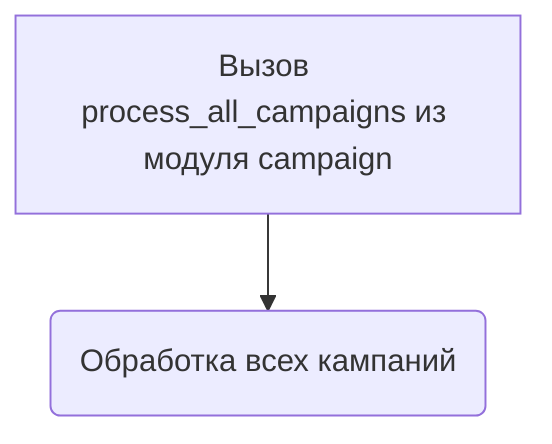

# Модуль подготовки всех кампаний AliExpress

## Обзор

Модуль `prepare_all_camapaigns.py` предназначен для подготовки и обработки всех рекламных кампаний AliExpress. Он использует модуль `process_all_campaigns` для фактической обработки. Если рекламная кампания не существует, она будет создана.

## Подробнее

Этот модуль является точкой входа для запуска процесса обработки всех рекламных кампаний AliExpress. Он импортирует модуль `process_all_campaigns` и вызывает его основную функцию для выполнения всей необходимой работы.

## Функции

### `process_all_campaigns`

```python
def process_all_campaigns():
    """
    Функция для обработки всех рекламных кампаний.

    Args:
        None

    Returns:
        None

    Raises:
        Exception: Если возникает ошибка во время обработки кампаний.

    """
```

**Назначение**: Функция `process_all_campaigns` отвечает за обработку всех рекламных кампаний AliExpress.

**Параметры**:
- Отсутствуют.

**Возвращает**:
- Отсутствует.

**Вызывает исключения**:
- `Exception`: Возникает, если в процессе обработки кампаний происходит ошибка.

**Как работает функция**:
1. Вызывает функцию `process_all_campaigns` из модуля `src.suppliers.aliexpress.campaign`.



**Примеры**:
```python
# Пример вызова функции process_all_campaigns
process_all_campaigns()