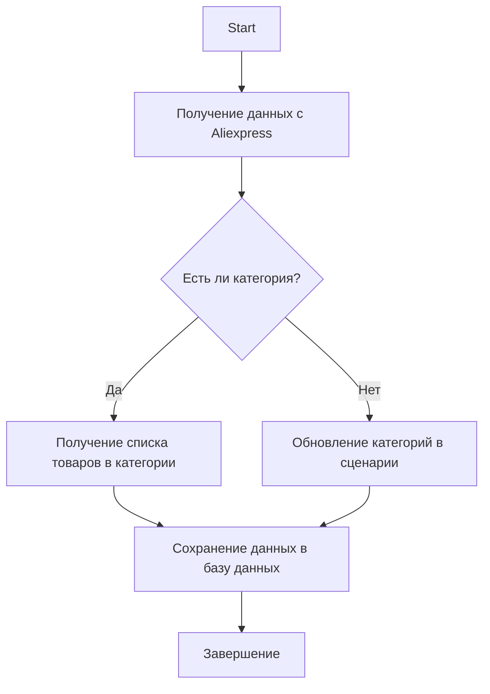

# Модуль управления категориями Aliexpress

## Обзор

Этот модуль предоставляет функциональность для работы с категориями товаров на платформе Aliexpress. Он включает в себя функции для получения ссылок на товары в категории, обновления категорий на основе данных с сайта и операций с базой данных.

## Подробнее

Модуль предназначен для управления категориями товаров на Aliexpress. Он включает в себя следующие ключевые функции:

- Получение списка товаров из категории.
- Обновление категорий в сценарии на основе данных с сайта.
- Операции с базой данных для работы с категориями.

## Принцип работы



## Пример использования

### Получение списка товаров из категории

```python
# Пример использования функции get_list_products_in_category
products = get_list_products_in_category(supplier)
```

### Обновление категорий в файле сценария

```python
# Пример использования функции update_categories_in_scenario_file
updated = update_categories_in_scenario_file(supplier, "scenario_file.json")
```

### Операции с базой данных

```python
# Пример использования DBAdaptor для операций с базой данных
db = DBAdaptor()
db.select(cat_id=123)
db.insert()
db.update()
db.delete()
```

## Функции

### `get_list_products_in_category(s)`

**Назначение**: Считывает URL товаров со страницы категории. Если есть несколько страниц с товарами, функция будет перелистывать все страницы.

**Параметры**:
- `s` (Supplier): Экземпляр поставщика.

**Возвращает**:
- Список URL продуктов в категории.

**Как работает функция**:
1. Функция принимает экземпляр поставщика `s`.
2. Функция получает URL товаров со страницы категории.
3. Если есть несколько страниц, функция переходит по ним, пока не будут собраны все URL товаров.

**Примеры**:
```python
# Пример вызова функции
supplier = Supplier()  # Предполагается, что класс Supplier определен в другом месте
products = get_list_products_in_category(supplier)
```

### `get_prod_urls_from_pagination(s)`

**Назначение**: Собирает ссылки на товары со страницы категории с перелистыванием страниц.

**Параметры**:
- `s` (Supplier): Экземпляр поставщика.

**Возвращает**:
- Список ссылок на товары.

**Как работает функция**:
1. Функция принимает экземпляр поставщика `s`.
2. Функция собирает ссылки на товары, перелистывая страницы категории.

**Примеры**:
```python
# Пример вызова функции
supplier = Supplier()  # Предполагается, что класс Supplier определен в другом месте
product_urls = get_prod_urls_from_pagination(supplier)
```

### `update_categories_in_scenario_file(s, scenario_filename)`

**Назначение**: Проверяет изменения категорий на сайте и обновляет файл сценария.

**Параметры**:
- `s` (Supplier): Экземпляр поставщика.
- `scenario_filename` (str): Имя файла сценария для обновления.

**Возвращает**:
- `True`, если обновление прошло успешно.

**Как работает функция**:
1. Функция принимает экземпляр поставщика `s` и имя файла сценария `scenario_filename`.
2. Функция проверяет изменения категорий на сайте.
3. Функция обновляет файл сценария, если есть изменения.

**Примеры**:
```python
# Пример вызова функции
supplier = Supplier()  # Предполагается, что класс Supplier определен в другом месте
scenario_file = "scenario.json"
updated = update_categories_in_scenario_file(supplier, scenario_file)
```

### `get_list_categories_from_site(s, scenario_file, brand='')`

**Назначение**: Получает список категорий с сайта на основе файла сценария.

**Параметры**:
- `s` (Supplier): Экземпляр поставщика.
- `scenario_file` (str): Имя файла сценария.
- `brand` (str, optional): Опциональное имя бренда.

**Возвращает**:
- Список категорий.

**Как работает функция**:
1. Функция принимает экземпляр поставщика `s`, имя файла сценария `scenario_file` и опциональное имя бренда `brand`.
2. Функция получает список категорий с сайта на основе данных из файла сценария.

**Примеры**:
```python
# Пример вызова функции
supplier = Supplier()  # Предполагается, что класс Supplier определен в другом месте
scenario_file = "scenario.json"
categories = get_list_categories_from_site(supplier, scenario_file)
```

### Класс `DBAdaptor`

**Описание**: Предоставляет методы для выполнения операций с базой данных, таких как `SELECT`, `INSERT`, `UPDATE` и `DELETE`.

**Методы**:
- `select(cat_id, parent_id, project_cat_id)`: Выбирает записи из базы данных.
- `insert()`: Вставляет новые записи в базу данных.
- `update()`: Обновляет записи в базе данных.
- `delete()`: Удаляет записи из базы данных.

**Принцип работы**:
Класс `DBAdaptor` предоставляет интерфейс для взаимодействия с базой данных. Он позволяет выполнять основные операции, такие как выборка, вставка, обновление и удаление данных. Конкретные детали реализации (например, параметры соединения с базой данных) предполагаются определенными в других частях проекта.

**Методы**:
- `select(cat_id, parent_id, project_cat_id)`: Выбирает записи из базы данных на основе предоставленных идентификаторов категорий.
- `insert()`: Вставляет новые записи в базу данных. Параметры для вставки предполагаются заданными заранее.
- `update()`: Обновляет записи в базе данных. Условия обновления и новые значения предполагаются заданными заранее.
- `delete()`: Удаляет записи из базы данных. Условия удаления предполагаются заданными заранее.

**Примеры**:
```python
# Пример использования класса DBAdaptor
db = DBAdaptor()
db.select(cat_id=123, parent_id=456, project_cat_id=789)
db.insert()
db.update()
db.delete()
```

## Установка

Для работы с модулем необходимо установить зависимые пакеты, такие как `requests`, а также настроить соединение с базой данных через `gs.db_translations_credentials`.

### Зависимости:
- `requests`
- `src.utils.jjson`
- `src.db.manager_categories.suppliers_categories`

## Логирование

В модуле используется логирование через `src.logger`, которое помогает отслеживать ошибки и события в процессе выполнения.

## Автор

Модуль разработан для внутреннего использования в проекте.