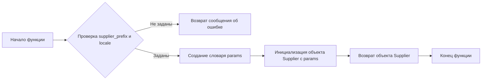

# Модуль для экспериментов с заголовками ноутбуков Amazon
## Обзор

Модуль `notebook_header.py` предназначен для экспериментов, связанных с заголовками ноутбуков Amazon. Он содержит импорты необходимых библиотек и классов для работы с проектом `hypotez`, включая управление веб-драйвером, обработку данных о товарах, категориях и поставщиках. Модуль также содержит функцию `start_supplier` для инициализации поставщика с заданными параметрами.

## Подробней

Этот модуль является частью экспериментального раздела проекта `hypotez` и, вероятно, используется для тестирования и отладки функциональности, связанной с парсингом и обработкой данных с Amazon. Он импортирует основные классы и функции, необходимые для работы с поставщиками, товарами и категориями, а также утилиты для форматирования и нормализации строк.

## Функции

### `start_supplier`

```python
def start_supplier(supplier_prefix, locale):
    """ Старт поставщика """
    ...
```

**Назначение**: Функция `start_supplier` предназначена для инициализации и запуска поставщика (Supplier) с заданными параметрами, такими как префикс поставщика (`supplier_prefix`) и локаль (`locale`).

**Параметры**:
- `supplier_prefix` (str): Префикс поставщика, используемый для идентификации конкретного поставщика.
- `locale` (str): Локаль, определяющая язык и регион для работы с поставщиком.

**Возвращает**:
- `Supplier` object: Возвращает объект `Supplier` при успешной инициализации.

**Как работает функция**:
1. **Проверка входных данных**: Функция проверяет, что оба параметра `supplier_prefix` и `locale` заданы. Если хотя бы один из них не задан, функция возвращает сообщение об ошибке "Не задан сценарий и язык".
2. **Создание словаря параметров**: Создается словарь `params`, содержащий переданные `supplier_prefix` и `locale`.
3. **Инициализация поставщика**: Создается экземпляр класса `Supplier` с использованием словаря `params` в качестве аргументов.
4. **Возврат объекта поставщика**: Функция возвращает созданный объект `Supplier`.



**Примеры**:

```python
# Пример вызова функции с заданными параметрами
supplier = start_supplier(supplier_prefix='amazon', locale='en_US')
# В результате будет создан и возвращен объект Supplier с указанными параметрами
```

```python
# Пример вызова функции без параметров
error_message = start_supplier(supplier_prefix=None, locale=None)
# В результате будет возвращено сообщение об ошибке "Не задан сценарий и язык"