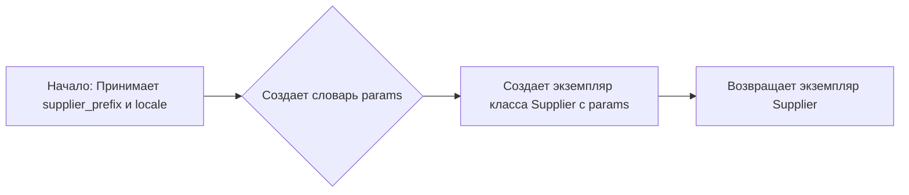

# Модуль: `src.suppliers.etzmaleh._experiments`

## Обзор

Модуль содержит экспериментальный код, связанный с поставщиком Etzmaleh. Включает в себя импорты необходимых библиотек и инициализацию путей к директориям проекта.

## Подробнее

Этот модуль, по-видимому, предназначен для экспериментов и отладки функциональности, связанной с поставщиком Etzmaleh. Он настраивает пути для импорта других модулей проекта, таких как `webdriver`, `Supplier`, `Product`, `Category` и т.д. Также здесь находятся различные утилиты и классы для работы с данными и API PrestaShop.

## Функции

### `start_supplier`

```python
def start_supplier(supplier_prefix: str = 'aliexpress', locale: str = 'en' ):
    """ Старт поставщика """
```

**Назначение**: Инициализирует и запускает поставщика.

**Параметры**:
- `supplier_prefix` (str): Префикс поставщика. По умолчанию 'aliexpress'.
- `locale` (str): Локаль поставщика. По умолчанию 'en'.

**Возвращает**:
- Экземпляр класса `Supplier`.

**Как работает функция**:

1. Функция принимает два параметра: `supplier_prefix` и `locale`, которые определяют префикс и локаль поставщика соответственно.
2. Создается словарь `params`, содержащий эти параметры.
3. Создается и возвращается экземпляр класса `Supplier` с использованием переданных параметров.



**Примеры**:

```python
# Пример вызова функции start_supplier с параметрами по умолчанию
supplier = start_supplier()

# Пример вызова функции start_supplier с указанием префикса и локали
supplier = start_supplier(supplier_prefix='my_supplier', locale='fr')