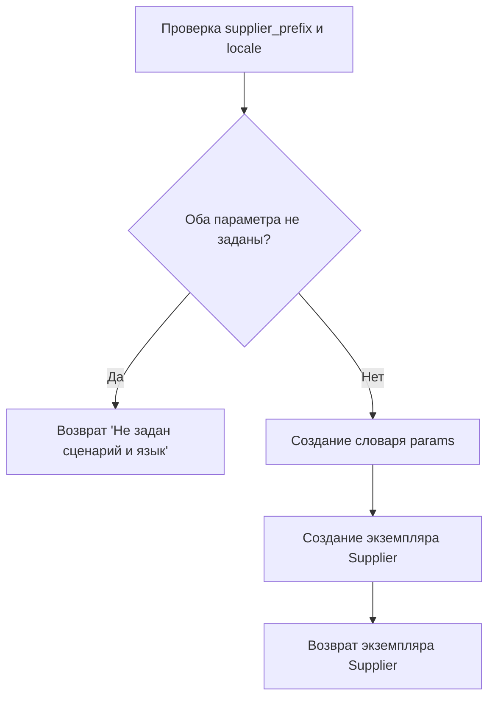

# Модуль _experiments (notebook_header-Copy1.py)

## Обзор

Модуль содержит набор экспериментов и вспомогательных функций, используемых в процессе разработки и отладки проекта `hypotez` для поставщика `hb`. Он включает в себя импорты различных модулей и библиотек, необходимых для работы с поставщиками, продуктами, категориями, веб-драйвером и другими утилитами.

## Подробней

Этот файл содержит импорты, настройки путей и определение функции для запуска поставщика. Он служит отправной точкой для различных экспериментов, связанных с поставщиками, и может быть использован для тестирования и отладки функциональности, связанной с обработкой данных от поставщиков.

## Функции

### `start_supplier`

```python
def start_supplier(supplier_prefix, locale):
    """ Старт поставщика """
```

**Назначение**: Функция для запуска поставщика с заданным префиксом и локалью.

**Параметры**:
- `supplier_prefix` (str): Префикс поставщика.
- `locale` (str): Локаль поставщика.

**Возвращает**:
- `Supplier` or `str`: Возвращает экземпляр класса `Supplier` или сообщение об ошибке, если префикс поставщика и локаль не заданы.

**Как работает функция**:

1. **Проверка входных данных**: Проверяет, заданы ли `supplier_prefix` и `locale`. Если оба параметра не заданы, возвращает сообщение об ошибке "Не задан сценарий и язык".
2. **Формирование параметров**: Создает словарь `params` с параметрами `supplier_prefix` и `locale`.
3. **Создание экземпляра Supplier**: Создает экземпляр класса `Supplier` с использованием сформированных параметров.
4. **Возврат результата**: Возвращает созданный экземпляр класса `Supplier`.



**Примеры**:

```python
# Пример вызова функции с заданными параметрами
supplier = start_supplier('some_supplier', 'ru_RU')

# Пример вызова функции без параметров
error_message = start_supplier('', '')
print(error_message)  # Вывод: Не задан сценарий и язык