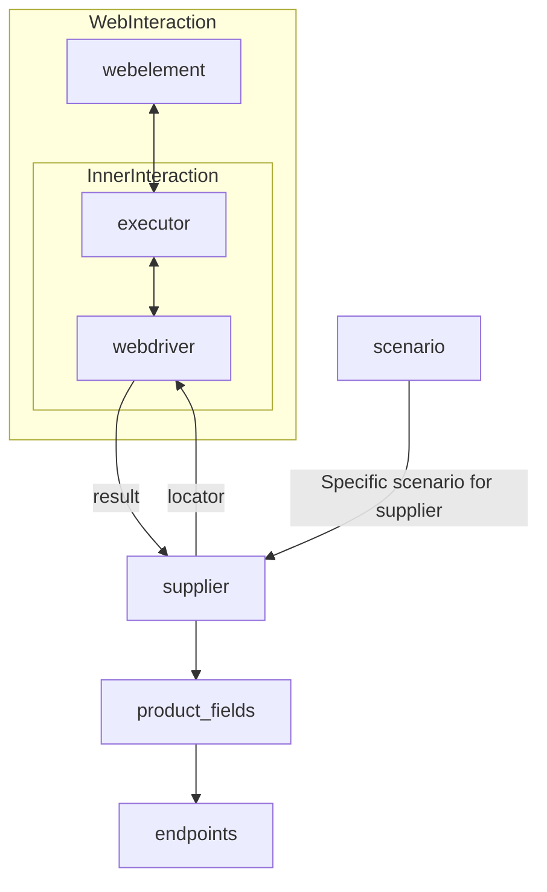

# Документация модуля `Supplier`

## Обзор

Этот модуль предоставляет базовый класс `Supplier`, который служит основой для всех поставщиков данных в проекте. Поставщик может быть производителем товаров, данных или информации. Источники поставщика включают целевую страницу веб-сайта, документ, базу данных или таблицу. Этот класс объединяет различных поставщиков под стандартизированным набором операций. Каждый поставщик имеет уникальный префикс.

## Подробней

Класс `Supplier` является основой для управления взаимодействием с поставщиками. Он обрабатывает инициализацию, конфигурацию, аутентификацию и выполнение рабочих процессов для различных источников данных, таких как `amazon.com`, `walmart.com`, `mouser.com` и `digikey.com`. Клиенты также могут определять дополнительных поставщиков.

## Список реализованных поставщиков:

- [aliexpress](aliexpress) - Реализован с двумя рабочими процессами: `webdriver` и `api`
- [amazon](amazon) - `webdriver`
- [bangood](bangood) - `webdriver`
- [cdata](cdata) - `webdriver`
- [chat_gpt](chat_gpt) - Взаимодействует с интерфейсом ChatGPT (НЕ С МОДЕЛЬЮ!)
- [ebay](ebay) - `webdriver`
- [etzmaleh](etzmaleh) - `webdriver`
- [gearbest](gearbest) - `webdriver`
- [grandadvance](grandadvance) - `webdriver`
- [hb](hb) - `webdriver`
- [ivory](ivory) - `webdriver`
- [ksp](ksp) - `webdriver`
- [kualastyle](kualastyle) `webdriver`
- [morlevi](morlevi) `webdriver`
- [visualdg](visualdg) `webdriver`
- [wallashop](wallashop) `webdriver`
- [wallmart](wallmart) `webdriver`

[Подробнее о WebDriver :class: `Driver`](../webdriver)
[Подробнее о рабочих процессах :class: `Scenario`](../scenarios)



## Атрибуты

- **`supplier_id`** *(int)*: Уникальный идентификатор поставщика.
- **`supplier_prefix`** *(str)*: Префикс поставщика, например, `'amazon'`, `'aliexpress'`.
- **`supplier_settings`** *(dict)*: Настройки поставщика, загруженные из JSON-файла.
- **`locale`** *(str)*: Код локализации (по умолчанию: `'en'`).
- **`price_rule`** *(str)*: Правила для расчета цен (например, правила НДС).
- **`related_modules`** *(module)*: Вспомогательные модули для конкретных операций поставщика.
- **`scenario_files`** *(list)*: Список файлов сценариев для выполнения.
- **`current_scenario`** *(dict)*: Сценарий, выполняемый в данный момент.
- **`login_data`** *(dict)*: Данные для аутентификации.
- **`locators`** *(dict)*: Словарь локаторов веб-элементов.
- **`driver`** *(Driver)*: Экземпляр WebDriver для взаимодействия с веб-сайтом поставщика.
- **`parsing_method`** *(str)*: Метод разбора данных (например, `'webdriver'`, `'api'`, `'xls'`, `'csv'`).

## Методы

### `__init__`

```python
def __init__(self, supplier_prefix: str, locale: str = 'en', webdriver: str | Driver | bool = 'default', *attrs, **kwargs):
    """Initializes an instance of Supplier.

    Args:
        supplier_prefix (str): The supplier's prefix.
        locale (str, optional): Localization code. Defaults to 'en'.
        webdriver (str | Driver | bool, optional): Type of WebDriver. Defaults to 'default'.

    Raises:
        DefaultSettingsException: If default settings are not properly configured.
    """
```

**Описание**:
Конструктор класса `Supplier`.

**Параметры**:
- `supplier_prefix` (str): Префикс поставщика.
- `locale` (str, optional): Код локализации. По умолчанию `'en'`.
- `webdriver` (str | Driver | bool, optional): Тип WebDriver. По умолчанию `'default'`.

**Вызывает исключения**:
- `DefaultSettingsException`: Если настройки по умолчанию не настроены должным образом.

**Как работает функция**:
Функция инициализирует экземпляр класса `Supplier`. Она принимает префикс поставщика, код локализации и тип WebDriver в качестве аргументов. Если настройки по умолчанию не настроены должным образом, функция вызывает исключение `DefaultSettingsException`.

### `_payload`

```python
def _payload(self, webdriver: str | Driver | bool, *attrs, **kwargs) -> bool:
    """Loads settings, locators, and initializes the WebDriver.

    Args:
        webdriver (str | Driver | bool): Type of WebDriver.

    Returns:
        bool: Returns `True` if the loading was successful.
    """
```

**Описание**:
Загружает настройки поставщика, инициализирует локаторы и WebDriver.

**Параметры**:
- `webdriver` (str | Driver | bool): Тип WebDriver.

**Возвращает**:
- `bool`: Возвращает `True`, если загрузка прошла успешно.

**Как работает функция**:
Функция загружает настройки, локаторы и инициализирует WebDriver. Она принимает тип WebDriver в качестве аргумента и возвращает `True`, если загрузка прошла успешно.

### `login`

```python
def login(self) -> bool:
    """Authenticates the user on the supplier's website.

    Returns:
        bool: Returns `True` if login was successful.
    """
```

**Описание**:
Аутентифицирует пользователя на веб-сайте поставщика.

**Возвращает**:
- `bool`: Возвращает `True`, если вход в систему выполнен успешно.

**Как работает функция**:
Функция аутентифицирует пользователя на веб-сайте поставщика и возвращает `True`, если вход в систему выполнен успешно.

### `run_scenario_files`

```python
def run_scenario_files(self, scenario_files: str | List[str] = None) -> bool:
    """Runs the provided scenario files.

    Args:
        scenario_files (str | List[str], optional): List or path to scenario files.

    Returns:
        bool: Returns `True` if scenarios were executed successfully.
    """
```

**Описание**:
Запускает предоставленные файлы сценариев.

**Параметры**:
- `scenario_files` (str | List[str], optional): Список или путь к файлам сценариев.

**Возвращает**:
- `bool`: Возвращает `True`, если сценарии были успешно выполнены.

**Как работает функция**:
Функция запускает предоставленные файлы сценариев и возвращает `True`, если сценарии были успешно выполнены.

### `run_scenarios`

```python
def run_scenarios(self, scenarios: dict | list[dict]) -> bool:
    """Executes specified scenarios.

    Args:
        scenarios (dict | list[dict]): Scenarios to be executed.

    Returns:
        bool: Returns `True` if all scenarios were executed successfully.
    """
```

**Описание**:
Выполняет указанные сценарии.

**Параметры**:
- `scenarios` (dict | list[dict]): Сценарии для выполнения.

**Возвращает**:
- `bool`: Возвращает `True`, если все сценарии были успешно выполнены.

**Как работает функция**:
Функция выполняет указанные сценарии и возвращает `True`, если все сценарии были успешно выполнены.

## Как это работает

1. **Инициализация**:
   - Метод `__init__` настраивает префикс поставщика, локализацию и WebDriver.
     Пример:
     ```python
     supplier = Supplier(supplier_prefix='aliexpress', locale='en', webdriver='chrome')
     ```

2. **Загрузка настроек**:
   - `_payload` загружает конфигурацию, инициализирует локаторы и WebDriver.
     Пример:
     ```python
     supplier._payload(webdriver='firefox')
     ```

3. **Аутентификация**:
   - `login` выполняет вход пользователя на веб-сайт поставщика.
     Пример:
     ```python
     supplier.login()
     ```

4. **Выполнение сценариев**:
   - **Запуск файлов сценариев**:
     ```python
     supplier.run_scenario_files(['example_scenario.json'])
     ```
   - **Запуск конкретных сценариев**:
     ```python
     supplier.run_scenarios([{'action': 'scrape', 'target': 'product_list'}])
     ```